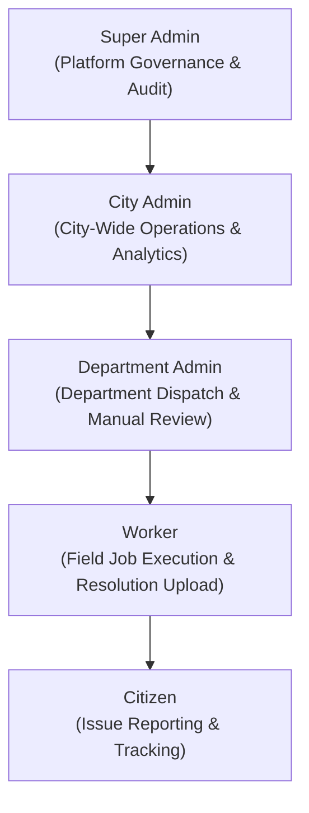

# CSCRS — Crowdsourced Civic Issue Reporting and Resolution System

[](https://fastapi.tiangolo.com/)
[](https://react.dev/)
[](https://www.postgresql.org/)
[](https://redis.io/)
[](https://ultralytics.com/)
[](LICENSE)

CSCRS (**Crowdsourced Civic Issue Reporting and Resolution System**) is an end-to-end, enterprise-grade civic management platform engineered for municipal governance across Uttar Pradesh cities. It empowers citizens to report civic infrastructure issues (potholes, garbage dumps, streetlamp failures, water leakage) via AI-assisted image verification and GPS EXIF validation while orchestrating automated department routing, worker dispatch, resolution AI verification, public transparency dashboards, and Super Admin system oversight.

---

## 🚀 Key Capabilities

- **AI-Driven Issue Detection & Quality Verification**: Integrated YOLOv8 object detection and OpenCLIP visual scene similarity engine with real-time EXIF GPS location verification and image quality sanity checks.
- **Smart Duplicate Prevention**: Multi-layered duplicate detection using spatial radius matching (8m) combined with OpenCLIP visual scene similarity scoring to eliminate duplicate citizen filings.
- **Automated & Manual Department Routing**: Dynamic routing of detected civic issues (Roads, Waste, Water, Electrical, Sanitation) with automated worker assignment and administrative forward/transfer workflows.
- **Worker Mobile Workflow & Geofenced Start**: Field worker job execution with 30-meter GPS proximity validation before work initiation.
- **AI-Powered Resolution Verification**: Dual-phase resolution validation comparing before and after site photos using visual scene embedding and object re-detection, routing ambiguous cases to Department Admin manual review.
- **Role-Based Access Control (RBAC)**: Fine-grained multi-tier authorization hierarchy across 5 roles: `SUPER_ADMIN`, `CITY_ADMIN`, `DEPARTMENT_ADMIN`, `WORKER`, and `CITIZEN`.
- **Public Transparency Platform**: Public-facing platform overview, news & press announcements, and interactive **Uttar Pradesh State & District Dashboard** rendering real-time municipal telemetry across 75 UP districts.
- **Super Admin Governance & Audit**: Platform-wide governance suite including system health diagnostics, AI telemetry, system broadcast messaging, login security auditing, and immutable system audit logs.

---

## 🏗️ Architecture & Technology Stack

| Layer | Technology / Tool | Purpose |
| :--- | :--- | :--- |
| **Backend API** | FastAPI 0.138.2, Uvicorn | High-performance async RESTful service layer |
| **Frontend Web** | React 19, Vite, TypeScript, Tailwind CSS | Responsive administrative and public web portal |
| **Database & ORM** | PostgreSQL 16 / SQLite, SQLAlchemy 2.0.51, Alembic 1.18.5 | Relational data persistence and schema migration management |
| **Cache & Rate Limiting** | Redis 7, SlowAPI | Session caching and API request rate limiting |
| **AI & Computer Vision** | Ultralytics YOLOv8, OpenCLIP, PyTorch, OpenCV, ExifRead | Image detection, scene similarity, quality checks & EXIF parsing |
| **Reverse Proxy & Server** | Nginx 1.28 (Alpine), Docker Compose | Production gateway, SSL termination, and static asset serving |
| **Hosting & Cloud** | Oracle Cloud Infrastructure (ARM64 VM), Vercel | Production container hosting and frontend static edge deployment |

---

## 👥 Role Hierarchy & Capabilities



- **`SUPER_ADMIN`**: Full platform oversight, city admin account creation, broadcast management, public news/press governance, system health diagnostics, AI telemetry, and immutable audit logs.
- **`CITY_ADMIN`**: Citywide operational analytics, department admin invitations, citizen block/unblock management, performance report PDF generation, and feedback analytics.
- **`DEPARTMENT_ADMIN`**: Department-level report management, manual worker dispatch, resolution manual review approval/rejection, forward transfer request handling, worker onboarding, and worker blocking.
- **`WORKER`**: View assigned jobs, geofenced job start (30m radius), photo proof resolution upload, and department transfer request flagging.
- **`CITIZEN`**: AI report submission (camera upload with GPS), duplicate report supporting, report tracking timeline, personal dashboard, feedback submission, and system bug reporting.

---

## ⚡ Quick Start (Local Development)

### 1. Prerequisites
- Python 3.10+
- Node.js 18+ & npm
- SQLite (default local) or PostgreSQL 16 & Redis 7 (optional for local dev)

### 2. Backend Setup
```bash
# Navigate to backend
cd backend

# Create & activate virtual environment
python -m venv venv
# On Windows: venv\Scripts\activate
# On Linux/macOS: source venv/bin/activate

# Install development dependencies
pip install -r requirements-dev.txt

# Run Alembic migrations
alembic upgrade head

# Seed initial departments & bootstrap Super Admin
python -m scripts.seed_departments
python -m scripts.bootstrap_super_admin

# Start FastAPI server
uvicorn api.app:app --host 0.0.0.0 --port 8000 --reload
```
API Documentation will be accessible at `http://localhost:8000/docs`.

### 3. Frontend Setup
```bash
# Navigate to frontend
cd frontend

# Install dependencies
npm install

# Start Vite development server
npm run dev
```
Web application will be accessible at `http://localhost:5173`.

---

## 🚢 Production Deployment Architecture

The production environment is hosted on an **Oracle Cloud Infrastructure ARM64 VM (Ubuntu 24.04 LTS)** utilizing Docker Compose and Nginx, paired with **Vercel** for high-availability frontend delivery.

```
                  ┌─────────────────────────────────────┐
                  │           Public Internet           │
                  └──────────────────┬──────────────────┘
                                     │
           ┌─────────────────────────┴─────────────────────────┐
           ▼                                                   ▼
┌─────────────────────┐                             ┌─────────────────────┐
│   Vercel Edge CDN   │                             │ Nginx Reverse Proxy │
│  (Frontend Web App) │                             │   (Docker Port 80/443)│
└─────────────────────┘                             └──────────┬──────────┘
                                                               │
                                                    ┌──────────┴──────────┐
                                                    ▼                     ▼
                                          ┌───────────────────┐ ┌───────────────────┐
                                          │  FastAPI Backend  │ │ Static Asset Vol  │
                                          │   (Container)     │ │    (/uploads)     │
                                          └─────────┬─────────┘ └───────────────────┘
                                                    │
                                       ┌────────────┴────────────┐
                                       ▼                         ▼
                            ┌────────────────────┐    ┌────────────────────┐
                            │ PostgreSQL 16 DB   │    │    Redis 7 Cache   │
                            │   (Container Vol)  │    │   (Container Vol)  │
                            └────────────────────┘    └────────────────────┘
```

For comprehensive production instructions, deployment scripts, backup routines, and runbooks, consult [`docs/DEPLOYMENT.md`](file:///d:/Projects/CSCRS/docs/DEPLOYMENT.md) and [`docs/OPERATIONS_RUNBOOK.md`](file:///d:/Projects/CSCRS/docs/OPERATIONS_RUNBOOK.md).

---

## 📚 Complete Documentation Suite

All system documentation resides in the [`docs/`](file:///d:/Projects/CSCRS/docs) directory and represents the exact, verified state of the CSCRS codebase:

- 📖 **[API Specification (`docs/API.md`)](file:///d:/Projects/CSCRS/docs/API.md)** — Complete reference of all 70+ backend endpoints across 23 functional modules, including authorization, parameters, schemas, and rate limits.
- 🏛️ **[System Architecture (`docs/ARCHITECTURE.md`)](file:///d:/Projects/CSCRS/docs/ARCHITECTURE.md)** — 25 architectural sections with 5 verified Mermaid diagrams covering frontend, backend, AI inference, verification pipelines, notification separation, and public platform services.
- 🗄️ **[Database Schema & Migrations (`docs/DATABASE.md`)](file:///d:/Projects/CSCRS/docs/DATABASE.md)** — Complete specification of all 26 SQLAlchemy models, relationships, indexes, enums, and the 7 Alembic migration revisions.
- 🚀 **[Deployment Guide (`docs/DEPLOYMENT.md`)](file:///d:/Projects/CSCRS/docs/DEPLOYMENT.md)** — Local development guide, Oracle Cloud ARM64 Docker Compose stack setup, Nginx configuration, CI/CD pipeline, and update scripts.
- 🗺️ **[Repository Project Map (`docs/PROJECT_MAP.md`)](file:///d:/Projects/CSCRS/docs/PROJECT_MAP.md)** — Complete filesystem mapping of backend, frontend, scripts, deployment assets, and tests with file responsibilities.
- 🔒 **[Security Architecture (`docs/SECURITY.md`)](file:///d:/Projects/CSCRS/docs/SECURITY.md)** — Security specification detailing JWT authentication, password hashing, OTP resend cooldowns, Redis rate limiting, RBAC route dependencies, EXIF/GPS security, and audit logging.
- 🧪 **[Testing Strategy (`docs/TESTING.md`)](file:///d:/Projects/CSCRS/docs/TESTING.md)** — Testing methodology covering pytest backend integration, TypeScript static verification, Vite build checks, API health validation, and known test limitations.
- 🛠️ **[Operations Runbook (`docs/OPERATIONS_RUNBOOK.md`)](file:///d:/Projects/CSCRS/docs/OPERATIONS_RUNBOOK.md)** — System operator guide for health monitoring, container management, log inspection, migration safety rules, backups, and recovery procedures.
- 📜 **[System Changelog (`docs/CHANGELOG.md`)](file:///d:/Projects/CSCRS/docs/CHANGELOG.md)** — Comprehensive technical history of system evolution from v1.0.0 initial release to v1.0.1 feature completion.

---

## 📄 License

This project is licensed under the MIT License — see the [LICENSE](LICENSE) file for details.
