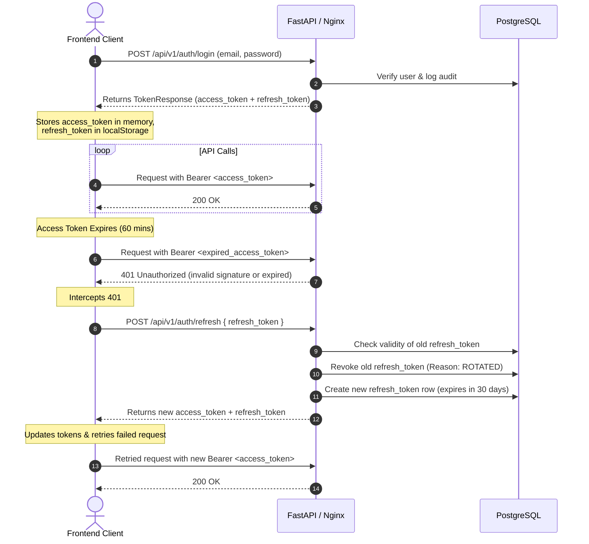

# Authentication Session Verification & Backend Sync Audit Report

This report documents the security audit and alignment verification between the CSCRS Frontend React application and the FastAPI backend authentication modules.

---

## 1. Backend Authentication Lifecycle (Source of Truth)

### Access Token
- **Expiration**: Configured via the `ACCESS_TOKEN_EXPIRE_MINUTES` environment variable in [`config.py`](file:///d:/Projects/CSCRS/backend/configs/config.py#L28) (default: `60` minutes).
- **Signing Algorithm**: HMAC-SHA256 (default: `HS256`, configurable via the `ALGORITHM` environment variable).
- **Storage**: Stateless JWT; no database persistence exists on the backend.
- **Expected Frontend Usage**: Sent inside the `Authorization: Bearer <access_token>` request header.

### Refresh Token
- **Expiration**: Hardcoded to `30` days (`REFRESH_TOKEN_EXPIRE_DAYS = 30` in [`config.py`](file:///d:/Projects/CSCRS/backend/configs/config.py#L34)).
- **Storage**: Hashed via SHA-256 on the backend and stored in the PostgreSQL database (`RefreshToken` table) alongside metadata (user ID, browser, IP address, OS, and expiration timestamp).
- **Rotation Policy (RTR)**: Single-use refresh tokens. When `/refresh` is called, the old refresh token is marked as `ROTATED` in the database, and a new refresh token is generated and returned to the client.
- **Token Reuse Detection / Revocation**: If a rotated or already-revoked refresh token is sent to the `/refresh` endpoint, the backend detects this, revokes the **entire active session** (invalidating all associated session tokens in the database with the reason `TOKEN_REUSE_DETECTED`), and forces a full re-login.

### Session Flow


### Refresh Endpoint
- **Path**: `POST /api/v1/auth/refresh`
- **Request Format**: JSON body matching `schemas.user.RefreshTokenRequest`:
  ```json
  {
    "refresh_token": "string"
  }
  ```
- **Response Format**: `TokenResponse` schema:
  ```json
  {
    "access_token": "string",
    "refresh_token": "string",
    "token_type": "bearer",
    "expires_in": 1800
  }
  ```

### Logout
- **Invalidation**: Invalidate tokens on the server. `AuthService.logout()` decodes the refresh token, identifies the database row, and marks it as revoked with `reason="LOGOUT"`. It also supports `logout_all()` which revokes all active session tokens with `reason="LOGOUT_ALL"`.

---

## 2. Frontend Authentication Lifecycle

### Login & Storage
- **Access Token**: Stored strictly in-memory inside [`client.ts`](file:///d:/Projects/CSCRS/frontend/src/services/api/client.ts#L29) (`tokenStore.accessToken`). It is not persisted across browser tabs or page reloads.
- **Refresh Token**: Stored in `localStorage` under the key `cscrs_refresh_token`.
- **User Object**: Stored in React state inside [`auth-provider.tsx`](file:///d:/Projects/CSCRS/frontend/src/providers/auth-provider.tsx#L30).

### App Startup
1. On mount, `restoreSession()` checks for the presence of the `cscrs_refresh_token` in `localStorage`.
2. If found, it immediately triggers a POST request to `/api/v1/auth/refresh`.
3. If successful, it stores the new access/refresh tokens in-memory and `localStorage`, then fetches the current user profile using `GET /api/v1/auth/me`.
4. If either call fails, it clears all client-side tokens and leaves the user in an unauthenticated state.

### Automatic Login
- **Behavior**: Users remain logged in even after opening the application many hours later.
- **Explanation**:
  - The `refresh_token` is stored persistently in `localStorage`.
  - On page load, the frontend uses this token to obtain a fresh access token via `/refresh`.
  - Because the backend implements Refresh Token Rotation (RTR), every refresh call updates the client with a new refresh token containing a fresh 30-day lifetime.
  - This forms an **indefinitely sliding session**; as long as the user loads the app at least once every 30 days, their session will remain active without prompting for credentials.

### Expiration Handling
- **Mechanism**: The frontend **does not** decode the access token to check the `exp` claim or perform client-side expiration checks before sending requests.
- **File Responsible**: [`client.ts`](file:///d:/Projects/CSCRS/frontend/src/services/api/client.ts#L65-L121) handles token expiration *reactively* via an Axios response interceptor:
  - If a request fails with `401 Unauthorized`, the interceptor triggers the token refresh process. If refresh succeeds, the interceptor re-sends the original request; if not, it triggers a redirect to `/login`.

### Route Protection
- **Mechanism**: Protected routes rely on the presence of the `user` profile object in the React context state ([`protected-route.tsx`](file:///d:/Projects/CSCRS/frontend/src/routes/protected-route.tsx#L31)).
- **Verification**: Protected routes do not check the token's validity directly. They trust the React state which is kept in sync via token interceptor outcomes.

---

## 3. Alignment & Inconsistencies Audit

| Feature | Backend Implementation | Frontend Implementation | Status / Inconsistency |
| :--- | :--- | :--- | :--- |
| **Access Token Expiry** | 60 minutes (`ACCESS_TOKEN_EXPIRE_MINUTES = 60`) | Inferred from response body parameter | **Inconsistent Contract**: The backend token payload has a `60` minutes expiry, but the JSON response hardcodes `expires_in: 1800` (30 minutes). |
| **Refresh Token Expiry** | 30 days | Persisted in `localStorage` | **Aligned**: Stored securely as long-lived token. |
| **Refresh Token Rotation** | Strict rotation (RTR); old token revoked as `ROTATED` | Replaces stored refresh token on every refresh call | **Aligned**: Rotation logic successfully rotates refresh tokens. |
| **Token Invalidation** | Marks database record as `LOGOUT` on `/logout` | Calls logout API, then clears local storage | **Aligned**: Session is revoked server-side on explicit logout. |
| **CORS / Dev Proxy** | Restricts origins to `FRONTEND_BASE_URL` | Routes via dev server proxy with Origin header rewrite | **Aligned**: Handled safely in development via Vite proxy configuration. |

---

## 4. Recommended Changes (If Required)

1. **Resolve `expires_in` Contract Mismatch**:
   - Align the FastAPI response `expires_in` value with `ACCESS_TOKEN_EXPIRE_MINUTES * 60` (seconds) dynamically instead of returning a hardcoded `1800` seconds value.
2. **Proactive Expiry Checks**:
   - Currently, a request is sent blindly and a 401 error is intercepted. A client-side check of the `access_token` JWT expiration before making requests (or a background timer scheduled using the `expires_in` field) would prevent requests from failing first, avoiding unnecessary 498ms round-trips.
3. **Move Refresh Token to HttpOnly Cookies (Architectural)**:
   - For production security, shifting refresh tokens from `localStorage` to `HttpOnly` cookie-based storage would defend the application from cross-site scripting (XSS) token extraction.
