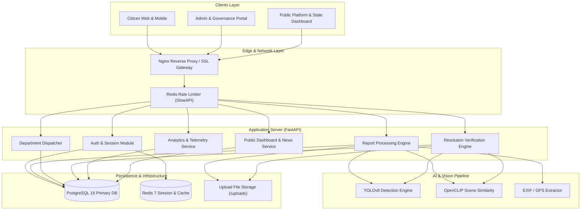
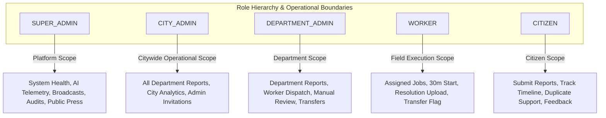
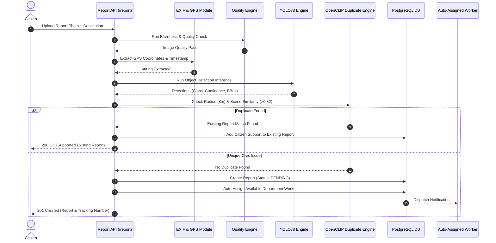
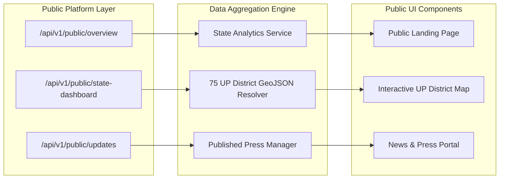
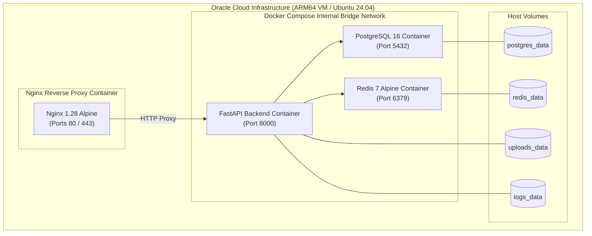

# CSCRS System Architecture Specification

This document presents the complete technical architecture of the **Crowdsourced Civic Issue Reporting and Resolution System (CSCRS)** codebase (`d:\Projects\CSCRS`).

---

## 1. System Overview & Product Identity

CSCRS is an end-to-end municipal governance platform designed for crowdsourced civic issue reporting, automated department dispatch, worker repair execution, AI-driven resolution validation, transparency dashboards, and Super Admin platform governance across Uttar Pradesh municipalities.



---

## 2. High-Level Architecture Principles

1. **Codebase as Source of Truth**: Architecture strictly mirrors the actual implemented code in `backend/` and `frontend/`.
2. **Decoupled System Architecture**: Clear separation of concern across REST API routers (`backend/api`), domain business services (`backend/services`), data access layer (`backend/database/crud`), and SQLAlchemy ORM models (`backend/database/models`).
3. **Stateless API & Distributed Caching**: REST API containers are stateless; active sessions and rate-limiting metrics are persisted in Redis (`redis:7-alpine`).
4. **Dual-Phase AI Verification**: AI computer vision operates at both issue reporting (YOLOv8 + GPS EXIF + OpenCLIP duplicate detection) and resolution validation (OpenCLIP before/after scene similarity + YOLO re-detection).
5. **Exact-Role Authorization**: Fine-grained role enforcement (`require_citizen`, `require_worker`, `require_department_admin`, `require_city_admin`, `require_super_admin`).

---

## 3. Frontend Architecture (`frontend/src`)

The frontend is built on **React 19**, **Vite**, **TypeScript**, and **Tailwind CSS**, using a feature-folder modular layout:

- **App Shell & Routing (`src/routes/index.tsx`)**: `createBrowserRouter` with code-splitting (`React.lazy`) and role-gated `<ProtectedRoute>` guards.
- **State Management & Data Fetching**: `React Query` (`@tanstack/react-query`) for server state management and caching; `Zustand` for client UI state (auth token, sidebar toggle).
- **API Client Layer (`src/lib/api-client.ts`)**: Axios instance with automatic JWT Bearer token injection, token rotation retry, and error interception.
- **Component Design System (`src/components/`)**: Atomic UI components, loading skeletons, responsive tables, badge status chips, and modal dialogs.
- **Feature Modules (`src/features/`)**:
  - `auth`: Login, OTP verification, password recovery.
  - `dashboard`: Role-specific performance dashboards.
  - `reports`: Citizen report filing, city report directory, PDF downloads.
  - `resolutions`: Worker proof upload and admin manual review workspace.
  - `forward-requests`: Inter-department report transfer approval workflow.
  - `super-admin`: Governance, broadcast management, public news press editor, audit security logs.
  - `public`: Landing page, public news details, Uttar Pradesh State Dashboard.

---

## 4. Backend Architecture (`backend/`)

The backend is built on **FastAPI 0.138.2** running on **Uvicorn** with Python 3.12:

- **Application Factory (`backend/api/app.py`)**: Initializes CORS middleware (Vercel origins), `SlowAPI` rate limiter, static `/uploads` file mounting, security headers (`X-Content-Type-Options`, `X-Frame-Options`), and custom lifespan hooks.
- **Router Layer (`backend/api/routes.py` & `backend/api/*.py`)**: Modular APIRouters bound to `/api/v1` prefixes and health routes (`/health`, `/liveness`, `/readiness`).
- **Dependency Injection (`backend/authentication/dependencies.py` & `backend/database/dependencies.py`)**: Session injection (`get_db`) and role enforcement dependencies.

---

## 5. API Layer

The API layer maps incoming HTTP requests to corresponding service classes:
- Handles request payload validation via Pydantic schemas (`backend/schemas/`).
- Enforces multipart file uploads validation (`validate_uploaded_file`) with extension checks (`.jpg`, `.jpeg`, `.png`, `.webp`) and size limits (`MAX_FILE_SIZE`).
- Wraps error conditions in standard `HTTPException` responses.

---

## 6. Service Layer (`backend/services/`)

The service layer contains domain logic:
- `ReportService`: Handles report creation, duplicate checks, image persistence, and cancellation/reopening workflows.
- `AssignmentService`: Worker auto-assignment logic, manual worker dispatch, and 30m geofenced work start.
- `ResolutionService`: Worker resolution proof creation, OpenCLIP scene comparison, YOLO verification scoring, and manual review routing.
- `ForwardRequestService`: Inter-department transfer workflow, source admin approvals, and destination admin acceptances.
- `SuperAdminService`: System health diagnostics, AI telemetry compilation, system announcements, and audit log querying.
- `PublicDashboardService`: Aggregates public overview stats and district-level metrics for all 75 Uttar Pradesh districts.
- `PublicUpdateService`: Public press updates creation, thumbnail upload, slug generation, and publication toggles.

---

## 7. CRUD / Data Access Layer (`backend/database/crud/`)

The CRUD layer handles database queries using SQLAlchemy ORM Sessions:
- Encapsulates database filters, joins, pagination queries, and model mutations.
- Modules: `user.py`, `report.py`, `assignment.py`, `resolution.py`, `broadcast.py`, `system_issue.py`, `login_audit.py`, `public_update.py`.

---

## 8. Database Layer (`backend/database/`)

- **ORM Engine**: SQLAlchemy 2.0.51 with declarative Base model definitions (`backend/database/models/`).
- **Connection Management (`backend/database/connection.py`)**: Connection pooling configured for PostgreSQL 16 (production) and SQLite (development).
- **Migrations (`backend/alembic/`)**: Alembic 1.18.5 migration chain tracking database schema evolution across 7 revisions.

---

## 9. Authentication & Security Architecture

- **JWT Tokens**: Signed access tokens (Short-lived, HS256) containing `sub` (User ID), `role`, and expiration timestamp.
- **Refresh Tokens (`RefreshToken` model)**: Stored in database with SHA256 hashed token strings, device user-agent tracking, and remote IP tracking to allow per-device or global session revocation.
- **Password Hashing**: Cryptographic password hashing using `bcrypt`.
- **Email OTP Verification**: 6-digit OTP generation with 5-minute expiry, max 5 failed attempts limit, and 60-second resend cooldowns.

---

## 10. Role-Based Access Control (RBAC) Architecture



- Operational boundaries are enforced strictly via route dependencies in `authentication/dependencies.py`.
- Higher roles possess platform-wide visibility but do not bypass department operational boundaries (e.g., `SUPER_ADMIN` cannot perform field worker job starts).

---

## 11. AI Inference Architecture (`backend/inference/`)

The AI vision pipeline consists of:
- **YOLOv8 Object Detection (`backend/inference/engine.py`)**: Loads pre-trained YOLO model (`models/best.pt`) to detect civic issue classes (potholes, garbage, streetlamps, water leakages) with confidence scoring and polygon annotations.
- **OpenCLIP Visual Scene Embeddings (`backend/inference/open_clip_engine.py`)**: Generates 512-dimensional visual vector embeddings for scene similarity comparison.
- **Quality Verification Engine (`backend/verification/quality.py`)**: Evaluates blurriness (Laplacian variance), contrast, brightness, and resolution threshold.

---

## 12. Citizen Report & Verification Pipeline



---

## 13. Resolution Verification Pipeline

1. **Field Worker Submission**: Worker uploads post-repair photo via `/api/v1/resolutions`.
2. **Visual Scene Comparison**: OpenCLIP measures cosine similarity between the original report photo and the resolution photo.
3. **YOLO Re-Inference**: YOLO scans the resolution image to confirm the original civic defect has been resolved.
4. **Automated Decision Routing**:
   - If visual similarity > threshold AND defect resolved $\rightarrow$ Status updated to `RESOLVED` / `VERIFIED`.
   - If metrics are ambiguous $\rightarrow$ Status set to `REVIEW` and routed to the Department Admin's **Manual Review Queue**.

---

## 14. In-App Notification vs Broadcast Architecture

- **In-App Notifications (`InAppNotification`)**: User-specific targeted notifications triggered by report status updates, worker assignments, or transfer requests.
- **Broadcast Announcements (`Broadcast`)**: Platform-wide or role-targeted announcements created by Super Admins (`SUPER_ADMIN`), decoupled from individual user rows with derived lifecycle states (`SCHEDULED`, `ACTIVE`, `EXPIRED`, `CANCELLED`).

---

## 15. Audit Logging & Security Tracking

- **System Audit Log (`AuditLog`)**: Records immutable administrative actions (`REPORT_CANCELLED`, `WORKER_BLOCKED`, `TRANSFER_APPROVED`) with user ID, IP address, and change details.
- **Login Audit Log (`LoginAudit`)**: Records user login attempts, success/failure flags, IP address, user-agent details, and timestamp for security monitoring.

---

## 16. Public Platform & Uttar Pradesh State Dashboard Architecture



- Provides public transparency metrics without exposing citizen personal identifiable information (PII).
- **Uttar Pradesh State Dashboard**: Aggregates civic metrics across all 75 UP districts with district resolution scores and GeoJSON boundaries.

---

## 17. Super Admin Governance Architecture

- Dedicated governance suite (`/api/v1/super-admin/*`) accessible exclusively to `SUPER_ADMIN`.
- Features real-time system health diagnostics, AI inference telemetry monitoring, audit log exports, broadcast management, and public press editor controls.

---

## 18. Image Storage & Serving Architecture

- **Upload Structure**:
  ```
  uploads/
  ├── [original_citizen_photos].jpg
  ├── [annotated_yolo_photos].jpg
  ├── public_updates/
  │   └── [press_thumbnails].jpg
  └── resolution/
      └── [worker_proof_photos].jpg
  ```
- Static images mounted via FastAPI `StaticFiles` at `/uploads`.
- Administrative report images served securely via authenticated endpoint `/api/v1/reports/{report_id}/admin/image`.

---

## 19. Cache & Rate Limiting Architecture

- **Redis Container**: `redis:7-alpine` running on port 6379 with AOF (`appendonly yes`) persistence.
- **Rate Limiting**: `SlowAPI` middleware applying limit rules (e.g., 60 reports/hr for citizen reporting, 20/hr for resolution uploads, 20/hr for bug submissions).

---

## 20. Deployment Topology



---

## 21. Major End-to-End System Workflows

1. **Citizen Filing to Resolution**: Report Submission $\rightarrow$ Quality/EXIF Check $\rightarrow$ YOLO Classification $\rightarrow$ Duplicate Check $\rightarrow$ Auto Assignment $\rightarrow$ Geofenced Job Start $\rightarrow$ Resolution Photo Upload $\rightarrow$ AI Verification / Manual Review $\rightarrow$ Closed.
2. **Inter-Department Transfer**: Worker Flag $\rightarrow$ Source Admin Approval $\rightarrow$ Destination Admin Acceptance $\rightarrow$ Re-Routing & Auto-Assignment.
3. **Super Admin System Broadcast**: Broadcast Created $\rightarrow$ Time Lifecycle Check $\rightarrow$ Active Broadcast Injection into User Navbars.

---

## 22. Error Handling & Resiliency

- Database connection failures trigger `503 Service Unavailable` on `/readiness`.
- File validation failures fail fast prior to running heavy model inference.
- Non-critical notification failures are logged without breaking primary transaction commits.

---

## 23. Telemetry & Monitoring Architecture

- System health metrics track memory consumption, CPU utilization, active database connections, and worker process pools.
- AI telemetry tracks model prediction counts, average inference latency in milliseconds, visual similarity score distributions, and OpenCLIP thresholds.

---

## 24. Security Headers & Proxy Configuration

- Reverse proxy passes original client IP (`X-Real-IP`, `X-Forwarded-For`) and protocol (`X-Forwarded-Proto`).
- Middleware injects security headers (`X-Content-Type-Options: nosniff`, `X-Frame-Options: DENY`, `Referrer-Policy: strict-origin-when-cross-origin`).

---

## 25. Architectural Extensibility & Evolution

- Decoupled inference engine permits seamless upgrading from YOLOv8 to newer YOLO versions or replacing OpenCLIP models.
- Modular FastAPI routers allow adding new municipal governance features without modifying existing service code.
