# CSCRS Architecture & Workflows Documentation

## 1. System Architecture Overview

The **Civic Surveillance & Complaint Resolution System (CSCRS)** is engineered as a multi-layered, micro-service-ready web application built around **FastAPI**, **SQLAlchemy ORM**, **SQLite/PostgreSQL**, and specialized **Deep Learning Computer Vision** models.

```mermaid
graph TD
    Client[Web / Mobile Clients] -->|HTTPS / JWT| API[FastAPI API Router Layer]
    API --> Auth[Authentication & Security]
    API --> Services[Domain Services Layer]
    
    subgraph Core Domain Services
        Services --> ReportSvc[Report Service]
        Services --> AssignSvc[Assignment Service]
        Services --> ResSvc[Resolution Service]
        Services --> FwdSvc[Forward Request Service]
        Services --> AnalyticsSvc[Analytics Service]
        Services --> AuditSvc[Audit Log Service]
        Services --> NotifSvc[Notification Service]
    end

    subgraph Verification & AI Inference Pipeline
        ReportSvc --> InferEngine[Inference Engine]
        ResSvc --> ResAI[Resolution AI Engine]
        
        InferEngine --> Verifier[Verification Engine]
        Verifier --> EXIF[EXIF Detector]
        Verifier --> Quality[Quality Detector - OpenCV]
        Verifier --> RiskEng[Risk Engine]
        
        InferEngine --> YOLO[YOLO Predictor - best_cscrs_seg_v1.pt]
        ResAI --> OpenCLIP[Scene Similarity - OpenCLIP ViT-B-32]
        ResAI --> RuleEng[Resolution Rule Engine]
    end

    subgraph Data Access Layer
        Services --> CRUD[SQLAlchemy CRUD Layer]
        CRUD --> Models[SQLAlchemy Models]
        Models --> DB [(PostgreSQL / SQLite)]
    end

    subgraph External System Interfaces
        NotifSvc --> SMTP[SMTP Email Server]
    end
```

---

## 2. Global Dependency Graph

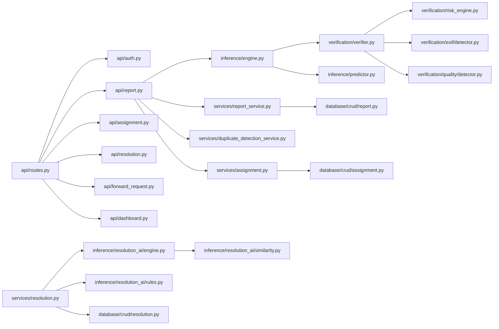

---

## 3. Service Interaction Map

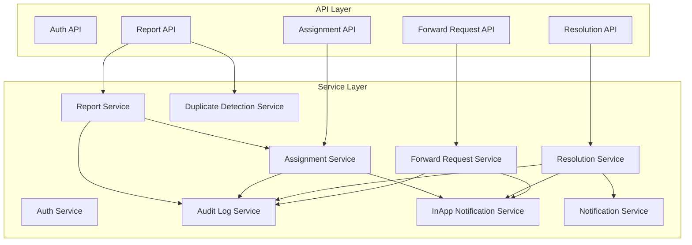

---

## 4. Workflows & Sequence Diagrams

### Workflow 1: Authentication & User Management Flow

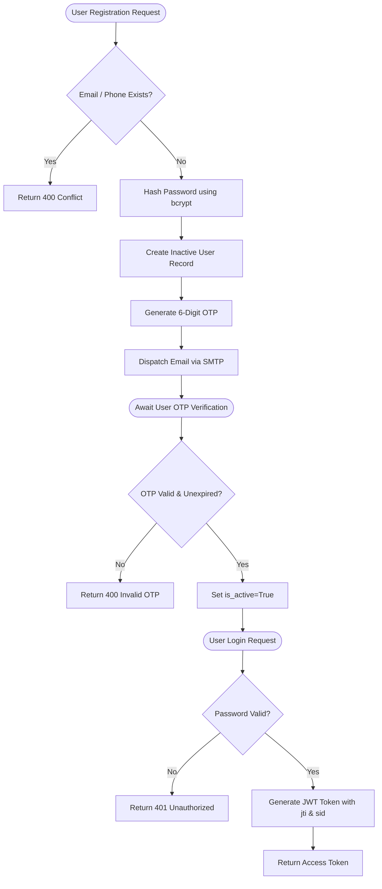

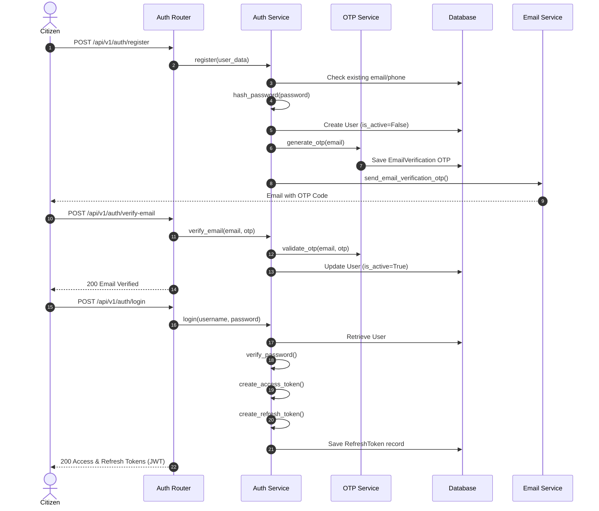

---

### Workflow 2: AI Report Submission & Verification Flow

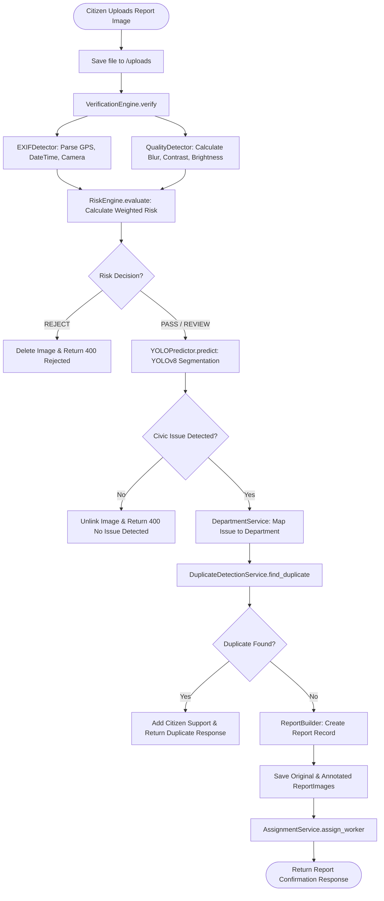

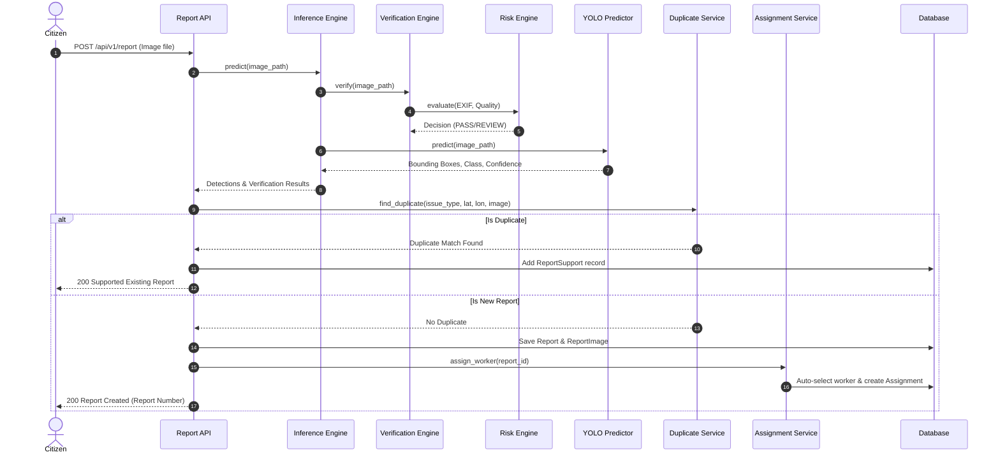

---

### Workflow 3: Worker Assignment & Work Start Flow

```mermaid
flowchart TD
    AssignStart([Report Created / Forward Accepted]) --> GetWorkers[Fetch Available Department Workers]
    GetWorkers --> WorkersExist{Workers Available?}
    WorkersExist -- No --> Throw404[Raise 404 No Available Workers]
    WorkersExist -- Yes --> SelectWorker[Select Worker with Lowest Active Assignments]
    SelectWorker --> CreateAssignment[Create Assignment (Status: ASSIGNED)]
    CreateAssignment --> UpdateReportStatus[Update Report Status to ASSIGNED]
    UpdateReportStatus --> AuditLog[Log Action AUTO_ASSIGNED]
    AuditLog --> NotifyWorker[Create InAppNotification for Worker]
    NotifyWorker --> WorkerArrives([Worker Arrives at Site])
    WorkerArrives --> StartWorkRequest[Worker POST /api/v1/assignments/{assignment_id}/start]
    StartWorkRequest --> CalcDist[Calculate Distance from Report GPS via Haversine]
    CalcDist --> CheckRadius{Distance <= 30m?}
    CheckRadius -- No --> RejectStart[Raise 403 Distance Exceeded]
    CheckRadius -- Yes --> UpdateAssign[Set Assignment Status IN_PROGRESS]
    UpdateAssign --> UpdateReport[Set Report Status IN_PROGRESS]
    UpdateReport --> LogWork[AuditLog: WORK_STARTED]
    LogWork --> NotifyCitizen[InAppNotification to Citizen: Work Started]
```

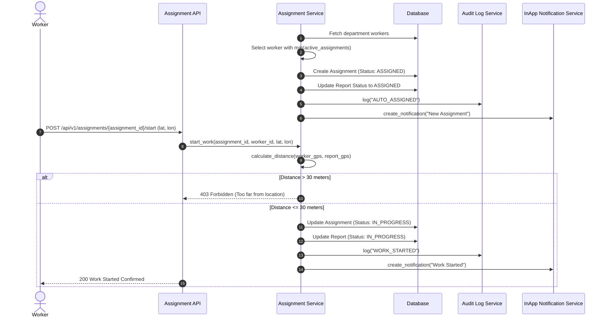

---

### Workflow 4: Resolution Verification & Approval Flow

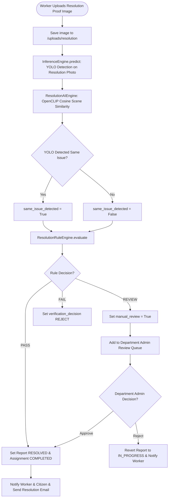

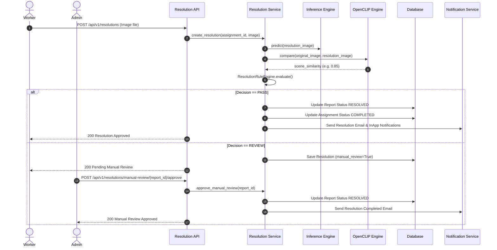

---

### Workflow 5: Inter-Department Forwarding Flow

```mermaid
flowchart TD
    WorkerFlag([Worker Flags Wrong Department Issue]) --> CreateFwd[Create DepartmentForwardRequest (Status: PENDING)]
    CreateFwd --> SourceReview([Source Department Admin Reviews Request])
    SourceReview --> SourceDecision{Source Admin Decision?}
    SourceDecision -- Reject --> RejectFwd[Set Status REJECTED & Keep Report Assigned to Worker]
    SourceDecision -- Approve --> ApproveFwd[Set Status WAITING_DESTINATION & Specify Target Department]
    ApproveFwd --> DestReview([Destination Department Admin Reviews Request])
    DestReview --> DestDecision{Destination Admin Decision?}
    DestDecision -- Decline --> ReturnSource[Set Status REJECTED & Reassign to Source Worker]
    DestDecision -- Accept --> AcceptFwd[Set Status ACCEPTED & Update Report Department]
    AcceptFwd --> NewAssign[AssignmentService: Assign Worker in Destination Department]
```

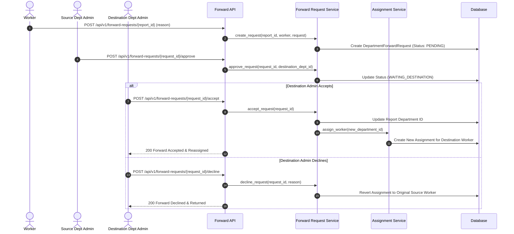

---

### Workflow 6: Duplicate Detection Flow

```mermaid
flowchart TD
    NewReport([New Report Submission Upload]) --> ExtractGPS[Extract Decimal Latitude & Longitude]
    ExtractGPS --> QueryNearby[Find Active Reports within DUPLICATE_REPORT_RADIUS_METERS (8m)]
    QueryNearby --> NearbyFound{Nearby Active Reports Found?}
    NearbyFound -- No --> ReturnNoDup[Return Duplicate: None]
    NearbyFound -- Yes --> MatchIssueClass{Same Issue Type / Class?}
    MatchIssueClass -- No --> ReturnNoDup
    MatchIssueClass -- Yes --> CheckScene{DUPLICATE_ENABLE_SCENE_CHECK == True?}
    CheckScene -- No --> MarkDuplicate[Mark Duplicate Found]
    CheckScene -- Yes --> RunCLIP[Compare Image Embeddings via OpenCLIP]
    RunCLIP --> SimCheck{Scene Similarity >= 0.82?}
    SimCheck -- No --> ReturnNoDup
    SimCheck -- Yes --> MarkDuplicate
    MarkDuplicate --> AddSupport[Add Citizen Support to Existing Report & Increment Support Count]
```

---

### Workflow 7: AI Inference Pipeline Flow

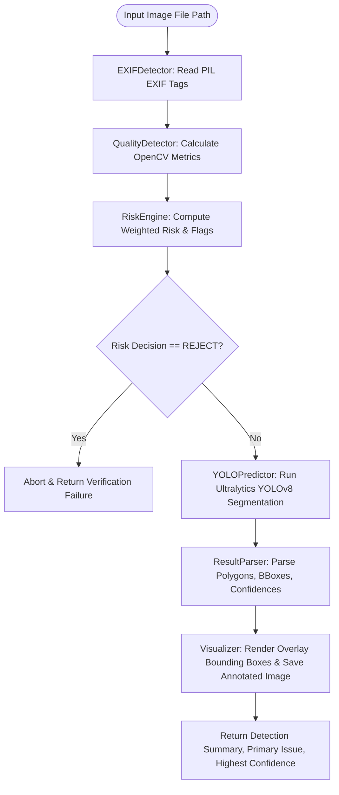

---

### Workflow 8: Notification & Email Flow

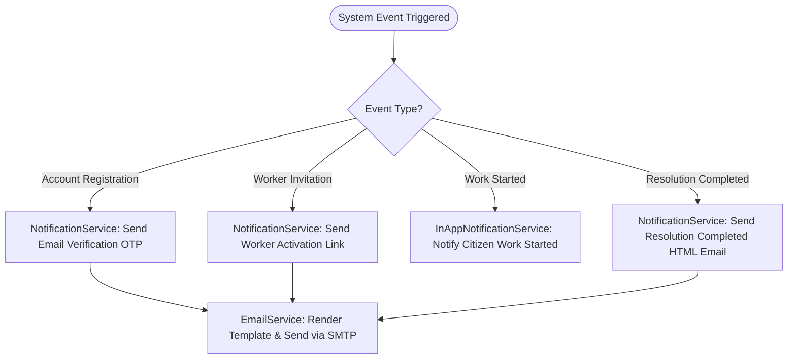

---

### Workflow 9: Citizen Timeline Flow

```mermaid
flowchart TD
    TimelineReq([Citizen Requests Timeline GET /api/v1/reports/{id}/timeline]) --> AuthCitizen[Verify Citizen Ownership]
    AuthCitizen --> QueryLogs[AuditLogCRUD: Fetch Audit Logs for Report ID]
    QueryLogs --> MapEvents[Map Internal Actions to Citizen-Facing Titles & Descriptions]
    MapEvents --> FormatTimeline[Format Timestamps & Timeline Items]
    FormatTimeline --> ReturnJson[Return JSON Array of Chronological Events]
```

---

### Workflow 10: Refresh Token Session Management Flow

This workflow handles rotation of refresh tokens to maintain long-lived sessions safely, revoke reused tokens (replay attack prevention), and execute logouts.

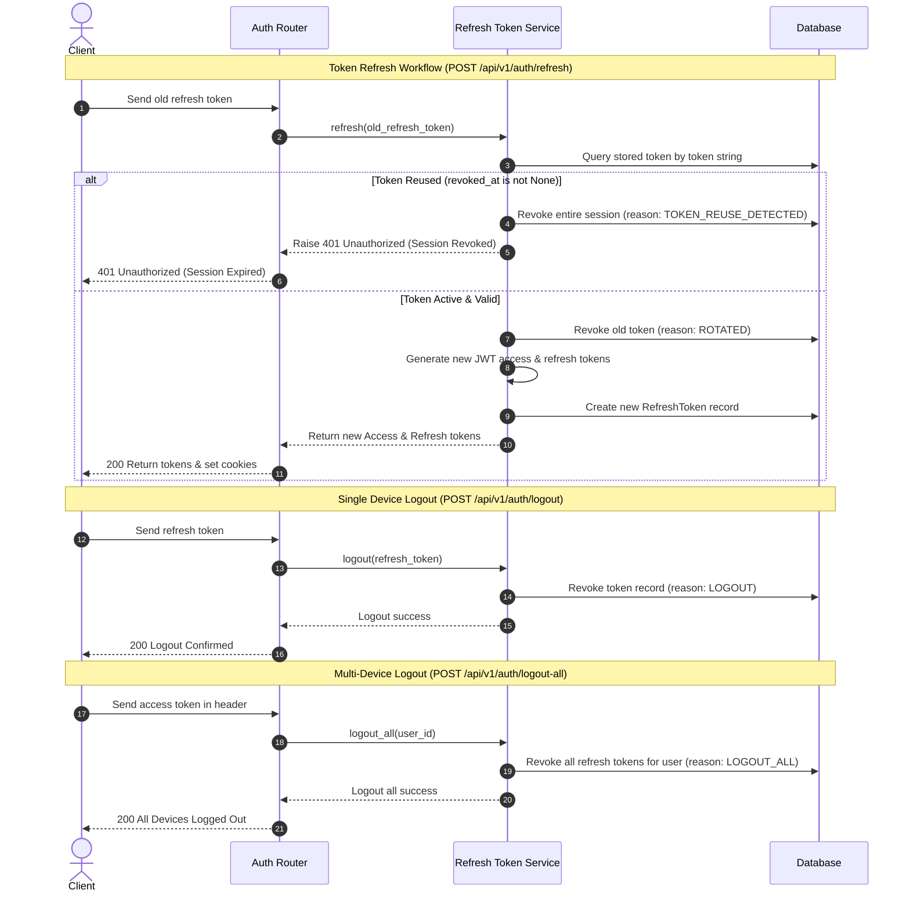
