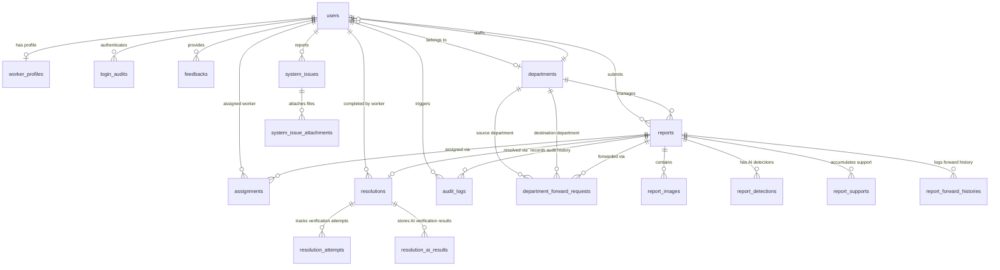

# CSCRS Database Schema & Relationship Documentation

## 1. Entity Relationship Diagram (ERD)

---

## 2. Enumeration Definitions

### `UserRole`
- `Citizen`: Standard public user submitting civic issues.
- `Worker`: Municipal field worker executing physical repairs.
- `DepartmentAdmin`: Administrator governing a specific municipal department.
- `CityAdmin`: Citywide administrator monitoring all departments and analytics.
- `SuperAdmin`: System owner with full administrative access.

### `ReportStatus`
- `Pending`: Newly submitted report awaiting verification / worker assignment.
- `Assigned`: Report assigned to a field worker.
- `In Progress`: Worker confirmed arrival on site and initiated repair work.
- `Resolved`: Resolution photo verified and issue completed.
- `Verified`: Manual review verified.
- `Closed`: Report archived and finalized.
- `Cancelled`: Report cancelled by department admin.
- `Rejected`: Report rejected during automated image verification.

### `Priority`
- `Low`, `Medium`, `High`, `Critical`: Assigned based on AI detection issue severity.

### `ImageType`
- `Original`: Original photo uploaded by citizen.
- `Annotated`: Rendered image with bounding boxes overlay.
- `Resolution`: Proof photo uploaded by worker after repair.

### `VerificationDecision`
- `PASS`: Verification passed risk engine thresholds.
- `REVIEW`: Flagged for manual administrative review.
- `REJECT`: High risk detected; report submission aborted.

### `AssignmentStatus`
- `Assigned`, `Accepted`, `In Progress`, `Rejected`, `Completed`, `Cancelled`, `Rework Required`

### `ForwardRequestStatus`
- `Pending`: Worker requested forward transfer.
- `Approved By Source`: Source Admin approved forwarding.
- `Waiting Destination`: Pending destination department approval.
- `Accepted`: Destination department accepted report.
- `Rejected`: Forward request declined/rejected.

---

## 3. Database Table Definitions

### 3.1 `users`
Stores all user accounts across all 5 roles.
- `id` (Integer, Primary Key, Autoincrement)
- `name` (String(100), Not Null)
- `email` (String(255), Unique, Index, Not Null)
- `phone` (String(20), Unique, Index, Nullable)
- `hashed_password` (String(255), Not Null)
- `role` (Enum(`UserRole`), Not Null, Default: `CITIZEN`)
- `is_active` (Boolean, Default: `False`)
- `is_blocked` (Boolean, Default: `False`)
- `block_type` (Enum(`BlockType`), Nullable)
- `block_reason` (Text, Nullable)
- `department_id` (Integer, Foreign Key `departments.id`, Nullable)
- `profile_image` (String(255), Nullable)
- `created_at` (DateTime, Default: `utcnow`)
- `updated_at` (DateTime, Default: `utcnow`)

### 3.2 `departments`
Municipal department entities responsible for specific issue types.
- `id` (Integer, Primary Key, Autoincrement)
- `name` (String(100), Unique, Not Null)
- `description` (Text, Nullable)
- `code` (String(20), Unique, Not Null)
- `is_active` (Boolean, Default: `True`)
- `created_at` (DateTime, Default: `utcnow`)

### 3.3 `worker_profiles`
Extended operational attributes for `WORKER` role users.
- `id` (Integer, Primary Key, Autoincrement)
- `user_id` (Integer, Foreign Key `users.id`, Unique, Not Null)
- `employee_code` (String(50), Unique, Not Null)
- `designation` (String(100), Nullable)
- `phone_extension` (String(10), Nullable)
- `is_available` (Boolean, Default: `True`)
- `active_assignment_count` (Integer, Default: 0)

### 3.4 `reports`
Core civic issue report records.
- `id` (Integer, Primary Key, Autoincrement)
- `report_number` (String(50), Unique, Index, Not Null)
- `citizen_id` (Integer, Foreign Key `users.id`, Not Null)
- `department_id` (Integer, Foreign Key `departments.id`, Not Null)
- `issue_type` (String(100), Not Null)
- `description` (Text, Nullable)
- `status` (Enum(`ReportStatus`), Default: `PENDING`, Index)
- `priority` (Enum(`Priority`), Default: `MEDIUM`, Index)
- `latitude` (Float, Index, Not Null)
- `longitude` (Float, Index, Not Null)
- `address` (Text, Nullable)
- `support_count` (Integer, Default: 1)
- `forward_count` (Integer, Default: 0)
- `created_at` (DateTime, Default: `utcnow`, Index)
- `updated_at` (DateTime, Default: `utcnow`)

### 3.5 `report_images`
Image asset tracking associated with civic reports.
- `id` (Integer, Primary Key, Autoincrement)
- `report_id` (Integer, Foreign Key `reports.id`, Index, Not Null)
- `image_type` (Enum(`ImageType`), Not Null)
- `image_path` (String(500), Not Null)
- `original_filename` (String(255), Not Null)
- `file_size` (Integer, Not Null)
- `mime_type` (String(100), Not Null)
- `created_at` (DateTime, Default: `utcnow`)

### 3.6 `report_detections`
YOLO object bounding box and polygon detection outputs.
- `id` (Integer, Primary Key, Autoincrement)
- `report_id` (Integer, Foreign Key `reports.id`, Not Null)
- `class_name` (String(100), Not Null)
- `confidence` (Float, Not Null)
- `bbox_x1`, `bbox_y1`, `bbox_x2`, `bbox_y2` (Float, Not Null)
- `polygon_json` (Text, Nullable)
- `model_version` (String(50), Not Null)
- `inference_time_ms` (Integer, Not Null)

### 3.7 `report_supports`
Duplicate report citizen endorsement records.
- `id` (Integer, Primary Key, Autoincrement)
- `report_id` (Integer, Foreign Key `reports.id`, Index, Not Null)
- `citizen_id` (Integer, Foreign Key `users.id`, Index, Not Null)
- `created_at` (DateTime, Default: `utcnow`)

### 3.8 `assignments`
Worker task assignments for report execution.
- `id` (Integer, Primary Key, Autoincrement)
- `report_id` (Integer, Foreign Key `reports.id`, Index, Not Null)
- `worker_id` (Integer, Foreign Key `users.id`, Index, Not Null)
- `assigned_by` (Integer, Foreign Key `users.id`, Not Null)
- `status` (Enum(`AssignmentStatus`), Default: `ASSIGNED`, Index)
- `remarks` (Text, Nullable)
- `assigned_at` (DateTime, Default: `utcnow`)
- `work_started_at` (DateTime, Nullable)
- `work_started_latitude` (Float, Nullable)
- `work_started_longitude` (Float, Nullable)
- `completed_at` (DateTime, Nullable)

### 3.9 `resolutions`
Final report resolution records.
- `id` (Integer, Primary Key, Autoincrement)
- `report_id` (Integer, Foreign Key `reports.id`, Unique, Not Null)
- `worker_id` (Integer, Foreign Key `users.id`, Not Null)
- `verification_passed` (Boolean, Default: `False`)
- `verification_score` (Float, Nullable)
- `verification_decision` (Enum(`VerificationDecision`), Nullable)
- `manual_review` (Boolean, Default: `False`)
- `remarks` (Text, Nullable)
- `resolved_at` (DateTime, Default: `utcnow`)
- `verified_at` (DateTime, Nullable)

### 3.10 `resolution_attempts`
Historical resolution verification attempt logs.
- `id` (Integer, Primary Key, Autoincrement)
- `resolution_id` (Integer, Foreign Key `resolutions.id`, Index, Not Null)
- `image_path` (String(500), Not Null)
- `annotated_image_path` (String(500), Nullable)
- `verification_passed` (Boolean, Default: `False`)
- `verification_score` (Float, Nullable)
- `verification_decision` (String(50), Nullable)
- `ai_decision` (String(50), Nullable)
- `failure_reason` (Text, Nullable)
- `scene_similarity` (Float, Nullable)
- `same_scene` (Boolean, Nullable)
- `yolo_issue_found` (Boolean, Nullable)
- `created_at` (DateTime, Default: `utcnow`)

### 3.11 `resolution_ai_results`
AI evaluation outputs for resolution verification.
- `id` (Integer, Primary Key, Autoincrement)
- `report_id` (Integer, Foreign Key `reports.id`, Index, Not Null)
- `attempt_number` (Integer, Not Null)
- `scene_similarity` (Float, Not Null)
- `same_scene` (Boolean, Not Null)
- `yolo_issue_found` (Boolean, Not Null)
- `ai_decision` (Enum(`ResolutionDecision`), Not Null)
- `model_version` (String(50), Nullable)
- `created_at` (DateTime, Default: `utcnow`)

### 3.12 `department_forward_requests`
Inter-department forward request records.
- `id` (Integer, Primary Key, Autoincrement)
- `report_id` (Integer, Foreign Key `reports.id`, Index, Not Null)
- `worker_id` (Integer, Foreign Key `users.id`, Not Null)
- `current_department_id` (Integer, Foreign Key `departments.id`, Not Null)
- `destination_department_id` (Integer, Foreign Key `departments.id`, Nullable)
- `reason` (Text, Not Null)
- `status` (Enum(`ForwardRequestStatus`), Default: `PENDING`, Index)
- `reviewed_by` (Integer, Foreign Key `users.id`, Nullable)
- `reviewed_at` (DateTime, Nullable)
- `decision_reason` (Text, Nullable)
- `created_at` (DateTime, Default: `utcnow`)

### 3.13 `audit_logs`
System activity audit trail.
- `id` (Integer, Primary Key, Autoincrement)
- `report_id` (Integer, Foreign Key `reports.id`, Index, Nullable)
- `user_id` (Integer, Foreign Key `users.id`, Index, Nullable)
- `action` (String(100), Index, Not Null)
- `details` (Text, Nullable)
- `created_at` (DateTime, Default: `utcnow`, Index)

### 3.14 `in_app_notifications`
In-app notification records.
- `id` (Integer, Primary Key, Autoincrement)
- `user_id` (Integer, Foreign Key `users.id`, Index, Not Null)
- `report_id` (Integer, Foreign Key `reports.id`, Nullable)
- `title` (String(200), Not Null)
- `message` (Text, Not Null)
- `notification_type` (String(50), Not Null)
- `is_read` (Boolean, Default: `False`)
- `created_at` (DateTime, Default: `utcnow`, Index)
