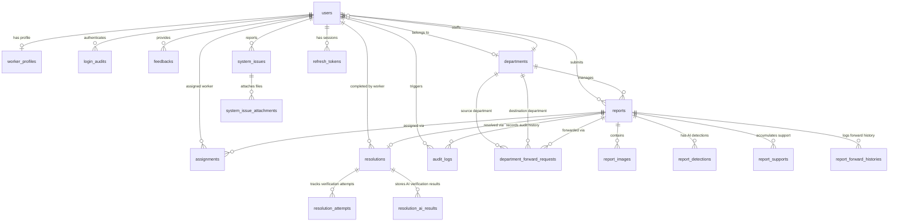

# CSCRS Database Schema & Relationship Documentation

## 1. Entity Relationship Diagram (ERD)

---

## 2. Enumeration Definitions

### `UserRole`
- `Citizen`: Standard public user submitting civic issues.
- `Worker`: Municipal field worker executing physical repairs.
- `DepartmentAdmin`: Administrator governing a specific municipal department.
- `CityAdmin`: Citywide administrator monitoring all departments and analytics.
- `SuperAdmin`: System owner with full administrative access.

### `ReportStatus`
- `Pending`: Newly submitted report awaiting verification / worker assignment.
- `Assigned`: Report assigned to a field worker.
- `In Progress`: Worker confirmed arrival on site and initiated repair work.
- `Resolved`: Resolution photo verified and issue completed.
- `Verified`: Manual review verified.
- `Closed`: Report archived and finalized.
- `Cancelled`: Report cancelled by department admin.
- `Rejected`: Report rejected during automated image verification.

### `Priority`
- `Low`, `Medium`, `High`, `Critical`: Assigned based on AI detection issue severity.

### `ImageType`
- `Original`: Original photo uploaded by citizen.
- `Annotated`: Rendered image with bounding boxes overlay.
- `Resolution`: Proof photo uploaded by worker after repair.

### `VerificationDecision`
- `PASS`: Verification passed risk engine thresholds.
- `REVIEW`: Flagged for manual administrative review.
- `REJECT`: High risk detected; report submission aborted.

### `AssignmentStatus`
- `Assigned`, `Accepted`, `In Progress`, `Rejected`, `Completed`, `Cancelled`, `Rework Required`

### `ForwardRequestStatus`
- `Pending`: Worker requested forward transfer.
- `Approved By Source`: Source Admin approved forwarding.
- `Waiting Destination`: Pending destination department approval.
- `Accepted`: Destination department accepted report.
- `Rejected`: Forward request declined/rejected.
- `Forwarded Again`: Destination department forwarded again.
- `Cancelled`: Request cancelled.

### `ResolutionDecision`
- `Fully Resolved`: Resolution verified successfully.
- `Partially Resolved`: Resolution verified partially.
- `Not Resolved`: Resolution failed verification.
- `Review Required`: Resolution requires manual review.

### `ForwardReasonType`
- `WRONG_AI_CLASSIFICATION`: Misclassified by AI detector.
- `WRONG_CITIZEN_CATEGORY`: Wrongly categorized by citizen.
- `ADMINISTRATIVE_TRANSFER`: Administrative department transfer.
- `DUPLICATE_DEPARTMENT`: Duplicate department handling.
- `OTHER`: Other reasons.

### `ReportCancellationReason`
- `DUPLICATE`: Duplicate of an existing report.
- `ALREADY_RESOLVED`: Issue has already been fixed.
- `NOT_A_CIVIC_ISSUE`: Reported item is not a civic issue.
- `FALSE_REPORT`: Spammed or fake report.
- `OUTSIDE_JURISDICTION`: Location falls outside handled area.
- `OTHER`: Other cancellation reason.

### `BlockType`
- `RETIRED`: Worker retired from duty.
- `TRANSFERRED`: Transferred to another department or region.
- `SUSPENDED`: Suspended due to investigation.
- `TERMINATED`: Terminated due to policy violation.
- `DISMISSED`: Dismissed.

### `SystemIssueStatus`
- `OPEN`: Bug reported, awaiting review.
- `IN_REVIEW`: Bug currently being reviewed.
- `RESOLVED`: Bug resolved.
- `REJECTED`: Bug report rejected.

### `SystemIssueCategory`
- `Authentication`, `Authorization`, `Report Submission`, `Report Verification`, `Duplicate Detection`, `Assignment`, `Worker`, `Resolution Upload`, `Resolution Verification`, `Timeline`, `Notification`, `Email`, `Dashboard`, `Search`, `Filter`, `Performance`, `UI / UX`, `API`, `Database`, `AI Detection`, `GPS / EXIF`, `Image Upload`, `Video Upload`, `Security`, `Other`.

---

## 3. Database Table Definitions

### 3.1 `users`
Stores all user accounts across all 5 roles.
- `id` (Integer, Primary Key, Autoincrement)
- `name` (String(100), Not Null)
- `email` (String(255), Unique, Index, Not Null)
- `phone` (String(20), Unique, Nullable)
- `profile_image` (String(500), Nullable)
- `password_hash` (String(255), Not Null)
- `is_active` (Boolean, Default: `False`, Not Null)
- `is_email_verified` (Boolean, Default: `False`, Not Null)
- `is_blocked` (Boolean, Default: `False`, Not Null)
- `blocked_at` (DateTime, Nullable)
- `blocked_by` (Integer, Foreign Key `users.id`, Nullable)
- `block_reason` (String(500), Nullable)
- `block_type` (String(20), Nullable)
- `role` (Enum(`UserRole`), Default: `CITIZEN`, Index, Not Null)
- `department_id` (Integer, Foreign Key `departments.id`, Index, Nullable)
- `created_at` (DateTime, server_default=func.now())
- `last_successful_login` (DateTime, Nullable)
- `last_failed_login` (DateTime, Nullable)
- `failed_login_attempts` (Integer, Default: 0, Not Null)
- `account_locked_until` (DateTime, Nullable)

### 3.2 `departments`
Municipal department entities responsible for specific issue types.
- `id` (Integer, Primary Key, Autoincrement)
- `name` (String(100), Unique, Not Null)
- `description` (String(255), Nullable)
- `is_active` (Boolean, Default: `True`)
- `created_at` (DateTime, server_default=func.now())

### 3.3 `worker_profiles`
Extended operational attributes for `WORKER` role users.
- `id` (Integer, Primary Key, Autoincrement)
- `user_id` (Integer, Foreign Key `users.id`, Unique, Not Null)
- `department_id` (Integer, Foreign Key `departments.id`, Not Null)
- `employee_code` (String(30), Unique, Not Null)
- `designation` (String(100), Not Null)
- `phone_extension` (String(20), Nullable)
- `is_available` (Boolean, Default: `False`, Not Null)
- `joined_at` (DateTime, server_default=func.now())

### 3.4 `reports`
Core civic issue report records.
- `id` (Integer, Primary Key, Autoincrement)
- `report_number` (String(30), Unique, Index, Not Null)
- `citizen_id` (Integer, Foreign Key `users.id`, Index, Not Null)
- `department_id` (Integer, Foreign Key `departments.id`, Index, Not Null)
- `issue_type` (String(100), Not Null)
- `description` (Text, Nullable)
- `latitude` (Float, Not Null)
- `longitude` (Float, Not Null)
- `address` (String(255), Nullable)
- `risk_score` (Float, Not Null)
- `ai_confidence` (Float, Not Null)
- `verification_decision` (Enum(`VerificationDecision`), Not Null)
- `verification_passed` (Boolean, Not Null)
- `priority` (Enum(`Priority`), Default: `MEDIUM`, Index, Not Null)
- `status` (Enum(`ReportStatus`), Default: `PENDING`, Index, Not Null)
- `created_at` (DateTime, server_default=func.now())
- `support_count` (Integer, Default: 0, Not Null)
- `forward_count` (Integer, Default: 0, Not Null)
- `updated_at` (DateTime, server_default=func.now(), onupdate=func.now())

### 3.5 `report_images`
Image asset tracking associated with civic reports.
- `id` (Integer, Primary Key, Autoincrement)
- `report_id` (Integer, Foreign Key `reports.id`, Index, Not Null)
- `original_filename` (String(255), Not Null)
- `stored_filename` (String(255), Not Null)
- `image_path` (String(500), Not Null)
- `mime_type` (String(100), Not Null)
- `file_size` (Integer, Not Null)
- `image_type` (Enum(`ImageType`), Default: `ORIGINAL`, Not Null)
- `uploaded_at` (DateTime, server_default=func.now())

### 3.6 `report_detections`
YOLO object bounding box and polygon detection outputs.
- `id` (Integer, Primary Key, Autoincrement)
- `report_id` (Integer, Foreign Key `reports.id`, Index, Not Null)
- `class_name` (String(100), Not Null)
- `confidence` (Float, Not Null)
- `bbox` (JSON, Not Null)
- `mask_area` (Float, Not Null)
- `model_version` (String(100), Not Null)
- `inference_time_ms` (Integer, Not Null)
- `created_at` (DateTime, server_default=func.now())

### 3.7 `report_supports`
Duplicate report citizen endorsement records.
- `id` (Integer, Primary Key, Autoincrement)
- `report_id` (Integer, Foreign Key `reports.id`, Index, Not Null)
- `citizen_id` (Integer, Foreign Key `users.id`, Index, Not Null)
- `created_at` (DateTime, server_default=func.now(), Not Null)

### 3.8 `assignments`
Worker task assignments for report execution.
- `id` (Integer, Primary Key, Autoincrement)
- `report_id` (Integer, Foreign Key `reports.id`, Index, Not Null)
- `worker_id` (Integer, Foreign Key `users.id`, Index, Not Null)
- `assigned_by` (Integer, Foreign Key `users.id`, Not Null)
- `assigned_at` (DateTime, server_default=func.now())
- `accepted_at` (DateTime, Nullable)
- `completed_at` (DateTime, Nullable)
- `work_started_at` (DateTime, Nullable)
- `work_started_latitude` (Float, Nullable)
- `work_started_longitude` (Float, Nullable)
- `status` (Enum(`AssignmentStatus`), Default: `ASSIGNED`, Index, Not Null)
- `remarks` (Text, Nullable)

### 3.9 `resolutions`
Final report resolution records.
- `id` (Integer, Primary Key, Autoincrement)
- `report_id` (Integer, Foreign Key `reports.id`, Unique, Not Null)
- `worker_id` (Integer, Foreign Key `users.id`, Not Null)
- `remarks` (Text, Nullable)
- `verification_passed` (Boolean, Default: `False`, Not Null)
- `resolved_at` (DateTime, server_default=func.now())
- `verification_score` (Float, Nullable)
- `verification_decision` (Enum(`VerificationDecision`), Nullable)
- `manual_review` (Boolean, Default: `False`, Not Null)
- `verified_at` (DateTime, Nullable)

### 3.10 `resolution_attempts`
Historical resolution verification attempt logs.
- `id` (Integer, Primary Key)
- `resolution_id` (Integer, Foreign Key `resolutions.id`, Index, Not Null)
- `attempt_number` (Integer, Not Null)
- `image_path` (String, Not Null)
- `annotated_image_path` (String, Nullable)
- `verification_passed` (Boolean, Not Null)
- `verification_score` (Float, Nullable)
- `verification_decision` (String(30), Nullable)
- `ai_decision` (String(30), Nullable)
- `failure_reason` (String(100), Nullable)
- `model_version` (String(100), Nullable)
- `scene_similarity` (Float, Nullable)
- `same_scene` (Boolean, Nullable)
- `yolo_issue_found` (Boolean, Nullable)
- `created_at` (DateTime, server_default=func.now())

### 3.11 `resolution_ai_results`
AI evaluation outputs for resolution verification.
- `id` (Integer, Primary Key, Autoincrement)
- `report_id` (Integer, Foreign Key `reports.id`, Index, Not Null)
- `attempt_number` (Integer, Default: 1, Not Null)
- `scene_similarity` (Float, Nullable)
- `same_scene` (Boolean, Nullable)
- `yolo_issue_found` (Boolean, Nullable)
- `ai_decision` (Enum(`ResolutionDecision`), Not Null)
- `model_version` (String(100), Not Null)
- `created_at` (DateTime, server_default=func.now())

### 3.12 `department_forward_requests`
Inter-department forward request records.
- `id` (Integer, Primary Key, Autoincrement)
- `report_id` (Integer, Foreign Key `reports.id`, Index, Not Null)
- `worker_id` (Integer, Foreign Key `users.id`, Index, Not Null)
- `current_department_id` (Integer, Foreign Key `departments.id`, Not Null)
- `destination_department_id` (Integer, Foreign Key `departments.id`, Nullable)
- `reason` (Text, Not Null)
- `status` (Enum(`ForwardRequestStatus`), Default: `PENDING`, Not Null)
- `decision_reason` (Text, Nullable)
- `reviewed_by` (Integer, Foreign Key `users.id`, Nullable)
- `reviewed_at` (DateTime, Nullable)
- `created_at` (DateTime, server_default=func.now(), Not Null)

### 3.13 `audit_logs`
System activity audit trail.
- `id` (Integer, Primary Key, Autoincrement)
- `report_id` (Integer, Foreign Key `reports.id`, Index, Nullable)
- `user_id` (Integer, Foreign Key `users.id`, Index, Nullable)
- `action` (String(100), Index, Not Null)
- `details` (Text, Nullable)
- `created_at` (DateTime, server_default=func.now(), Index, Not Null)

### 3.14 `in_app_notifications`
In-app notification records.
- `id` (Integer, Primary Key, Autoincrement)
- `user_id` (Integer, Foreign Key `users.id`, Index, Not Null)
- `report_id` (Integer, Foreign Key `reports.id`, Nullable)
- `title` (String(200), Not Null)
- `message` (Text, Not Null)
- `notification_type` (String(50), Not Null)
- `is_read` (Boolean, Default: `False`)
- `created_at` (DateTime, server_default=func.now(), Index, Not Null)

### 3.15 `email_verifications`
OTP-based email verification records.
- `id` (Integer, Primary Key, Autoincrement)
- `user_id` (Integer, Foreign Key `users.id`, Index, Not Null)
- `otp_hash` (String(64), Not Null)
- `expires_at` (DateTime, Not Null)
- `verified` (Boolean, Default: `False`, Not Null)
- `attempts` (Integer, Default: 0, Not Null)
- `created_at` (DateTime, server_default=func.now())

### 3.16 `password_resets`
OTP-based password reset records.
- `id` (Integer, Primary Key, Autoincrement)
- `user_id` (Integer, Foreign Key `users.id`, Index, Not Null)
- `otp_hash` (String, Not Null)
- `expires_at` (DateTime, Not Null)
- `verified` (Boolean, Default: `False`, Not Null)
- `attempts` (Integer, Default: 0, Not Null)
- `created_at` (DateTime, server_default=func.now())

### 3.17 `worker_invitations`
Worker invitation and activation tokens.
- `id` (Integer, Primary Key, Autoincrement)
- `user_id` (Integer, Foreign Key `users.id`, Unique, Not Null)
- `token_hash` (String(255), Not Null)
- `expires_at` (DateTime, Not Null)
- `used` (Boolean, Default: `False`, Not Null)
- `created_at` (DateTime, server_default=func.now())

### 3.18 `feedbacks`
Citizen application feedback records.
- `id` (Integer, Primary Key, Autoincrement)
- `user_id` (Integer, Foreign Key `users.id`, Index, Not Null)
- `rating` (Integer, Not Null)
- `liked_text` (Text, Nullable)
- `suggestion_text` (Text, Nullable)
- `created_at` (DateTime, server_default=func.now(), Not Null)

### 3.19 `login_audits`
Login history and session analytics audits.
- `id` (Integer, Primary Key, Autoincrement)
- `user_id` (Integer, Foreign Key `users.id`, Index, Nullable)
- `email` (String(255), Not Null)
- `role` (String(50), Nullable)
- `login_success` (Boolean, Not Null)
- `failure_reason` (Text, Nullable)
- `ip_address` (String(45), Nullable)
- `user_agent` (Text, Nullable)
- `browser` (String(100), Nullable)
- `browser_version` (String(50), Nullable)
- `operating_system` (String(100), Nullable)
- `os_version` (String(50), Nullable)
- `device_type` (String(50), Nullable)
- `platform` (String(100), Nullable)
- `city` (String(100), Nullable)
- `state` (String(100), Nullable)
- `country` (String(100), Nullable)
- `request_path` (String(255), Nullable)
- `http_method` (String(10), Nullable)
- `login_source` (String(50), Nullable)
- `login_at` (DateTime, server_default=func.now(), Not Null)
- `logout_at` (DateTime, Nullable)
- `session_id` (String(255), Index, Nullable)
- `jwt_id` (String(255), Index, Nullable)

### 3.20 `system_issues`
System issues and platform bug reports.
- `id` (Integer, Primary Key, Autoincrement)
- `issue_number` (String(50), Unique, Index, Not Null)
- `reporter_id` (Integer, Foreign Key `users.id`, Index, Not Null)
- `related_report_id` (Integer, Foreign Key `reports.id`, Nullable)
- `title` (String(200), Not Null)
- `description` (Text, Not Null)
- `category` (Enum(`SystemIssueCategory`), Default: `OTHER`, Index, Not Null)
- `status` (Enum(`SystemIssueStatus`), Default: `OPEN`, Index, Not Null)
- `created_at` (DateTime, server_default=func.now(), Not Null)
- `updated_at` (DateTime, server_default=func.now(), onupdate=func.now(), Not Null)
- `closed_at` (DateTime, Nullable)
- `remarks` (Text, Nullable)

### 3.21 `system_issue_attachments`
Attachments associated with system issues.
- `id` (Integer, Primary Key, Autoincrement)
- `issue_id` (Integer, Foreign Key `system_issues.id`, Index, Not Null)
- `original_filename` (String(255), Not Null)
- `stored_filename` (String(255), Not Null)
- `file_path` (String(500), Not Null)
- `mime_type` (String(100), Not Null)
- `file_size` (Integer, Not Null)
- `created_at` (DateTime, server_default=func.now(), Not Null)

### 3.22 `report_forward_history`
Inter-department report transfer history trail.
- `id` (Integer, Primary Key, Autoincrement)
- `report_id` (Integer, Foreign Key `reports.id`, Not Null)
- `forward_number` (Integer, Not Null)
- `from_department_id` (Integer, Foreign Key `departments.id`, Not Null)
- `to_department_id` (Integer, Foreign Key `departments.id`, Not Null)
- `forwarded_by` (Integer, Foreign Key `users.id`, Not Null)
- `issue_type` (String(100), Not Null)
- `reason_type` (Enum(`ForwardReasonType`), Not Null)
- `remarks` (String(500), Nullable)
- `created_at` (DateTime, server_default=func.now())

### 3.23 `refresh_tokens`
User refresh token session storage.
- `id` (Integer, Primary Key, Autoincrement)
- `user_id` (Integer, Foreign Key `users.id`, Index, Not Null)
- `token_hash` (String(64), Unique, Index, Not Null)
- `jwt_id` (String(36), Unique, Index, Not Null)
- `session_id` (String(36), Index, Not Null)
- `ip_address` (String(64), Nullable)
- `device_type` (String(50), Nullable)
- `browser` (String(100), Nullable)
- `operating_system` (String(100), Nullable)
- `created_at` (DateTime, server_default=func.now())
- `expires_at` (DateTime, Not Null)
- `last_used_at` (DateTime, Nullable)
- `revoked_at` (DateTime, Nullable)
- `revoked_reason` (String(255), Nullable)

