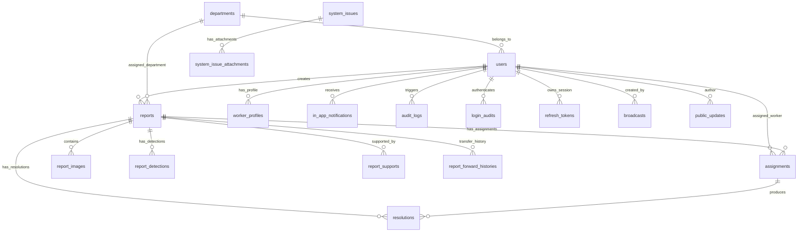

# CSCRS Database Schema & Migration Specification

This document provides a synchronized specification of the database layer for the **Crowdsourced Civic Issue Reporting and Resolution System (CSCRS)** (`backend/database`).

---

## 1. Database Architecture & ORM Setup

- **Supported RDBMS**: PostgreSQL 16 (Production) / SQLite (Development).
- **ORM Framework**: SQLAlchemy 2.0.51 using Declarative Base mapping (`backend/database/base.py`).
- **Connection Management (`backend/database/connection.py`)**: Uses `SessionLocal` with auto-flush disabled and connection pooling.
- **Migration Engine**: Alembic 1.18.5 (`backend/alembic`).

---

## 2. Global Enums (`backend/database/enums.py`)

| Enum Name | Enum Values | Usage / Description |
| :--- | :--- | :--- |
| `UserRole` | `Citizen`, `Worker`, `DepartmentAdmin`, `CityAdmin`, `SuperAdmin` | Platform access control roles. |
| `ReportStatus` | `Pending`, `Assigned`, `In Progress`, `Resolved`, `Verified`, `Closed`, `Cancelled`, `Rejected` | Report lifecycle state. |
| `Priority` | `Low`, `Medium`, `High`, `Critical` | Civic issue priority score. |
| `ImageType` | `Original`, `Annotated`, `Resolution` | Category of uploaded report image. |
| `VerificationDecision` | `PASS`, `REVIEW`, `REJECT` | AI quality & verification decision. |
| `AssignmentStatus` | `Assigned`, `Accepted`, `In Progress`, `Rejected`, `Completed`, `Cancelled`, `Rework Required` | Worker assignment execution status. |
| `ResolutionDecision` | `Fully Resolved`, `Partially Resolved`, `Not Resolved`, `Review Required` | AI resolution verification decision. |
| `ForwardReasonType` | `WRONG_AI_CLASSIFICATION`, `WRONG_CITIZEN_CATEGORY`, `ADMINISTRATIVE_TRANSFER`, `DUPLICATE_DEPARTMENT`, `OTHER` | Reason code for inter-department transfer. |
| `ReportCancellationReason` | `DUPLICATE`, `ALREADY_RESOLVED`, `NOT_A_CIVIC_ISSUE`, `FALSE_REPORT`, `OUTSIDE_JURISDICTION`, `OTHER` | Reason code for report cancellation. |
| `ForwardRequestStatus` | `Pending`, `Approved By Source`, `Waiting Destination`, `Accepted`, `Rejected`, `Forwarded Again`, `Cancelled` | Lifecycle state of inter-department transfer request. |
| `BlockType` | `RETIRED`, `TRANSFERRED`, `SUSPENDED`, `TERMINATED`, `DISMISSED` | Reason for blocking worker or admin account. |
| `SystemIssueStatus` | `OPEN`, `IN_REVIEW`, `RESOLVED`, `REJECTED` | Status of system bug reports. |
| `SystemIssueCategory` | `Authentication`, `Authorization`, `Report Submission`, `Report Verification`, `Duplicate Detection`, `Assignment`, `Worker`, `Resolution Upload`, `Resolution Verification`, `Timeline`, `Notification`, `Email`, `Dashboard`, `Search`, `Filter`, `Performance`, `UI / UX`, `API`, `Database`, `AI Detection`, `GPS / EXIF`, `Image Upload`, `Video Upload`, `Security`, `Other` | System issue classification category. |

---

## 3. Entity Relationship Overview

---

## 4. Entity Specifications (26 SQLAlchemy Models)

### 4.1 `users` (`User`)
Stores account profiles across all 5 roles.
- `id` (PK, Integer, autoincrement)
- `name` (String(100), non-nullable)
- `email` (String(255), unique, indexed, non-nullable)
- `phone` (String(20), nullable)
- `password_hash` (String(255), non-nullable)
- `role` (Enum(`UserRole`), default `Citizen`, non-nullable)
- `department_id` (FK $\rightarrow$ `departments.id`, nullable)
- `is_active` (Boolean, default `True`)
- `is_email_verified` (Boolean, default `False`)
- `is_blocked` (Boolean, default `False`)
- `block_type` (Enum(`BlockType`), nullable)
- `block_reason` (Text, nullable)
- `blocked_at` (DateTime(timezone=True), nullable)
- `blocked_by` (FK $\rightarrow$ `users.id`, nullable)
- `created_at` / `updated_at` (DateTime(timezone=True))

### 4.2 `departments` (`Department`)
Municipal functional departments (Roads, Sanitation, Water, Electrical, Waste).
- `id` (PK, Integer, autoincrement)
- `name` (String(100), unique, indexed, non-nullable)
- `code` (String(20), unique, indexed, non-nullable)
- `description` (Text, nullable)
- `is_active` (Boolean, default `True`)
- `created_at` / `updated_at` (DateTime(timezone=True))

### 4.3 `worker_profiles` (`WorkerProfile`)
Field worker details linked to a user account.
- `id` (PK, Integer, autoincrement)
- `user_id` (FK $\rightarrow$ `users.id`, unique, non-nullable)
- `department_id` (FK $\rightarrow$ `departments.id`, non-nullable)
- `employee_code` (String(50), unique, indexed, non-nullable)
- `designation` (String(100), nullable)
- `phone_extension` (String(10), nullable)
- `is_available` (Boolean, default `True`)
- `joined_at` (DateTime(timezone=True))

### 4.4 `reports` (`Report`)
Core civic issue report filings.
- `id` (PK, Integer, autoincrement)
- `report_number` (String(50), unique, indexed, non-nullable)
- `citizen_id` (FK $\rightarrow$ `users.id`, non-nullable)
- `department_id` (FK $\rightarrow$ `departments.id`, non-nullable)
- `issue_type` (String(100), indexed, non-nullable)
- `description` (Text, nullable)
- `status` (Enum(`ReportStatus`), default `Pending`, indexed, non-nullable)
- `priority` (Enum(`Priority`), default `Medium`, indexed, non-nullable)
- `latitude` / `longitude` (Float, indexed, nullable)
- `address` (Text, nullable)
- `support_count` (Integer, default 1)
- `cancelled_reason` (Enum(`ReportCancellationReason`), nullable)
- `cancellation_notes` (Text, nullable)
- `reopened_count` (Integer, default 0)
- `last_reopened_at` (DateTime(timezone=True), nullable)
- `created_at` / `updated_at` (DateTime(timezone=True))

### 4.5 `report_images` (`ReportImage`)
Associated photo media for citizen reports and worker resolution proofs.
- `id` (PK, Integer, autoincrement)
- `report_id` (FK $\rightarrow$ `reports.id`, non-nullable)
- `original_filename` (String(255), non-nullable)
- `stored_filename` (String(255), non-nullable)
- `image_path` (String(500), non-nullable)
- `mime_type` (String(50), non-nullable)
- `file_size` (Integer, non-nullable)
- `image_type` (Enum(`ImageType`), default `Original`, non-nullable)
- `created_at` (DateTime(timezone=True))

### 4.6 `assignments` (`Assignment`)
Worker job dispatches.
- `id` (PK, Integer, autoincrement)
- `report_id` (FK $\rightarrow$ `reports.id`, non-nullable)
- `worker_id` (FK $\rightarrow$ `users.id`, non-nullable)
- `assigned_by` (FK $\rightarrow$ `users.id`, non-nullable)
- `status` (Enum(`AssignmentStatus`), default `Assigned`, non-nullable)
- `remarks` (Text, nullable)
- `work_started_at` (DateTime(timezone=True), nullable)
- `start_latitude` / `start_longitude` (Float, nullable)
- `assigned_at` / `updated_at` (DateTime(timezone=True))

### 4.7 `resolutions` (`Resolution`)
Worker site repair proof submissions.
- `id` (PK, Integer, autoincrement)
- `assignment_id` (FK $\rightarrow$ `assignments.id`, unique, non-nullable)
- `report_id` (FK $\rightarrow$ `reports.id`, non-nullable)
- `worker_id` (FK $\rightarrow$ `users.id`, non-nullable)
- `remarks` (Text, nullable)
- `status` (Enum(`ReportStatus`), default `Resolved`, non-nullable)
- `submitted_at` (DateTime(timezone=True))

### 4.8 `resolution_ai_results` (`ResolutionAIResult`)
AI verification metrics comparing pre- and post-repair photos.
- `id` (PK, Integer, autoincrement)
- `resolution_id` (FK $\rightarrow$ `resolutions.id`, unique, non-nullable)
- `scene_similarity_score` (Float, non-nullable)
- `defect_resolved_confidence` (Float, non-nullable)
- `decision` (Enum(`ResolutionDecision`), non-nullable)
- `verified_at` (DateTime(timezone=True))

### 4.9 `resolution_attempts` (`ResolutionAttempt`)
Historical attempt log for resolution submissions.
- `id` (PK, Integer, autoincrement)
- `resolution_id` (FK $\rightarrow$ `resolutions.id`, non-nullable)
- `attempt_number` (Integer, non-nullable)
- `attempt_image_path` (String(500), non-nullable)
- `ai_decision` (Enum(`ResolutionDecision`), nullable)
- `created_at` (DateTime(timezone=True))

### 4.10 `report_detections` (`ReportDetection`)
YOLO object detection results stored per report.
- `id` (PK, Integer, autoincrement)
- `report_id` (FK $\rightarrow$ `reports.id`, non-nullable)
- `class_name` (String(100), non-nullable)
- `confidence` (Float, non-nullable)
- `bbox_x1`, `bbox_y1`, `bbox_x2`, `bbox_y2` (Float, non-nullable)
- `model_version` (String(50), nullable)
- `inference_time_ms` (Integer, nullable)

### 4.11 `report_supports` (`ReportSupport`)
Tracks secondary citizen support on duplicate reports.
- `id` (PK, Integer, autoincrement)
- `report_id` (FK $\rightarrow$ `reports.id`, non-nullable)
- `citizen_id` (FK $\rightarrow$ `users.id`, non-nullable)
- `created_at` (DateTime(timezone=True))

### 4.12 `report_forward_histories` (`ReportForwardHistory`)
Audit trail of report department transfers.
- `id` (PK, Integer, autoincrement)
- `report_id` (FK $\rightarrow$ `reports.id`, non-nullable)
- `from_department_id` (FK $\rightarrow$ `departments.id`, non-nullable)
- `to_department_id` (FK $\rightarrow$ `departments.id`, non-nullable)
- `forwarded_by` (FK $\rightarrow$ `users.id`, non-nullable)
- `reason` (Text, nullable)
- `created_at` (DateTime(timezone=True))

### 4.13 `department_forward_requests` (`DepartmentForwardRequest`)
Formal inter-department transfer requests.
- `id` (PK, Integer, autoincrement)
- `report_id` (FK $\rightarrow$ `reports.id`, non-nullable)
- `requested_by_worker_id` (FK $\rightarrow$ `users.id`, non-nullable)
- `source_department_id` (FK $\rightarrow$ `departments.id`, non-nullable)
- `target_department_id` (FK $\rightarrow$ `departments.id`, nullable)
- `status` (Enum(`ForwardRequestStatus`), default `Pending`, non-nullable)
- `reason_type` (Enum(`ForwardReasonType`), non-nullable)
- `worker_remarks` (Text, nullable)
- `source_admin_remarks` (Text, nullable)
- `destination_admin_remarks` (Text, nullable)
- `created_at` / `updated_at` (DateTime(timezone=True))

### 4.14 `in_app_notifications` (`InAppNotification`)
User targeted in-app notifications.
- `id` (PK, Integer, autoincrement)
- `user_id` (FK $\rightarrow$ `users.id`, non-nullable)
- `title` (String(200), non-nullable)
- `message` (Text, non-nullable)
- `is_read` (Boolean, default `False`)
- `created_at` (DateTime(timezone=True))

### 4.15 `broadcasts` (`Broadcast`)
Platform-wide system broadcasts created by Super Admins.
- `id` (PK, Integer, autoincrement)
- `broadcast_id` (String(50), unique, indexed, non-nullable)
- `title` (String(200), non-nullable)
- `message` (Text, non-nullable)
- `target_role` (String(50), default `ALL`, non-nullable)
- `announcement_type` (String(50), default `INFO`, non-nullable)
- `starts_at` (DateTime(timezone=True), nullable)
- `ends_at` (DateTime(timezone=True), nullable)
- `recipient_count` (Integer, default 0)
- `is_cancelled` (Boolean, default `False`)
- `created_by` (FK $\rightarrow$ `users.id`, non-nullable)
- `created_at` (DateTime(timezone=True))

### 4.16 `public_updates` (`PublicUpdate`)
Public news and press updates published by Super Admins.
- `id` (PK, Integer, autoincrement)
- `title` (String(200), non-nullable)
- `slug` (String(200), unique, indexed, non-nullable)
- `content` (Text, non-nullable)
- `category` (String(50), default `Press Release`, non-nullable)
- `thumbnail_url` (String(500), nullable)
- `is_published` (Boolean, default `False`, indexed)
- `published_at` (DateTime(timezone=True), nullable)
- `created_by_id` (FK $\rightarrow$ `users.id`, non-nullable)
- `created_at` / `updated_at` (DateTime(timezone=True))

### 4.17 `system_issues` (`SystemIssue`)
System bug and issue reports filed by users.
- `id` (PK, Integer, autoincrement)
- `issue_number` (String(100), unique, indexed, non-nullable)
- `reporter_id` (FK $\rightarrow$ `users.id`, non-nullable)
- `title` (String(200), non-nullable)
- `description` (Text, non-nullable)
- `category` (Enum(`SystemIssueCategory`), non-nullable)
- `status` (Enum(`SystemIssueStatus`), default `OPEN`, non-nullable)
- `related_report_number` (String(50), nullable)
- `admin_notes` (Text, nullable)
- `created_at` / `updated_at` (DateTime(timezone=True))

### 4.18 `system_issue_attachments` (`SystemIssueAttachment`)
File attachments associated with system issues.
- `id` (PK, Integer, autoincrement)
- `issue_id` (FK $\rightarrow$ `system_issues.id`, non-nullable)
- `file_path` (String(500), non-nullable)
- `file_name` (String(255), non-nullable)
- `file_size` (Integer, non-nullable)
- `created_at` (DateTime(timezone=True))

### 4.19 `feedback` (`Feedback`)
Citizen ratings and feedback comments for resolved reports.
- `id` (PK, Integer, autoincrement)
- `report_id` (FK $\rightarrow$ `reports.id`, unique, non-nullable)
- `citizen_id` (FK $\rightarrow$ `users.id`, non-nullable)
- `rating` (Integer, non-nullable) -- 1 to 5 stars
- `comments` (Text, nullable)
- `created_at` (DateTime(timezone=True))

### 4.20 `audit_logs` (`AuditLog`)
Immutable administrative action log.
- `id` (PK, Integer, autoincrement)
- `report_id` (FK $\rightarrow$ `reports.id`, nullable)
- `user_id` (FK $\rightarrow$ `users.id`, nullable)
- `action` (String(100), indexed, non-nullable)
- `details` (Text, nullable)
- `ip_address` (String(45), nullable)
- `created_at` (DateTime(timezone=True))

### 4.21 `login_audits` (`LoginAudit`)
User login security tracking log.
- `id` (PK, Integer, autoincrement)
- `user_id` (FK $\rightarrow$ `users.id`, nullable)
- `email` (String(255), indexed, non-nullable)
- `login_success` (Boolean, indexed, non-nullable)
- `ip_address` (String(45), nullable)
- `user_agent` (String(500), nullable)
- `failure_reason` (String(255), nullable)
- `created_at` (DateTime(timezone=True))

### 4.22 `refresh_tokens` (`RefreshToken`)
Session refresh tokens for JWT authentication rotation.
- `id` (PK, Integer, autoincrement)
- `user_id` (FK $\rightarrow$ `users.id`, non-nullable)
- `token_hash` (String(255), unique, indexed, non-nullable)
- `device_info` (String(255), nullable)
- `ip_address` (String(45), nullable)
- `is_revoked` (Boolean, default `False`)
- `expires_at` (DateTime(timezone=True), non-nullable)
- `created_at` (DateTime(timezone=True))

### 4.23 `email_verifications` (`EmailVerification`)
OTP codes for citizen email verification.
- `id` (PK, Integer, autoincrement)
- `user_id` (FK $\rightarrow$ `users.id`, non-nullable)
- `otp_code` (String(10), non-nullable)
- `expires_at` (DateTime(timezone=True), non-nullable)
- `attempts` (Integer, default 0)
- `resend_count` (Integer, default 0)
- `last_sent_at` (DateTime(timezone=True))

### 4.24 `password_resets` (`PasswordReset`)
OTP codes for account password reset.
- `id` (PK, Integer, autoincrement)
- `user_id` (FK $\rightarrow$ `users.id`, non-nullable)
- `otp_code` (String(10), non-nullable)
- `expires_at` (DateTime(timezone=True), non-nullable)
- `is_used` (Boolean, default `False`)
- `created_at` (DateTime(timezone=True))

### 4.25 `worker_invitations` (`WorkerInvitation`)
Activation tokens for newly onboarded field workers.
- `id` (PK, Integer, autoincrement)
- `email` (String(255), unique, indexed, non-nullable)
- `token` (String(100), unique, indexed, non-nullable)
- `department_id` (FK $\rightarrow$ `departments.id`, non-nullable)
- `employee_code` (String(50), non-nullable)
- `designation` (String(100), nullable)
- `phone_extension` (String(10), nullable)
- `expires_at` (DateTime(timezone=True), non-nullable)
- `is_used` (Boolean, default `False`)
- `created_at` (DateTime(timezone=True))

---

## 5. Alembic Migration Chain (`backend/alembic/versions`)

The repository contains 7 executed database migration revisions:

1. `08a946b86902_initial_postgresql_schema.py`: Initial schema creation establishing base tables (`users`, `departments`, `reports`, `assignments`, `resolutions`, etc.).
2. `2a344703429c_fix_timestamp_timezone_consistency.py`: Enforces UTC timezone consistency (`DateTime(timezone=True)`) across all timestamp columns.
3. `65d2488006d6_create_refresh_tokens_table.py`: Creates `refresh_tokens` table for JWT session management.
4. `cd2598f26b66_increase_system_issue_number_length.py`: Expands `issue_number` column length to `VARCHAR(100)` on `system_issues`.
5. `7a8e9f102345_add_announcement_lifecycle_fields.py`: Adds derived lifecycle attributes to announcements.
6. `8b9fa0113456_create_broadcasts_table_and_decouple_notifications.py`: Creates `broadcasts` table and decouples user notifications from broad announcements.
7. `9c71a8234567_create_public_updates_table.py`: Creates `public_updates` table for public news and press announcements.
