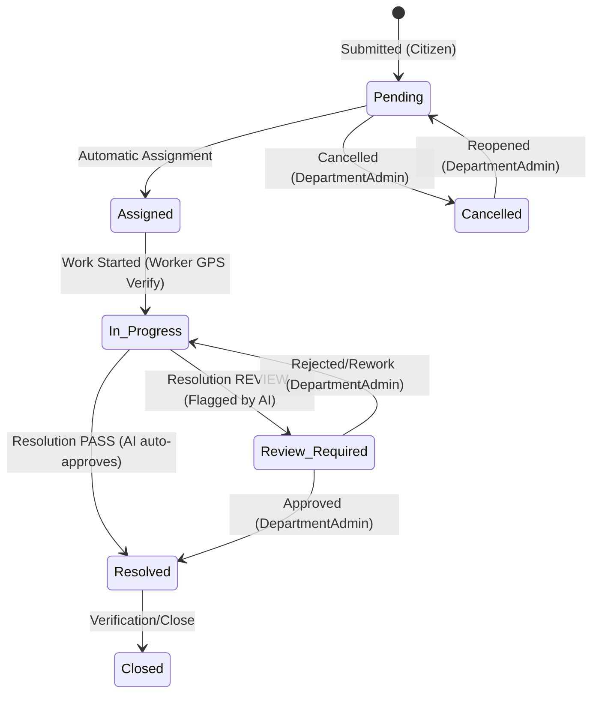

# 00 - Introduction

## What is CSCRS?
The **Citizen Suggestion & Complaint Resolution System (CSCRS)** is an enterprise civic technology platform designed to streamline the reporting, assignment, AI-assisted verification, and resolution of public infrastructure and environmental issues. By connecting municipal authorities directly with field workers and citizens, CSCRS enables efficient civic maintenance workflows.

## Purpose of the Backend API
The CSCRS Backend API acts as the central engine for the platform. It provides a secure, performant, and automated REST service that manages:
1. **Reporting:** Direct intake of geotagged civic complaints from citizens.
2. **AI Computer Vision:** Automated scene assessment and object detection (e.g., detecting pothole size, waste piles) to verify issue validity and prevent duplicates.
3. **Work Allocation:** Rule-based automatic worker assignment based on current backlogs and geographical distance.
4. **Resolution Verification:** Automatic evaluation of post-repair photos submitted by workers to confirm the issue was fixed, with flagging for manual administrative review when needed.
5. **Administrative Controls:** Multi-tier municipal role hierarchies to monitor resolution status, manage workers, adjust department boundaries, and run citywide reporting metrics.

## Major Actors (Roles)
The API identifies five distinct actors through its role-based security framework:
* **Citizen:** A public user who submits complaints, monitors status timelines, upvotes/supports existing issues, and provides system feedback.
* **Worker:** A field maintenance agent who views assigned work orders, updates work states from coordinates, and uploads repair proof.
* **DepartmentAdmin:** A supervisor who manages field workers, handles manual review resolution flags, and forwards mismatched complaints to other departments.
* **CityAdmin:** A municipal administrator who manages departments, views aggregated city dashboards, and blocks/unblocks inactive/bad-actor accounts.
* **SuperAdmin:** A high-level technician who oversees administrative onboarding, global system configurations, and raw database/AI dataset extraction.

## High-Level Report Lifecycle
Complaints move through a deterministic state machine driven by API operations:

## API Philosophy
* **Implementation-Centric:** All route behaviors, input validations, and error statuses are derived from the actual Python runtime implementation rather than abstract design drafts.
* **Security-First:** Endpoints are closed by default, requiring granular authentication dependencies to execute.
* **Contextual Scoping:** Data exposure is strictly scoped. For example, a DepartmentAdmin can only access reports associated with their specific `department_id`, and a Worker can only view their own active task queue.

## Versioning & API Access
* **Version Prefix:** All standard application endpoints are versioned under `/api/v1` to ensure stable contracts.
* **Public vs. Authenticated Areas:**
  * **Public API:** Health check routes (`/health`, `/liveness`, `/readiness`), citizen registration, token authentication, and email OTP validation.
  * **Authenticated API:** All administrative dashboards, work assignments, profile updates, and report management endpoints. Access requires a valid JWT bearer token.

## Relationship to Future Integration Guides
This API Reference describes *what* the endpoints are and *how* they behave. It forms the foundational technical blueprint upon which subsequent client guides (such as the Frontend Integration Guide or Mobile Worker Client Spec) will build client-side form rendering, state caching, and offline synchronization capabilities.
