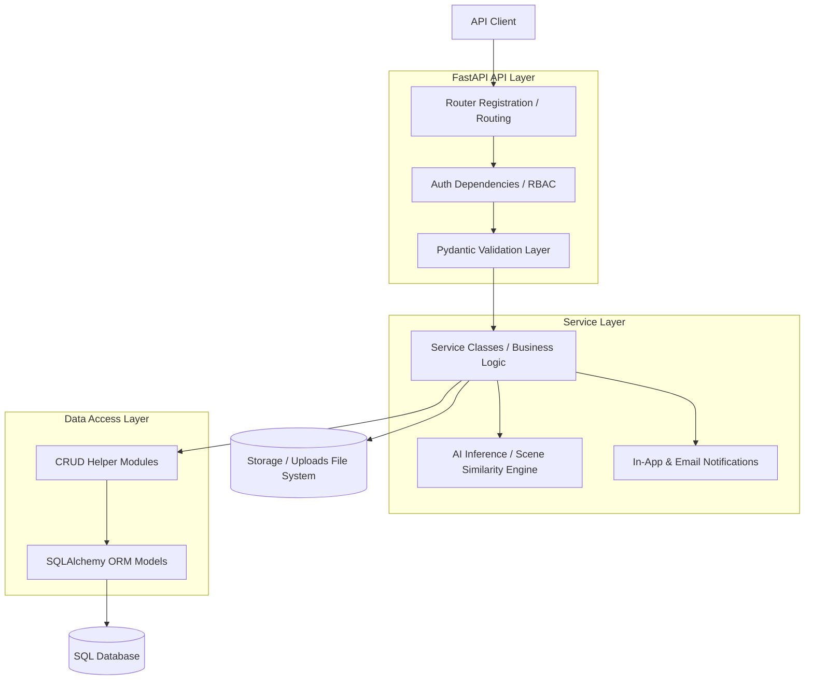
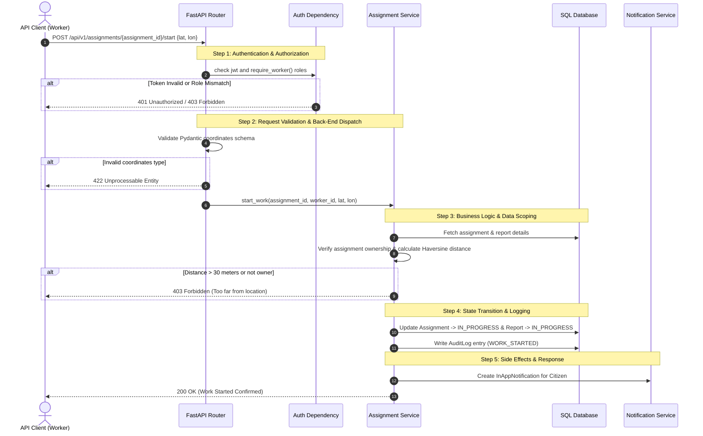

# 01 - Architecture Overview

The CSCRS backend utilizes a modular, layered architecture built on FastAPI. Understanding these layers helps API consumers anticipate performance, security gates, data validation behaviors, and side-effects.

## Architectural Layers

### 1. FastAPI API Layer (`api/`)
* **Routing & Controllers:** Acts as the entry gate. Routes are declared in modular files (e.g. `api/report.py`, `api/assignment.py`) and aggregated in `api/routes.py`.
* **Authentication & RBAC:** Enforced via dependency injection (`Depends(require_roles(...))`). Invalid tokens or insufficient roles trigger immediate early returns (`401` or `403` HTTP status codes) before executing any service logic.
* **Pydantic Validation:** Request payloads are checked against Pydantic models. Any structural or type mismatch raises a `422 Unprocessable Entity` error.

### 2. Service Layer (`services/`)
* **Business Logic:** Implements application rules (e.g., verifying a worker is within 30 meters of coordinates to start an assignment).
* **AI Computer Vision Pipeline:** Integrates custom computer vision components:
  * **YOLO Engine:** Runs inference on submitted reports to verify objects (e.g., street lights, potholes, trash).
  * **OpenCLIP Scene Similarity:** Computes cosine similarity scores (threshold of 0.82) to detect duplicate reports in the same location and evaluate post-repair resolution validity.
* **Notification Dispatchers:** Manages transactional operations, sending email notifications and writing in-app alert events to the database.

### 3. Data Access Layer (`database/`)
* **CRUD Helper Modules:** Functions that execute database commands via SQLAlchemy sessions.
* **SQLAlchemy ORM Models:** Defines the database tables, relations, and enums (e.g. User, Report, Assignment, AuditLog).
* **SQL Database:** Persistence layer configured via connection pools, utilizing transaction rollbacks on failure.

### 4. File / Media Handling (`uploads/` & `utils/file_utils.py`)
* File uploads are received via multipart forms and passed to a centralized validator checking file size, extension, MIME type, and binary header magic-bytes.
* Validated files are assigned a unique, random UUID filename to prevent collision and saved to disk under designated folders (e.g. `uploads/`, `uploads/resolution/`, `uploads/profile/`).

---

## Lifecycle of a Typical Request
To demonstrate the coordination of these layers, the diagram below outlines the flow of a worker attempting to start an assignment via `POST /api/v1/assignments/{assignment_id}/start`:

