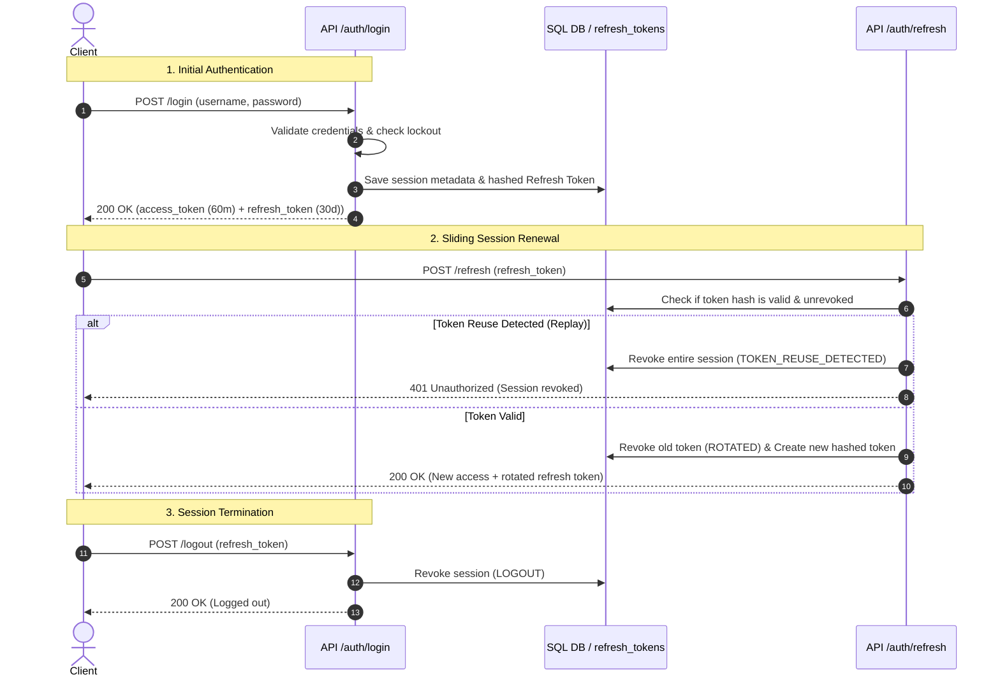
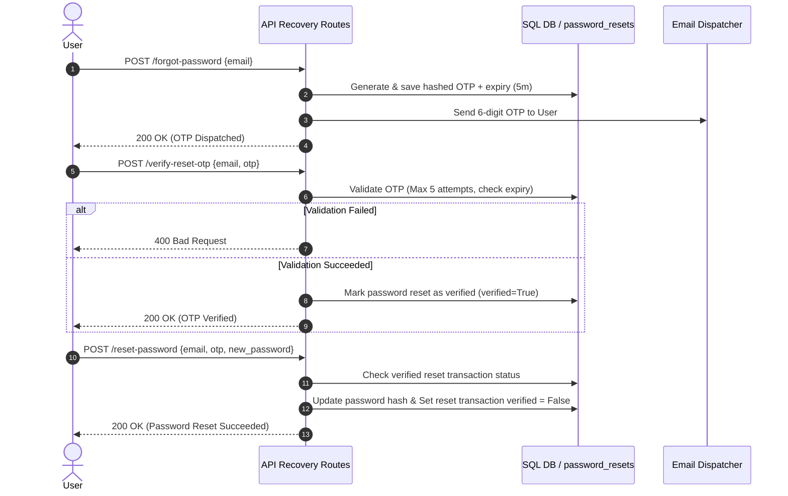

# 03 - Authentication Overview

CSCRS enforces a dual-token JWT (JSON Web Token) authentication architecture with database-backed session tracking, rotation security, and automatic password lockout logic.

## 1. Core Authentication Flow & Token Lifetimes
* **Token Handshake:** Logging in via `POST /api/v1/auth/login` returns an access token and a refresh token.
* **Access Tokens:**
  * **Lifespan:** Confirmed at `60` minutes (configured via `ACCESS_TOKEN_EXPIRE_MINUTES` in `configs/config.py`). *Inconsistency: The returned JSON response metadata reports `expires_in: 1800` (30 minutes) on login and refresh, despite the actual generated token claims enforcing a 60-minute duration.*
  * **Payload Structure:** Contains standard claims: `sub` (User ID string), `role` (PascalCase user role string), `iat` (issued at), `exp` (expiry), `jti` (unique token ID), `sid` (session ID), and `type` (`"access"`).
  * **Authorization Scheme:** Passed via HTTP header as a standard Bearer credential: `Authorization: Bearer <access_token>`.
* **Refresh Tokens:**
  * **Lifespan:** Confirmed at `30` days (configured via `REFRESH_TOKEN_EXPIRE_DAYS` in `configs/config.py`).
  * **Payload Structure:** Contains `sub`, `role`, `iat`, `exp`, `jti`, `sid` (matching the access token session ID), and `type` (`"refresh"`).
  * **Storage:** Hashed using SHA-256 (`hash_refresh_token()`) and persisted in the database table `refresh_tokens` containing metadata (IP, OS, browser, device type).

---

## 2. JWT Session & Token Rotation Lifecycle
* **Token Rotation (Security Measure):** When calling `POST /api/v1/auth/refresh`, the client must send the plain-text refresh token. The backend:
  1. Decodes and hashes the incoming token.
  2. Confirms the token exists in the database and is active.
  3. Generates a new access token and a new refresh token.
  4. Marks the old refresh token as revoked (`reason="ROTATED"`).
  5. Saves the new hashed refresh token under the *same* `session_id`.
* **Replay Attack / Token Reuse Detection:** If an attacker attempts to replay an already rotated refresh token (found by hash search with `revoked_at` populated), the backend immediately revokes the **entire session** (`reason="TOKEN_REUSE_DETECTED"`) and all matching tokens under that session ID. The legitimate user is forced to re-authenticate.
* **Logout Mechanisms:**
  * **Single Session (`POST /api/v1/auth/logout`):** Revokes the active refresh token session (`reason="LOGOUT"`).
  * **Global Logout (`POST /api/v1/auth/logout-all`):** Revokes all active refresh tokens associated with the user's ID (`reason="LOGOUT_ALL"`).
* **Session Listing (`GET /api/v1/auth/sessions`):** Authenticated users can list all active, unrevoked session tokens containing client metadata (browser, OS, device, last used time).

### Login & Session Lifecycle Diagram



---

## 3. Account Creation & Activation Lifecycle
* **Citizen Account Setup:**
  1. Citizens register via `POST /api/v1/auth/register` (which creates a user record with default state `is_active=False` and `is_email_verified=False`).
  2. A 6-digit numeric OTP is generated, hashed, saved, and emailed to the citizen (valid for `5` minutes, limited to `5` failed verification attempts).
  3. Citizen verifies via `POST /api/v1/auth/verify-email`. Upon validation, `is_active` and `is_email_verified` are set to `True`.
* **Administrative & Worker Account Invitations:**
  1. Admins create workers via `POST /api/v1/workers` or admins via `POST /api/v1/admins`. The system creates a user record in an inactive state (`is_active=False`).
  2. A unique UUID activation token is generated and emailed as a link:
     ```
     {FRONTEND_BASE_URL}/workers/activate?token={token}
     ```
  3. The link expires in `24` hours (configured via `WORKER_INVITATION_EXPIRY_HOURS`).
  4. The invited worker/admin clicks the link and provides their password to `POST /api/v1/workers/activate` (or `/admins/activate`). Upon success, `is_active=True`, `is_email_verified=True`, and the activation token is marked `used = True`.

---

## 4. Password Recovery & Account Restrictions
* **Password Recovery Lifecycle:**
  1. User triggers recovery via `POST /api/v1/auth/forgot-password`. A 6-digit OTP is generated and emailed (valid for `5` minutes, max `5` attempts).
  2. User verifies OTP via `POST /api/v1/auth/verify-reset-otp`. This sets the password reset transaction record to `verified = True`.
  3. User resets password via `POST /api/v1/auth/reset-password` (which validates the verified token status, updates the password hash, and resets the token's verified status to `False` to prevent reuse).

### Password Recovery Lifecycle Diagram



* **Failed Login & Temporary Lockout:**
  * If a user submits an incorrect password during login, the system increments `failed_login_attempts` in their record.
  * Upon **5 consecutive failed attempts**, the account is temporarily locked by setting `account_locked_until = datetime.now() + 30 minutes`.
  * Attempts to authenticate during this lockout period bypass password verification and return an HTTP status `423 Locked` detailing the remaining lockout duration.
* **Account Status Gates:**
  * **Inactive Accounts:** Users with `is_active = False` are blocked from logging in or using authenticated routes, returning a `403 Forbidden` (`"Account is inactive."`).
  * **Blocked Accounts:** Accounts flagged with `is_blocked = True` by administrators return a `403 Forbidden` (`"Your account has been blocked."`).
