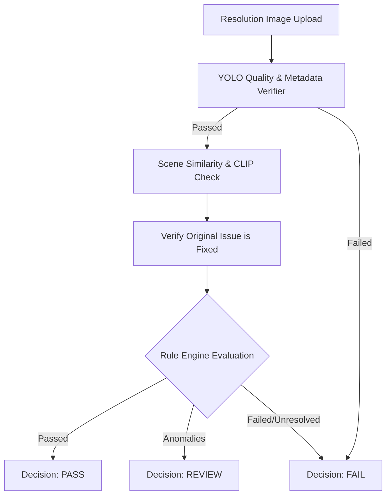

# Resolutions API

The Resolutions API manages the workflow and validation checks for task completion. Municipal workers submit resolution evidence, which is parsed through an AI validation pipeline. The resolution then transitions either to auto-approval, manual review by a Department Admin, or rejection (triggering a rework cycle).

### Core Resolution Workflow:
```
[Report: Pending]
    ↓ (Workload Auto-Assignment)
[Report: Assigned] / [Assignment: Assigned]
    ↓ (POST /api/v1/assignments/{assignment_id}/start)
[Report: In Progress] / [Assignment: In Progress]
    ↓ (POST /api/v1/resolutions)
[AI Verification & Scene Similarity Engine]
   ├── [PASS] ──→ [Report: Resolved] / [Assignment: Completed] / [Worker: Available]
   ├── [REVIEW] ─→ [Report: In Progress] / [Assignment: In Progress] / [Pending Manual Review Queue]
   └── [FAIL] ───→ [Report: In Progress] / [Assignment: In Progress] / [Immediate Rework Re-upload]
```

---

## Endpoint Summary

The Resolutions controller maps exactly 5 operations under `/api/v1/resolutions`:

| Method | Endpoint | Roles | Authentication | Purpose |
| :---: | :--- | :--- | :--- | :--- |
| **POST** | `/api/v1/resolutions` | Worker | Bearer Access Token | Submit resolution image evidence for an assignment. |
| **GET** | `/api/v1/resolutions/manual-review` | Department Admin | Bearer Access Token | Retrieve list of pending manual review cases. |
| **GET** | `/api/v1/resolutions/manual-review/{report_id}` | Department Admin | Bearer Access Token | Retrieve detailed metadata for a pending manual review report. |
| **POST** | `/api/v1/resolutions/manual-review/{report_id}/approve` | Department Admin | Bearer Access Token | Approve manual review, completing the report and assignment. |
| **POST** | `/api/v1/resolutions/manual-review/{report_id}/reject` | Department Admin | Bearer Access Token | Reject manual review and trigger worker rework. |

---

## Resolution Enumerations

The following enums are serialized and exposed via the Resolutions API:

### `VerificationDecision`
Defines the verification state resolved during evaluation.

| Value | Meaning |
| :--- | :--- |
| `PASS` | Resolution verification succeeded. |
| `REVIEW` | Minor anomalies detected; routed to manual review queue. |
| `REJECT` | Verification failed (poor quality, missing EXIF metadata, or issue still present). |

### `ResolutionDecision`
AI-evaluated resolution verdict stored in `ResolutionAIResult`.

| Value | Meaning |
| :--- | :--- |
| `Fully Resolved` | Issue is fixed; visual evidence verified. |
| `Review Required` | Routed for admin confirmation. |
| `Not Resolved` | Original issue remains visible or image rejected. |

---

## Resolution Verification Pipeline

Submitted resolution evidence is analyzed through a dual-channel AI verification engine:



### 1. Verification Decision Logic Matrix:
* **Quality & Metadata Verification:** Predicts EXIF data and quality. If the verifier flags critical details missing (blurry, no camera make, or missing datetime headers) resulting in `verification_passed = False`, the Rule Engine defaults the decision to **`FAIL`**.
* **Geographic & Visual Scene Similarity:** OpenCLIP compares the original report photo against the newly uploaded resolution image to verify the worker is at the correct scene:
  * **`scene_similarity < 0.40`:** Triggers automatic **`FAIL`**.
  * **`scene_similarity < 0.70`:** Triggers **`REVIEW`** (manual review required).
* **AI Civic Issue Check (YOLOv8):** Runs YOLOv8 civic issue detection on the resolution image. The engine normalizes the original issue name (e.g. `Road Damage` $\rightarrow$ `road damage`) and compares it against detected objects:
  * **`yolo_issue_found = True`:** If the original issue is still detected in the resolution image, it triggers automatic **`FAIL`**.

### 2. State-Rule Resolution Mapping:
* **`PASS` Decision (Fully Resolved):**
  * `verification_passed = True`, `verification_decision = PASS`, `manual_review = False`.
  * `Report.status = Resolved`, `Assignment.status = Completed`, `WorkerProfile.is_available = True`.
  * Dispatches confirmation email to citizen and notifications to worker and citizen.
* **`REVIEW` Decision (Manual Review Required):**
  * `verification_passed = False`, `verification_decision = REVIEW`, `manual_review = True`.
  * *Report and Assignment remain `In Progress`* in the database but are visible on the admin's manual review queue.
  * Dispatches `MANUAL_REVIEW` notification to the worker. Worker availability remains `False`.
* **`FAIL` Decision (Not Resolved):**
  * `verification_passed = False`, `verification_decision = REJECT`, `manual_review = False`.
  * *Report and Assignment remain `In Progress`*.
  * No admin queue items are generated. The worker must perform rework and submit another resolution attempt.

---

## Resolution Attempts

CSCRS supports **multiple resolution attempts** for a single assignment:
* Attempts are tracked sequentially under the `resolution_attempts` table.
* Each submission creates a new `ResolutionAttempt` row, incrementing the attempt count (stored as `attempt_number` in manual review schemas).
* Previous attempts, their metadata (scene similarity, YOLO outcomes), and their uploaded images remain stored in the system for administrative audit trail, avoiding evidence overwrite.
* Rework simply clears the active complete flag, returning the report and assignment state to `In Progress` and prompting the worker to upload a new attempt.

---

## Resolution State Transitions

The following table summarizes all state transitions triggered by Resolutions API events:

| Event | Report Before | Assignment Before | Result | Report After | Assignment After | Worker Availability |
| :--- | :--- | :--- | :--- | :--- | :--- | :--- |
| **POST /resolutions** (AI PASS) | `In Progress` | `In Progress` | Auto-Approved | `Resolved` | `Completed` | `True` (Available) |
| **POST /resolutions** (AI REVIEW) | `In Progress` | `In Progress` | Manual Review | `In Progress` | `In Progress` | `False` (Busy) |
| **POST /resolutions** (AI FAIL) | `In Progress` | `In Progress` | Auto-Rejected | `In Progress` | `In Progress` | `False` (Busy) |
| **POST /manual-review/{id}/approve** | `In Progress` | `In Progress` | Approved | `Resolved` | `Completed` | `True` (Available) |
| **POST /manual-review/{id}/reject** | `In Progress` | `In Progress` | Rejected | `In Progress` | `In Progress` | `False` (Busy) |

---

## Detailed Endpoint Specifications

---

## `POST /api/v1/resolutions`

### Purpose
Allows an assigned worker to upload a photo of the completed repair work. This starts the AI verification pipeline.

### Roles / Authorization
* Worker role. The worker must be the assigned owner of the target assignment.
* **State Requirements:** The assignment status must be exactly `In Progress`.

### Authentication
* Bearer Access Token required.

### Headers
* `Authorization: Bearer <access_token>`
* `Content-Type: multipart/form-data`

### Path Parameters
* `Not applicable`

### Query Parameters
* `Not applicable`

### Request Body / Form Data

| Field | Type | Required | Constraints / Validation | Description |
| :--- | :--- | :---: | :--- | :--- |
| `assignment_id` | Integer | Yes | Form Parameter | Database ID of target assignment. |
| `remarks` | String | No | Form Parameter | Optional text remarks regarding work details. |
| `image` | File (Binary) | Yes | File type: Multipart File | The photo showing the resolved civic issue. |

### Validation Rules
* **File Constraints:** Maximum file size is exactly **10 MB**. Allowed extensions are `.jpg`, `.jpeg`, `.png`, and `.webp`. Content-Type must match `image/jpeg`, `image/png`, or `image/webp`. Magic-byte signatures are checked.
* **Assignment State Gate:** Checks that the assignment status is `In Progress`. Attempting to submit resolutions for completed tasks yields `409 Conflict`.
* **Report State Gate:** If the report status is already `Resolved`, throws `409 Conflict`.
* **AI Pipeline Rejection:** If YOLOv8 analysis on the resolution image fails (`success = False`), unlinks the saved files and raises HTTP `400 Bad Request` containing the AI predictor error message.

### Rate Limit
* Configured rate limit: `20 per hour` (Effective: 20 requests per hour per User/IP).

### Business Flow
1. Authenticates worker and validates assignment ownership.
2. Checks assignment status is `In Progress`. Throws `409` if not.
3. Saves file to local `uploads/resolution/` with a generated UUID-based filename.
4. Saves a record of the resolution image linked to the report.
5. Runs YOLOv8 civic issue detection on the resolution image. Unlinks image and throws `400` if predictor success is false.
6. Resolves original report image. Compares images using the scene similarity engine.
7. Evaluates Rule Engine: computes verification decision (`PASS`, `REVIEW`, `FAIL`).
8. Creates a `Resolution` row if it does not exist, and inserts a new sequential `ResolutionAttempt` record.
9. Updates attempt parameters (scene similarity score, quality flags, YOLO detections).
10. Saves `ResolutionAIResult` record.
11. Applies state updates based on rule engine decision (see [Resolution State Transitions](#resolution-state-transitions)).
12. Dispatches notifications and commits the database transaction.

### Success Response
* **HTTP Status:** `201 Created`
* **Response Model:** `ResolutionResponse`

| Field | Type | Description |
| :--- | :--- | :--- |
| `id` | Integer | Database key of the resolution. |
| `report_id` | Integer | ID of the linked report. |
| `worker_id` | Integer | ID of the submitting worker. |
| `remarks` | String \| null | Worker remarks. |
| `verification_passed` | Boolean | True if auto-approved (`PASS`). |
| `verification_score` | Float \| null | Verification quality risk score. |
| `verification_decision` | String \| null | Decision enum (`PASS`, `REVIEW`, `REJECT`). |
| `manual_review` | Boolean | True if routed to manual review. |
| `verified_at` | DateTime \| null | Timestamp of approval (if auto-approved). |
| `resolved_at` | DateTime | Timestamp of resolution creation. |

### Example Success Response (Auto-Approved)
```json
{
  "id": 89,
  "report_id": 92,
  "worker_id": 18,
  "remarks": "Pothole filled with cold mix asphalt.",
  "verification_passed": true,
  "verification_score": 0.12,
  "verification_decision": "PASS",
  "manual_review": false,
  "verified_at": "2026-07-28T15:45:00.123456Z",
  "resolved_at": "2026-07-28T15:45:00.123456Z"
}
```

### Example Success Response (Manual Review Required)
```json
{
  "id": 90,
  "report_id": 93,
  "worker_id": 18,
  "remarks": "Cleaned up garbage pile.",
  "verification_passed": false,
  "verification_score": 0.42,
  "verification_decision": "REVIEW",
  "manual_review": true,
  "verified_at": null,
  "resolved_at": "2026-07-28T15:48:10.123456Z"
}
```

### Error Responses
| HTTP Status | Condition | Response / Detail |
| :---: | :--- | :--- |
| **400** | Inference engine prediction failed. | `{"detail": "Failed to analyze image file."}` |
| **401** | Missing/invalid token. | `{"detail": "Invalid or expired token."}` |
| **403** | Worker is not assigned to this assignment. | `{"detail": "You are not assigned to this report."}` |
| **409** | Work has not been started. | `{"detail": "Please start work before uploading the resolution."}` |
| **409** | Assignment is already completed. | `{"detail": "This assignment has already been completed."}` |
| **409** | Report has already been resolved. | `{"detail": "This report has already been resolved."}` |
| **413** | File size exceeds 10MB limit. | `{"detail": "File size exceeds allowed limit."}` |
| **422** | Missing required parameters. | `{"detail": [{"loc": ["body", "assignment_id"], "msg": "field required", "type": "value_error.missing"}]}` |
| **429** | Limit of 20 requests per hour exceeded. | `{"success": false, "message": "Too many requests. Please try again later.", "error_code": "RATE_LIMIT_EXCEEDED"}` |
| **500** | Original report image is missing from database. | `{"detail": "Original report image not found."}` |

### Possible HTTP Status Codes
* `201`, `400`, `401`, `403`, `409`, `413`, `422`, `429`, `500`

### Database / State Changes
* Inserts records to `resolutions`, `resolution_attempts`, and `resolution_ai_results` tables.
* Saves upload file path details to `report_images` table.
* Updates report and assignment statuses if auto-approved.

### Frontend Integration Notes
* Submit body parameters using `multipart/form-data`.
* Pay close attention to file field name: it must be **`image`**.
* Parse `manual_review` and `verification_decision` keys to display appropriate status updates to workers.

---

## `GET /api/v1/resolutions/manual-review`

### Purpose
Retrieves a list of reports in the admin's department that are pending manual review.

### Roles / Authorization
* Department Admin role. Scoped strictly to the admin's `department_id`.

### Authentication
* Bearer Access Token required.

### Headers
* `Authorization: Bearer <access_token>`

### Path Parameters
* `Not applicable`

### Query Parameters
* `Not applicable`

### Request Body / Form Data
* `Not applicable`

### Validation Rules
* Access token signature verification.

### Rate Limit
* `No endpoint-specific rate limit verified.`

### Business Flow
1. Authenticates Department Admin.
2. Queries database for all resolutions in the admin's department where `manual_review = True`.
3. Returns matching items list.

### Success Response
* **HTTP Status:** `200 OK`
* **Response Model:** `list[ManualReviewItem]`

| Field | Type | Description |
| :--- | :--- | :--- |
| `report_id` | Integer | Database key of the report. |
| `report_number` | String | Unique report identifier. |
| `issue_type` | String | Issue classification. |
| `priority` | String | Priority level. |
| `worker_name` | String | Name of assigned worker. |
| `verification_score` | Float \| null | Verification quality risk score. |
| `resolved_at` | DateTime | Timestamp of worker submission. |
| `scene_similarity` | Float \| null | OpenCLIP similarity score. |
| `verification_decision` | String \| null | Decision enum (`REVIEW`). |
| `failure_reason` | String \| null | Semicolon-separated verifier flags (if any). |
| `attempt_number` | Integer \| null | Database ID of the resolution attempt. |

### Example Success Response
```json
[
  {
    "report_id": 93,
    "report_number": "REP-2026-0104",
    "issue_type": "Garbage",
    "priority": "Medium",
    "worker_name": "Bob Vance",
    "verification_score": 0.42,
    "resolved_at": "2026-07-28T15:48:10.123456Z",
    "scene_similarity": 0.65,
    "verification_decision": "REVIEW",
    "failure_reason": "NO_DATETIME",
    "attempt_number": 1
  }
]
```

### Error Responses
| HTTP Status | Condition | Response / Detail |
| :---: | :--- | :--- |
| **401** | Missing/invalid token. | `{"detail": "Invalid or expired token."}` |
| **403** | Caller is not a Department Admin. | `{"detail": "Forbidden"}` |

### Possible HTTP Status Codes
* `200`, `401`, `403`

### Related APIs
* [GET /api/v1/resolutions/manual-review/{report_id}](#get-apiv1resolutionsmanual-reviewreport_id)

---

## `GET /api/v1/resolutions/manual-review/{report_id}`

### Purpose
Retrieves full details for a pending manual review report, including original, annotated, and resolution image paths.

### Roles / Authorization
* Department Admin role. Scoped to the admin's `department_id`.

### Authentication
* Bearer Access Token required.

### Path Parameters

| Name | Type | Required | Description |
| :--- | :--- | :---: | :--- |
| `report_id` | Integer | Yes | Database key identifier of report. |

### Success Response
* **HTTP Status:** `200 OK`
* **Response Model:** `ManualReviewDetail`

| Field | Type | Description |
| :--- | :--- | :--- |
| `report_id` | Integer | ID of the report. |
| `report_number` | String | Report identifier. |
| `issue_type` | String | Issue classification. |
| `priority` | String | Priority level. |
| `remarks` | String \| null | Worker remarks. |
| `verification_score` | Float \| null | Risk score. |
| `verification_decision` | String \| null | Decision enum. |
| `manual_review` | Boolean | True. |
| `resolved_at` | DateTime | Timestamp of submission. |
| `worker_name` | String | Name of worker. |
| `failure_reason` | String \| null | Verifier failure flags. |
| `attempt_number` | Integer \| null | Attempt database ID. |
| `ai_decision` | String \| null | AI evaluated decision. |
| `model_version` | String \| null | YOLO model version. |
| `scene_similarity` | Float \| null | Similarity score. |
| `same_scene` | Boolean \| null | True if scene matched. |
| `yolo_issue_found` | Boolean \| null | True if issue still visible. |
| `worker_id` | Integer | Worker ID. |
| `worker_email` | String | Worker email. |
| `worker_phone` | String \| null | Worker phone number. |
| `department_name` | String | Department name. |
| `address` | String \| null | Decoded address. |
| `latitude` | Float \| null | Latitude coordinate. |
| `longitude` | Float \| null | Longitude coordinate. |
| `original_image_path` | String \| null | File path to original image. |
| `annotated_image_path` | String \| null | File path to annotated image. |
| `resolution_image_path` | String \| null | File path to resolution image. |

### Example Success Response
```json
{
  "report_id": 93,
  "report_number": "REP-2026-0104",
  "issue_type": "Garbage",
  "priority": "Medium",
  "remarks": "Cleaned up garbage pile.",
  "verification_score": 0.42,
  "verification_decision": "REVIEW",
  "manual_review": true,
  "resolved_at": "2026-07-28T15:48:10.123456Z",
  "worker_name": "Bob Vance",
  "failure_reason": "NO_DATETIME",
  "attempt_number": 1,
  "ai_decision": "Review Required",
  "model_version": "YOLOv8x-Civic-V1",
  "scene_similarity": 0.65,
  "same_scene": true,
  "yolo_issue_found": false,
  "worker_id": 18,
  "worker_email": "bob.vance@city.gov",
  "worker_phone": "9876543211",
  "department_name": "Sanitation",
  "address": "42 Main St, Bangalore, India",
  "latitude": 12.9716,
  "longitude": 77.5946,
  "original_image_path": "uploads/8e9a2b1c4d7e6f8a.jpeg",
  "annotated_image_path": "uploads/annotated_8e9a2b1c4d7e6f8a.jpeg",
  "resolution_image_path": "uploads/resolution/9f8e7d6c5b4a3f2e.jpeg"
}
```

### Error Responses
| HTTP Status | Condition | Response / Detail |
| :---: | :--- | :--- |
| **401** | Missing/invalid token. | `{"detail": "Invalid or expired token."}` |
| **403** | Caller is not Department Admin. | `{"detail": "Forbidden"}` |
| **404** | Report ID is not pending manual review. | `{"detail": "Manual review not found."}` |

### Possible HTTP Status Codes
* `200`, `401`, `403`, `404`

---

## `POST /api/v1/resolutions/manual-review/{report_id}/approve`

### Purpose
Allows a Department Admin to manually approve a resolution, completing the report and assignment.

### Roles / Authorization
* Department Admin role. Scoped strictly to reports assigned to the admin's `department_id`.

### Authentication
* Bearer Access Token required.

### Headers
* `Authorization: Bearer <access_token>`

### Path Parameters

| Name | Type | Required | Description |
| :--- | :--- | :---: | :--- |
| `report_id` | Integer | Yes | Database ID of the report. |

### Validation Rules
* **State Verification:** Resolution must have `manual_review = True`. Returns `400` if not.
* **Scope Verification:** Report must belong to the admin's department. Returns `403` on violation.

### Rate Limit
* `No endpoint-specific rate limit verified.`

### Business Flow
1. Authenticates Department Admin.
2. Checks resolution manual review status. Throws `400` or `404` if invalid.
3. Checks department ownership. Raises `403` if mismatch.
4. Sets `resolution.manual_review = False`, `verification_passed = True`, `verification_decision = VerificationDecision.PASS`, and sets `verified_at = now()`.
5. Updates statuses:
   * `Report.status = ReportStatus.RESOLVED`
   * `Assignment.status = AssignmentStatus.COMPLETED`
   * Sets `assignment.completed_at = now()`.
   * Sets worker profile `is_available = True`.
6. Logs audit logs: `MANUAL_REVIEW_APPROVED` and `REPORT_COMPLETED`.
7. Dispatches in-app notifications:
   * `RESOLUTION_APPROVED` to worker.
   * `REPORT_RESOLVED` to citizen.
8. Dispatches resolution completion email to citizen.
9. Commits transaction and returns resolution metadata.

### Success Response
* **HTTP Status:** `200 OK`
* **Response Model:** `ResolutionResponse`

### Example Success Response
```json
{
  "id": 90,
  "report_id": 93,
  "worker_id": 18,
  "remarks": "Cleaned up garbage pile.",
  "verification_passed": true,
  "verification_score": 0.42,
  "verification_decision": "PASS",
  "manual_review": false,
  "verified_at": "2026-07-28T16:05:12.123456Z",
  "resolved_at": "2026-07-28T15:48:10.123456Z"
}
```

### Error Responses
| HTTP Status | Condition | Response / Detail |
| :---: | :--- | :--- |
| **400** | Resolution is not pending manual review. | `{"detail": "Resolution is not pending manual review."}` |
| **401** | Missing/invalid token. | `{"detail": "Invalid or expired token."}` |
| **403** | Scopes violated (admin's department doesn't match report). | `{"detail": "You can review only your department reports."}` |
| **404** | Resolution does not exist for report. | `{"detail": "Resolution not found."}` |

### Possible HTTP Status Codes
* `200`, `400`, `401`, `403`, `404`

### Related APIs
* [POST /api/v1/resolutions/manual-review/{report_id}/reject](#post-apiv1resolutionsmanual-reviewreport_idreject)

---

## `POST /api/v1/resolutions/manual-review/{report_id}/reject`

### Purpose
Allows a Department Admin to reject a manual review, triggering a worker rework cycle.

### Roles / Authorization
* Department Admin role. Scoped to reports in the admin's department.

### Authentication
* Bearer Access Token required.

### Headers
* `Authorization: Bearer <access_token>`
* `Content-Type: application/json`

### Path Parameters

| Name | Type | Required | Description |
| :--- | :--- | :---: | :--- |
| `report_id` | Integer | Yes | Database ID of the report. |

### Request Body / Form Data

| Field | Type | Required | Constraints / Validation | Description |
| :--- | :--- | :---: | :--- | :--- |
| `reason` | String | Yes | `min_length=5`, `max_length=500` | Rejection feedback / rework instructions. |

### Validation Rules
* **Pydantic Validation:** Feedback under 5 characters yields `422`.
* **State Verification:** Resolution must have `manual_review = True`. Returns `400` if not.
* **Scope Verification:** Scoped to admin's department. Returns `403` on violation.

### Rate Limit
* `No endpoint-specific rate limit verified.`

### Business Flow
1. Authenticates Department Admin.
2. Checks resolution manual review status. Throws `400` or `404` if invalid.
3. Checks department ownership. Raises `403` if mismatch.
4. Sets `resolution.manual_review = False`, `verification_passed = False`, `verification_decision = VerificationDecision.REJECT`.
5. Updates statuses (Rework Cycle):
   * `Report.status = ReportStatus.IN_PROGRESS`
   * `Assignment.status = AssignmentStatus.IN_PROGRESS`
   * Clears assignment completed timestamp: `assignment.completed_at = None`.
   * Sets worker profile `is_available = False` (locks worker back to assignment).
6. Logs audit log: `MANUAL_REVIEW_REJECTED` (storing feedback reason).
7. Dispatches in-app notification `RESOLUTION_REJECTED` to worker containing the feedback.
8. Commits database changes and returns resolution metadata.

### Success Response
* **HTTP Status:** `200 OK`
* **Response Model:** `ResolutionResponse`

### Example Success Response
```json
{
  "id": 90,
  "report_id": 93,
  "worker_id": 18,
  "remarks": "Cleaned up garbage pile.",
  "verification_passed": false,
  "verification_score": 0.42,
  "verification_decision": "REJECT",
  "manual_review": false,
  "verified_at": null,
  "resolved_at": "2026-07-28T15:48:10.123456Z"
}
```

### Error Responses
| HTTP Status | Condition | Response / Detail |
| :---: | :--- | :--- |
| **400** | Resolution is not pending manual review. | `{"detail": "Resolution is not pending manual review."}` |
| **401** | Missing/invalid token. | `{"detail": "Invalid or expired token."}` |
| **403** | Scopes violated. | `{"detail": "You can review only your department reports."}` |
| **404** | Resolution does not exist for report. | `{"detail": "Resolution not found."}` |
| **422** | Feedback reason string too short. | `{"detail": [{"loc": ["body", "reason"], "msg": "ensure this value has at least 5 characters", "type": "value_error.any_str.min_length"}]}` |

### Possible HTTP Status Codes
* `200`, `400`, `401`, `403`, `404`, `422`

### Related APIs
* [POST /api/v1/resolutions/manual-review/{report_id}/approve](#post-apiv1resolutionsmanual-reviewreport_idapprove)
