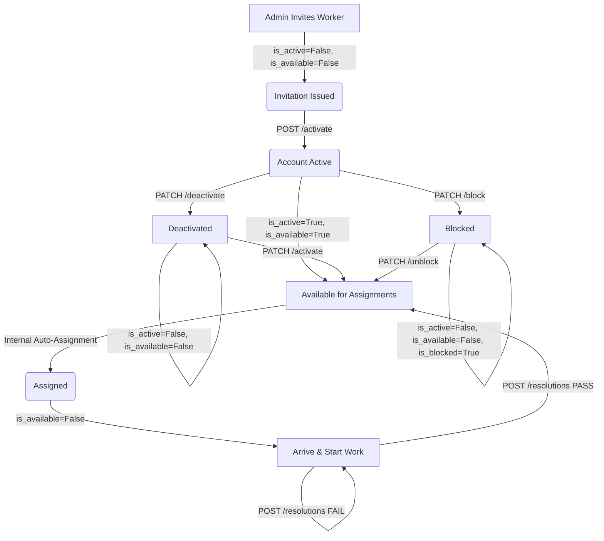

# Workers API

The Workers API manages municipal field technicians (workers). It handles administrative account invitations, account activation, deactivation/reactivation, and worker blocking workflows.

---

## Endpoint Summary

The Workers controller maps exactly 6 operations under `/api/v1/workers`:

| Method | Endpoint | Roles / Credential | Authentication | Purpose |
| :---: | :--- | :--- | :--- | :--- |
| **POST** | `/api/v1/workers` | Department Admin, Super Admin | Bearer Access Token | Create and email a registration invitation to a new worker. |
| **POST** | `/api/v1/workers/activate` | Public (Guest) | Invitation Token | Activate account and set login password. |
| **PATCH** | `/api/v1/workers/{worker_id}/deactivate` | Department Admin, Super Admin | Bearer Access Token | Deactivate a worker's account. |
| **PATCH** | `/api/v1/workers/{worker_id}/activate` | Department Admin, Super Admin | Bearer Access Token | Reactivate a deactivated worker's account. |
| **PATCH** | `/api/v1/workers/{worker_id}/block` | Department Admin | Bearer Access Token | Block a worker account, recording a block category reason. |
| **PATCH** | `/api/v1/workers/{worker_id}/unblock` | Department Admin | Bearer Access Token | Unblock a blocked worker account. |

---

## Worker Lifecycle

The account and assignment state lifecycle of a municipal worker flows as follows:



### Account Lifecycle States:
* **Invitation Issued:** A User record is created in an inactive, unverified state (`is_active = False`, `is_email_verified = False`). A unique UUID invitation token is generated (valid for **24 hours**) and emailed to the worker.
* **Account Activated:** The worker clicks the link, submits a password, and the system sets `is_active = True`, `is_email_verified = True`, and `WorkerProfile.is_available = True`.
* **Deactivated:** An administrator deactivates the account. The system flags `is_active = False` and `is_available = False`, locking the worker out of logins and assignments.
* **Blocked:** Scoped to disciplinary or contract terminations. The system flags `is_blocked = True`, `is_active = False`, and `is_available = False`. The worker is permanently locked out until unblocked.

---

## Worker Availability Semantics

`WorkerProfile.is_available` determines whether the worker is eligible to receive assignments from the auto-assignment engine:
* **Activation:** Activating the account sets `is_available = True`.
* **Assignment Allocation:** When a worker is assigned a report, their availability remains `True` (as the engine operates on **Least Active Workload**).
* **Work Commencement:** Executing `/api/v1/assignments/{assignment_id}/start` locks the worker to the task. Worker profile updates to `is_available = False` inside the database (cannot receive new tasks).
* **Resolution Auto-Approval (`PASS`):** When the AI verifier auto-approves a resolution, `is_available` is reset to `True`.
* **Manual Review Approval:** When an admin manual-approves, resets `is_available = True`.
* **Rework / Rejection:** If a manual review is rejected (rework cycle), the worker remains assigned and `is_available = False` is enforced.
* **Deactivation / Blocking:** Setting an account inactive or blocked forces `is_available = False`.

---

## Worker Enumerations

The following enums are utilized inside the Workers module:

### `BlockType`
Specifies the category of account restriction during blocking.

| Value | Meaning |
| :--- | :--- |
| `RETIRED` | Worker has retired. |
| `TRANSFERRED` | Worker was transferred to another department/city. |
| `SUSPENDED` | Account suspended temporarily due to disciplinary review. |
| `TERMINATED` | Worker contract was terminated. |
| `DISMISSED` | Worker was dismissed from service. |

---

## Detailed Endpoint Specifications

---

## `POST /api/v1/workers`

### Purpose
Allows an administrator to create a worker account and generate an email invitation containing an activation token.

### Roles / Authorization
* Department Admin or Super Admin roles.
* **Scope Scoping:** If called by a Department Admin, the `department_id` is automatically overridden to match the admin's own department ID (they cannot invite workers to other departments). A Super Admin can invite workers to any department ID.

### Authentication
* Bearer Access Token required.

### Headers
* `Authorization: Bearer <access_token>`
* `Content-Type: application/json`

### Path Parameters
* `Not applicable`

### Query Parameters
* `Not applicable`

### Request Body / Form Data

| Field | Type | Required | Constraints / Validation | Description |
| :--- | :--- | :---: | :--- | :--- |
| `name` | String | Yes | `min_length=2`, `max_length=100` | Full name of the worker. |
| `email` | String | Yes | Valid Email syntax | Corporate or corporate-assigned email address. |
| `department_id` | Integer | Yes | None | Municipal department ID. |
| `employee_code` | String | Yes | `min_length=2`, `max_length=30` | Unique municipal employee identifier code. |
| `designation` | String | Yes | `min_length=2`, `max_length=100` | Job designation title (e.g. Lead Technician). |
| `phone` | String | No | Optional, defaults to `None` | Contact telephone number. |
| `phone_extension` | String | No | Optional, defaults to `None` | Office desk extension number. |

### Validation Rules
* **Pydantic Validation:** String boundaries or email validation failures return `422`.
* **Unique Email check:** Email must not exist in `users`. Returns `400 Bad Request`.
* **Unique Phone check:** Phone must not exist in `users`. Returns `400 Bad Request`.
* **Unique Employee Code check:** Employee code must not exist in `worker_profiles`. Returns `409 Conflict`.
* **Department existence check:** Department ID must exist. Returns `400 Bad Request`.

### Rate Limit
* `No endpoint-specific rate limit verified.`

### Business Flow
1. Authenticates admin. Overrides `department_id` if caller is a Department Admin.
2. Validates uniqueness (email, phone, employee code) and department existence. Raises `400` or `409` on conflict.
3. Creates a `User` record: `is_active = False`, `is_email_verified = False`, `role = UserRole.WORKER`, default password `"CHANGE_ME"`.
4. Creates a `WorkerProfile` record: `is_available = False`.
5. Creates a `WorkerInvitation` token (valid for 24 hours).
6. Dispatches an invitation email containing the activation link.
7. Commits database transaction and returns the created worker profile.

### Success Response
* **HTTP Status:** `201 Created`
* **Response Model:** `WorkerResponse`

| Field | Type | Description |
| :--- | :--- | :--- |
| `id` | Integer | Database key of the worker profile. |
| `user_id` | Integer | Database key of the associated user record. |
| `department_id` | Integer | Scoped department ID. |
| `employee_code` | String | Unique employee code. |
| `designation` | String | Title designation. |
| `phone_extension` | String \| null | Office extension number. |
| `is_available` | Boolean | Availability status (`false` initially). |

### Example Success Response
```json
{
  "id": 18,
  "user_id": 48,
  "department_id": 2,
  "employee_code": "EMP-9402",
  "designation": "Lead Field Inspector",
  "phone_extension": "402",
  "is_available": false
}
```

### Error Responses
| HTTP Status | Condition | Response / Detail |
| :---: | :--- | :--- |
| **400** | Email is already registered. | `{"detail": "Email is already registered."}` |
| **400** | Phone number already registered. | `{"detail": "Phone number is already registered."}` |
| **400** | Department ID does not exist. | `{"detail": "Department not found."}` |
| **401** | Missing/invalid token. | `{"detail": "Invalid or expired token."}` |
| **403** | Caller is not administrative role. | `{"detail": "Permission denied."}` |
| **409** | Employee code already exists. | `{"detail": "Employee code already exists."}` |
| **422** | Invalid parameter format. | `{"detail": [{"loc": ["body", "email"], "msg": "value is not a valid email address", "type": "value_error.email"}]}` |

### Possible HTTP Status Codes
* `201`, `400`, `401`, `403`, `409`, `422`, `500`

### Database / State Changes
* Creates new `User` record.
* Creates new `WorkerProfile` record.
* Creates new `WorkerInvitation` record.

### Side Effects
* Sends email invitation containing activation link token to worker.

### Related APIs
* [POST /api/v1/workers/activate](#post-apiv1workersactivate)

---

## `POST /api/v1/workers/activate`

### Purpose
Allows a guest user to activate their invited worker account by providing a valid activation token and setting a password.

### Roles / Authorization
* Public (Unauthenticated guest).

### Authentication
* Activation token verification.

### Headers
* `Content-Type: application/json`

### Path Parameters
* `Not applicable`

### Query Parameters
* `Not applicable`

### Request Body / Form Data

| Field | Type | Required | Constraints / Validation | Description |
| :--- | :--- | :---: | :--- | :--- |
| `token` | String | Yes | UUID token string | The invitation activation token. |
| `password` | String | Yes | `min_length=8`, `max_length=128` | Plain-text password to configure. |

### Validation Rules
* **Pydantic Validation:** Password shorter than 8 characters returns `422`.
* **Token Verification:** The token must exist in the `worker_invitations` table, must not be marked `used = True`, and must not be expired (24-hour lifetime from creation). Returns `400 Bad Request`.

### Rate Limit
* `No endpoint-specific rate limit verified.`

### Business Flow
1. Resolves token against invitation records.
2. Validates expiration and usage status. Throws `400` if invalid.
3. Retrieves the associated `User` and `WorkerProfile` records.
4. Hashes the new password via `hash_password()`.
5. Updates User flags: `is_active = True`, `is_email_verified = True`.
6. Updates WorkerProfile flag: `is_available = True`.
7. Marks invitation `used = True`.
8. Dispatches account activation success notification email.
9. Commits transaction and returns success message.

### Success Response
* **HTTP Status:** `200 OK`
* **Response Model:** `WorkerActivationResponse`

| Field | Type | Description |
| :--- | :--- | :--- |
| `message` | String | `"Worker account activated successfully."` |

### Example Success Response
```json
{
  "message": "Worker account activated successfully."
}
```

### Error Responses
| HTTP Status | Condition | Response / Detail |
| :---: | :--- | :--- |
| **400** | Token is invalid, expired, or already used. | `{"detail": "Invalid or expired activation link."}` |
| **404** | Target user profile not found. | `{"detail": "Worker not found."}` |
| **422** | Password too short. | `{"detail": [{"loc": ["body", "password"], "msg": "ensure this value has at least 8 characters", "type": "value_error.any_str.min_length"}]}` |

### Possible HTTP Status Codes
* `200`, `400`, `404`, `422`

### Database / State Changes
* Updates password hash in User record.
* Sets User `is_active = True`, `is_email_verified = True`.
* Sets WorkerProfile `is_available = True`.
* Sets `used = True` in `WorkerInvitation` record.

### Side Effects
* Sends email notifying the user of account activation success.

---

## `PATCH /api/v1/workers/{worker_id}/deactivate`

### Purpose
Allows an administrator to deactivate a worker's account.

### Roles / Authorization
* Department Admin or Super Admin roles.
* **Scope Scoping:** Department Admin is restricted to workers in their own department.

### Authentication
* Bearer Access Token required.

### Path Parameters

| Name | Type | Required | Description |
| :--- | :--- | :---: | :--- |
| `worker_id` | Integer | Yes | Database ID of target worker profile. |

### Validation Rules
* **Ownership Scope Check:** If caller is a Department Admin, raises `403` if target worker's department ID does not match the admin's.
* **Active Status Check:** If the account is already inactive, returns success directly.

### Rate Limit
* `No endpoint-specific rate limit verified.`

### Business Flow
1. Authenticates admin and validates department scopes.
2. Checks worker profile existence. Throws `404` if not found.
3. If user is already inactive (`is_active = False`), returns message directly.
4. Sets `user.is_active = False` and `worker_profile.is_available = False`.
5. Commits transaction and returns success.

### Success Response
* **HTTP Status:** `200 OK`
* **Response Model:** `WorkerStatusResponse`

| Field | Type | Description |
| :--- | :--- | :--- |
| `message` | String | `"Worker deactivated successfully."` |

### Example Success Response
```json
{
  "message": "Worker deactivated successfully."
}
```

### Error Responses
| HTTP Status | Condition | Response / Detail |
| :---: | :--- | :--- |
| **401** | Missing/invalid token. | `{"detail": "Invalid or expired token."}` |
| **403** | Scope boundaries crossed. | `{"detail": "You can only manage workers from your own department."}` |
| **404** | Worker profile or associated user is missing. | `{"detail": "Worker not found."}` |

### Possible HTTP Status Codes
* `200`, `401`, `403`, `404`

### Database / State Changes
* Sets User `is_active = False`.
* Sets WorkerProfile `is_available = False`.

### Related APIs
* [PATCH /api/v1/workers/{worker_id}/activate](#patch-apiv1workersworker_idactivate)

---

## `PATCH /api/v1/workers/{worker_id}/activate`

### Purpose
Allows an administrator to reactivate a deactivated worker's account.

### Roles / Authorization
* Department Admin or Super Admin roles.
* **Scope Scoping:** Department Admin is restricted to workers in their own department.

### Path Parameters

| Name | Type | Required | Description |
| :--- | :--- | :---: | :--- |
| `worker_id` | Integer | Yes | Database ID of target worker profile. |

### Success Response
* **HTTP Status:** `200 OK`
* **Response Model:** `WorkerStatusResponse`

| Field | Type | Description |
| :--- | :--- | :--- |
| `message` | String | `"Worker activated successfully."` |

### Error Responses
| HTTP Status | Condition | Response / Detail |
| :---: | :--- | :--- |
| **401** | Missing/invalid token. | `{"detail": "Invalid or expired token."}` |
| **403** | Scope boundaries crossed. | `{"detail": "You can only manage workers from your own department."}` |
| **404** | Worker not found. | `{"detail": "Worker not found."}` |

### Possible HTTP Status Codes
* `200`, `401`, `403`, `404`

### Database / State Changes
* Sets User `is_active = True`.
* Sets WorkerProfile `is_available = True`.

### Related APIs
* [PATCH /api/v1/workers/{worker_id}/deactivate](#patch-apiv1workersworker_iddeactivate)

---

## `PATCH /api/v1/workers/{worker_id}/block`

### Purpose
Allows a Department Admin to block a worker's account, recording a block category reason.

### Roles / Authorization
* Department Admin role only.
* **Scope Scoping:** Admin is restricted to workers in their own department.

### Authentication
* Bearer Access Token required.

### Path Parameters

| Name | Type | Required | Description |
| :--- | :--- | :---: | :--- |
| `worker_id` | Integer | Yes | Database ID of worker profile. |

### Request Body / Form Data

| Field | Type | Required | Constraints / Validation | Description |
| :--- | :--- | :---: | :--- | :--- |
| `block_type` | String | Yes | Must match `BlockType` | Category of block reason. |
| `reason` | String | Yes | `min_length=5`, `max_length=500` | Details explaining the restriction. |

### Validation Rules
* **Pydantic Validation:** Feedback reason under 5 characters returns `422`.
* **Blocked Verification Gate:** If the account is already blocked (`user.is_blocked = True`), raises `409 Conflict`.
* **Scope Verification:** Admin must manage worker's department. Returns `403`.

### Rate Limit
* `No endpoint-specific rate limit verified.`

### Business Flow
1. Authenticates admin and validates department scopes.
2. Checks worker profile existence. Throws `404` if not found.
3. Checks if user is already blocked. Raises `409` if true.
4. Performs block update: sets `user.is_blocked = True`, `user.is_active = False`, and `worker_profile.is_available = False`. Records block metadata (block type, reason, blocked by admin ID).
5. Dispatches email notification alerting account has been blocked.
6. Commits transaction and returns success.

### Success Response
* **HTTP Status:** `200 OK`
* **Response Model:** `WorkerStatusResponse`

| Field | Type | Description |
| :--- | :--- | :--- |
| `message` | String | `"Worker blocked successfully."` |

### Example Success Response
```json
{
  "message": "Worker blocked successfully."
}
```

### Error Responses
| HTTP Status | Condition | Response / Detail |
| :---: | :--- | :--- |
| **401** | Missing/invalid token. | `{"detail": "Invalid or expired token."}` |
| **403** | Scope boundaries crossed. | `{"detail": "You can only block workers from your own department."}` |
| **404** | Worker profile not found. | `{"detail": "Worker not found."}` |
| **409** | Account is already blocked. | `{"detail": "Worker account is already blocked."}` |
| **422** | Invalid block type enum value. | `{"detail": [{"loc": ["body", "block_type"], "msg": "value is not a valid enumeration member", "type": "type_error.enum"}]}` |

### Possible HTTP Status Codes
* `200`, `401`, `403`, `404`, `409`, `422`

### Database / State Changes
* Sets User `is_blocked = True`, `is_active = False`.
* Sets WorkerProfile `is_available = False`.
* Adds entry to worker blocks tables.

### Side Effects
* Sends email notifying the worker of account restriction.

### Related APIs
* [PATCH /api/v1/workers/{worker_id}/unblock](#patch-apiv1workersworker_idunblock)

---

## `PATCH /api/v1/workers/{worker_id}/unblock`

### Purpose
Allows a Department Admin to unblock a blocked worker's account.

### Roles / Authorization
* Department Admin role only.
* **Scope Scoping:** Admin is restricted to workers in their own department.

### Path Parameters

| Name | Type | Required | Description |
| :--- | :--- | :---: | :--- |
| `worker_id` | Integer | Yes | Database ID of worker profile. |

### Validation Rules
* **Active Verification Gate:** If the account is not blocked (`user.is_blocked = False`), raises `409 Conflict`.
* **Scope Verification:** Admin must manage worker's department. Returns `403`.

### Rate Limit
* `No endpoint-specific rate limit verified.`

### Business Flow
1. Authenticates admin and validates department scopes.
2. Checks worker profile existence. Throws `404` if not found.
3. Checks if user is not blocked. Raises `409` if true.
4. Performs unblock update: sets `user.is_blocked = False`, `user.is_active = True`, and `worker_profile.is_available = True`.
5. Dispatches email notification alerting account has been unblocked.
6. Commits transaction and returns success.

### Success Response
* **HTTP Status:** `200 OK`
* **Response Model:** `WorkerStatusResponse`

| Field | Type | Description |
| :--- | :--- | :--- |
| `message` | String | `"Worker unblocked successfully."` |

### Example Success Response
```json
{
  "message": "Worker unblocked successfully."
}
```

### Error Responses
| HTTP Status | Condition | Response / Detail |
| :---: | :--- | :--- |
| **401** | Missing/invalid token. | `{"detail": "Invalid or expired token."}` |
| **403** | Scope boundaries crossed. | `{"detail": "You can only unblock workers from your own department."}` |
| **404** | Worker profile not found. | `{"detail": "Worker not found."}` |
| **409** | Account is already active. | `{"detail": "Worker account is already active."}` |

### Possible HTTP Status Codes
* `200`, `401`, `403`, `404`, `409`

### Database / State Changes
* Sets User `is_blocked = False`, `is_active = True`.
* Sets WorkerProfile `is_available = True`.
* Removes active restrictions block records.

### Side Effects
* Sends email notifying the worker of account unblocking.

### Related APIs
* [PATCH /api/v1/workers/{worker_id}/block](#patch-apiv1workersworker_idblock)
