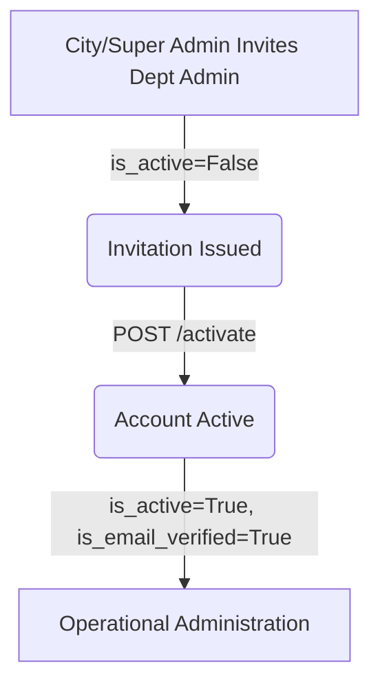

# Department Admin API

The Department Admin API manages the accounts of municipal department administrators. Higher-level administrators (City Admins and Super Admins) invite department admins, who then manage municipal workflows, task allocations, and field technicians within their designated sectors.

---

## Endpoint Summary

The Department Admin controller maps exactly 2 operations under `/api/v1/admins`:

| Method | Endpoint | Caller Role / Credential | Authentication | Purpose |
| :---: | :--- | :--- | :--- | :--- |
| **POST** | `/api/v1/admins` | City Admin, Super Admin | Bearer Access Token | Create and email a registration invitation to a new Department Admin. |
| **POST** | `/api/v1/admins/activate` | Public (Guest) | Invitation Token | Activate the Department Admin account and configure their password. |

---

## Department Admin Lifecycle

The account state lifecycle of a Department Admin flows as follows:



### Account Lifecycle States:
* **Invitation Issued:** A User record is created in an inactive, unverified state (`is_active = False`, `is_email_verified = False`) with role `DepartmentAdmin`. A unique UUID invitation token is generated (valid for **24 hours**) and emailed to the user.
* **Account Activated:** The invited administrator clicks the email link, submits a password, and the system sets `is_active = True`, `is_email_verified = True` on their user record, marking the invitation as consumed.

---

## Department Admin Management Scope

Account management access follows a strict administrative hierarchy:

| Caller Role | Target Admin Scoping | Action Permitted |
| :--- | :--- | :---: |
| **Super Admin** | Create/invite Department Admins across any municipal department. | **Yes** |
| **City Admin** | Create/invite Department Admins across any municipal department. | **Yes** |
| **Department Admin** | Create/invite other Department Admins. | **No** |
| **Worker / Citizen** | Create/invite Department Admins. | **No** |

---

## Department Relationship

Unlike field technicians who require a separate profile record, Department Admins are mapped directly on the core User record:
* **Direct Mapping:** The database stores `department_id` directly in the core `users` database table when mapping users with the `DepartmentAdmin` role.
* **Department Constraints:** A department must exist in the database for the registration to succeed. A department can have multiple registered Department Admins.
* **No Administrative Transfer:** Re-assigning a Department Admin to a different department, deactivating, blocking, or unblocking admin accounts are `Not verified from current implementation` (no administrative endpoints exist in the current controller router).

---

## Department Admin Enumerations

No specific enums are directly exposed through these endpoints.

---

## Detailed Endpoint Specifications

---

## `POST /api/v1/admins`

### Purpose
Allows a City Admin or Super Admin to create a Department Admin account and email an invitation containing an activation token.

### Roles / Authorization
* City Admin or Super Admin roles only.

### Authentication
* Bearer Access Token required.

### Headers
* `Authorization: Bearer <access_token>`
* `Content-Type: application/json`

### Path Parameters
* `Not applicable`

### Query Parameters
* `Not applicable`

### Request Body / Form Data

| Field | Type | Required | Constraints / Validation | Description |
| :--- | :--- | :---: | :--- | :--- |
| `name` | String | Yes | `min_length=2`, `max_length=100` | Full name of the administrator. |
| `email` | String | Yes | Valid Email syntax | Corporate email address. |
| `phone` | String | No | Optional, defaults to `None` | Contact telephone number. |
| `department_id` | Integer | Yes | None | Database ID of the assigned municipal department. |

### Validation Rules
* **Pydantic Validation:** String boundaries or email validation failures return `422 Unprocessable Entity`.
* **Unique Email Check:** Email must not exist in `users`. Returns `400 Bad Request`.
* **Unique Phone Check:** Phone must not exist in `users`. Returns `400 Bad Request`.
* **Department Existence Check:** Department ID must exist in `departments`. Returns `400 Bad Request`.

### Rate Limit
* `No endpoint-specific rate limit verified.`

### Business Flow
1. Authenticates admin caller.
2. Validates uniqueness (email, phone) and department existence. Raises `400` on conflict.
3. Creates a `User` record: `is_active = False`, `is_email_verified = False`, `role = UserRole.DEPARTMENT_ADMIN`, `department_id = department_id`, default password `"Temp@123456"`.
4. Creates a `WorkerInvitation` token (valid for 24 hours).
5. Dispatches an invitation email containing the activation link.
6. Commits database transaction and returns the created administrator details.

### Success Response
* **HTTP Status:** `201 Created`
* **Response Model:** `DepartmentAdminResponse`

| Field | Type | Description |
| :--- | :--- | :--- |
| `id` | Integer | Database key of the created administrator user. |
| `name` | String | Full name. |
| `email` | String | Corporate email address. |
| `phone` | String \| null | Contact telephone number. |
| `department_id` | Integer | Assigned department ID. |

### Example Success Response
```json
{
  "id": 49,
  "name": "Sarah Connor",
  "email": "sarah.connor@city.gov",
  "phone": "9876543212",
  "department_id": 3
}
```

### Error Responses
| HTTP Status | Condition | Response / Detail |
| :---: | :--- | :--- |
| **400** | Email is already registered. | `{"detail": "Email already registered."}` |
| **400** | Phone number is already registered. | `{"detail": "Phone number already registered."}` |
| **400** | Department ID does not exist. | `{"detail": "Department not found."}` |
| **401** | Missing/invalid token. | `{"detail": "Invalid or expired token."}` |
| **403** | Caller is not administrative role. | `{"detail": "Permission denied."}` |
| **422** | Invalid parameter format. | `{"detail": [{"loc": ["body", "email"], "msg": "value is not a valid email address", "type": "value_error.email"}]}` |

### Possible HTTP Status Codes
* `201`, `400`, `401`, `403`, `422`

### Database / State Changes
* Creates new `User` record (with role `DepartmentAdmin`).
* Creates new `WorkerInvitation` record.

### Side Effects
* Sends email invitation containing activation link token to the administrator.

### Related APIs
* [POST /api/v1/admins/activate](#post-apiv1adminsactivate)

---

## `POST /api/v1/admins/activate`

### Purpose
Allows a guest user to activate their invited Department Admin account by providing a valid activation token and setting a password.

### Roles / Authorization
* Public (Unauthenticated guest).

### Authentication
* Activation token verification.

### Headers
* `Content-Type: application/json`

### Path Parameters
* `Not applicable`

### Query Parameters
* `Not applicable`

### Request Body / Form Data

| Field | Type | Required | Constraints / Validation | Description |
| :--- | :--- | :---: | :--- | :--- |
| `token` | String | Yes | UUID token string | The invitation activation token. |
| `password` | String | Yes | `min_length=8`, `max_length=128` | Plain-text password to configure. |

### Validation Rules
* **Pydantic Validation:** Password shorter than 8 characters returns `422`.
* **Token Verification:** The token must exist in the `worker_invitations` table, must not be marked `used = True`, and must not be expired (24-hour lifetime). Returns `400 Bad Request`.

### Rate Limit
* `No endpoint-specific rate limit verified.`

### Business Flow
1. Resolves token against invitation records.
2. Validates expiration and usage status. Throws `400` if invalid.
3. Retrieves the associated `User` record.
4. Hashes the new password via `hash_password()`.
5. Updates User flags: `is_active = True`, `is_email_verified = True`.
6. Marks invitation `used = True`.
7. Dispatches account activation success notification email.
8. Commits transaction and returns success message.

### Success Response
* **HTTP Status:** `200 OK`
* **Response Model:** `DepartmentAdminActivationResponse`

| Field | Type | Description |
| :--- | :--- | :--- |
| `message` | String | `"Department Admin account activated successfully."` |

### Example Success Response
```json
{
  "message": "Department Admin account activated successfully."
}
```

### Error Responses
| HTTP Status | Condition | Response / Detail |
| :---: | :--- | :--- |
| **400** | Token is invalid, expired, or already used. | `{"detail": "Invalid or expired activation link."}` |
| **400** | Target user profile not found. | `{"detail": "Department Admin not found."}` |
| **422** | Password too short. | `{"detail": [{"loc": ["body", "password"], "msg": "ensure this value has at least 8 characters", "type": "value_error.any_str.min_length"}]}` |

### Possible HTTP Status Codes
* `200`, `400`, `422`

### Database / State Changes
* Updates password hash in User record.
* Sets User `is_active = True`, `is_email_verified = True`.
* Sets `used = True` in `WorkerInvitation` record.

### Side Effects
* Sends email notifying the user of account activation success.
