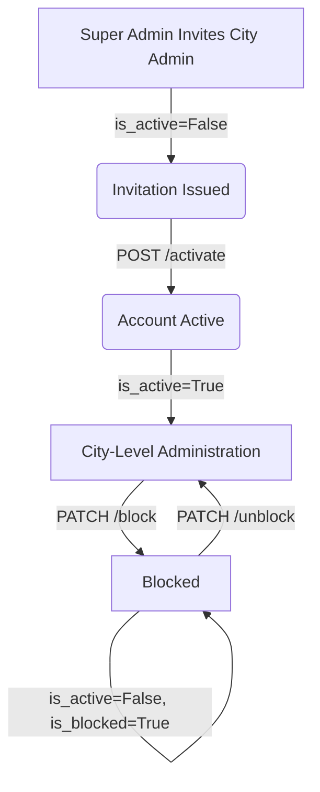

# City Admin API

The City Admin API manages the accounts of City Administrators, who oversee all municipal departments, citizen blocking reviews, and administrative scopes within the CSCRS. 

---

## Endpoint Summary

The City Admin controller maps exactly 8 operations under `/api/v1/city-admins`:

| Method | Endpoint | Caller Role / Credential | Authentication | Purpose |
| :---: | :--- | :--- | :--- | :--- |
| **POST** | `/api/v1/city-admins` | Super Admin | Bearer Access Token | Create and email a registration invitation to a new City Admin. |
| **POST** | `/api/v1/city-admins/activate` | Public (Guest) | Invitation Token | Activate the City Admin account and configure their password. |
| **PATCH** | `/api/v1/city-admins/admins/{admin_id}/block` | Super Admin | Bearer Access Token | Block a City Admin account. |
| **PATCH** | `/api/v1/city-admins/admins/{admin_id}/unblock` | Super Admin | Bearer Access Token | Unblock a blocked City Admin account. |
| **PATCH** | `/api/v1/city-admins/citizens/{citizen_id}/block` | City Admin | Bearer Access Token | Block a citizen account with a specified block reason. |
| **PATCH** | `/api/v1/city-admins/citizens/{citizen_id}/unblock` | City Admin | Bearer Access Token | Unblock a previously blocked citizen account. |
| **PATCH** | `/api/v1/city-admins/department-admins/{admin_id}/block` | City Admin | Bearer Access Token | Block a Department Admin account with a specified block reason. |
| **PATCH** | `/api/v1/city-admins/department-admins/{admin_id}/unblock` | City Admin | Bearer Access Token | Unblock a previously blocked Department Admin account. |

---

## City Admin Lifecycle

The account state lifecycle of a City Admin flows as follows:



### Account Lifecycle States:
* **Invitation Issued:** A User record is created in an inactive, unverified state (`is_active = False`, `is_email_verified = False`) with role `CityAdmin`. A unique UUID invitation token is generated (valid for **24 hours**) and emailed to the user.
* **Account Activated:** The invited administrator clicks the email link, submits a password, and the system sets `is_active = True`, `is_email_verified = True` on their user record, marking the invitation as consumed.
* **Blocked:** A Super Admin blocks the account. The system flags `is_blocked = True` and `is_active = False` on the core User record, locking them out of system logins.
* **Unblocked:** A Super Admin reactivates the blocked account. The system flags `is_blocked = False` and `is_active = True`.

---

## City Admin Scope

* **No Database City Scoping:** Currently, **no database city-scoping model exists**. The database does not define a `city_id` field or a `CityAdminProfile` model.
* **Global Scope:** The backend currently implements a single-city model where City Admins are globally scoped administrators over all municipal departments. They have authority to view and coordinate all reports and departmental queues across the municipality.

---

## City Admin Management Hierarchy

City Admin account creation and blocking restrictions are strictly enforced by role:

| Caller Role | Target City Admin Action | Allowed |
| :--- | :--- | :---: |
| **Super Admin** | Invite City Admin, Block City Admin, Unblock City Admin. | **Yes** |
| **City Admin** | Invite or Block another City Admin. | **No** |
| **Department Admin** | Manage City Admin accounts. | **No** |

---

## City Admin Enumerations

No specific enums are directly exposed by these account-management operations.

---

## Detailed Endpoint Specifications

---

## `POST /api/v1/city-admins`

### Purpose
Allows a Super Admin to create a City Admin account and email an invitation containing an activation token.

### Roles / Authorization
* Super Admin role only.

### Authentication
* Bearer Access Token required.

### Headers
* `Authorization: Bearer <access_token>`
* `Content-Type: application/json`

### Path Parameters
* `Not applicable`

### Query Parameters
* `Not applicable`

### Request Body / Form Data

| Field | Type | Required | Constraints / Validation | Description |
| :--- | :--- | :---: | :--- | :--- |
| `name` | String | Yes | `min_length=2`, `max_length=100` | Full name of the administrator. |
| `email` | String | Yes | Valid Email syntax | Corporate email address. |
| `phone` | String | No | Optional, defaults to `None` | Contact telephone number. |

### Validation Rules
* **Pydantic Validation:** String boundaries or email validation failures return `422 Unprocessable Entity`.
* **Unique Email Check:** Email must not exist in `users`. Returns `400 Bad Request`.
* **Unique Phone Check:** Phone must not exist in `users`. Returns `400 Bad Request`.

### Rate Limit
* `No endpoint-specific rate limit verified.`

### Business Flow
1. Authenticates Super Admin caller.
2. Validates uniqueness of email and phone. Raises `400` on conflict.
3. Creates a `User` record: `is_active = False`, `is_email_verified = False`, `role = UserRole.CITY_ADMIN`, default password `"Temp@123456"`.
4. Creates a `WorkerInvitation` token (valid for 24 hours).
5. Dispatches an invitation email containing the activation link.
6. Commits database transaction and returns the created administrator details.

### Success Response
* **HTTP Status:** `201 Created`
* **Response Model:** `CityAdminResponse`

| Field | Type | Description |
| :--- | :--- | :--- |
| `id` | Integer | Database key of the created administrator user. |
| `name` | String | Full name. |
| `email` | String | Corporate email address. |
| `phone` | String \| null | Contact telephone number. |

### Example Success Response
```json
{
  "id": 50,
  "name": "Jane Doe",
  "email": "jane.doe@city.gov",
  "phone": "9876543213"
}
```

### Error Responses
| HTTP Status | Condition | Response / Detail |
| :---: | :--- | :--- |
| **400** | Email is already registered. | `{"detail": "Email already registered."}` |
| **400** | Phone number is already registered. | `{"detail": "Phone number already registered."}` |
| **401** | Missing/invalid token. | `{"detail": "Invalid or expired token."}` |
| **403** | Caller is not Super Admin. | `{"detail": "Permission denied."}` |
| **422** | Invalid parameter format. | `{"detail": [{"loc": ["body", "email"], "msg": "value is not a valid email address", "type": "value_error.email"}]}` |

### Possible HTTP Status Codes
* `201`, `400`, `401`, `403`, `422`

### Database / State Changes
* Creates new `User` record (with role `CityAdmin`).
* Creates new `WorkerInvitation` record.

### Side Effects
* Sends email invitation containing activation link token to the administrator.

### Related APIs
* [POST /api/v1/city-admins/activate](#post-apiv1city-adminsactivate)

---

## `POST /api/v1/city-admins/activate`

### Purpose
Allows a guest user to activate their invited City Admin account by providing a valid activation token and setting a password.

### Roles / Authorization
* Public (Unauthenticated guest).

### Authentication
* Activation token verification.

### Headers
* `Content-Type: application/json`

### Path Parameters
* `Not applicable`

### Query Parameters
* `Not applicable`

### Request Body / Form Data

| Field | Type | Required | Constraints / Validation | Description |
| :--- | :--- | :---: | :--- | :--- |
| `token` | String | Yes | UUID token string | The invitation activation token. |
| `password` | String | Yes | `min_length=8`, `max_length=128` | Plain-text password to configure. |

### Validation Rules
* **Pydantic Validation:** Password shorter than 8 characters returns `422`.
* **Token Verification:** The token must exist in the `worker_invitations` table, must not be marked `used = True`, and must not be expired (24-hour lifetime). Returns `400 Bad Request`.

### Rate Limit
* `No endpoint-specific rate limit verified.`

### Business Flow
1. Resolves token against invitation records.
2. Validates expiration and usage status. Throws `400` if invalid.
3. Retrieves the associated `User` record.
4. Hashes the new password via `hash_password()`.
5. Updates User flags: `is_active = True`, `is_email_verified = True`.
6. Marks invitation `used = True`.
7. Dispatches account activation success notification email.
8. Commits transaction and returns success message.

### Success Response
* **HTTP Status:** `200 OK`
* **Response Model:** `CityAdminActivationResponse`

| Field | Type | Description |
| :--- | :--- | :--- |
| `message` | String | `"City Admin account activated successfully."` |

### Example Success Response
```json
{
  "message": "City Admin account activated successfully."
}
```

### Error Responses
| HTTP Status | Condition | Response / Detail |
| :---: | :--- | :--- |
| **400** | Token is invalid, expired, or already used. | `{"detail": "Invalid or expired activation link."}` |
| **400** | Target user profile not found. | `{"detail": "City Admin not found."}` |
| **422** | Password too short. | `{"detail": [{"loc": ["body", "password"], "msg": "ensure this value has at least 8 characters", "type": "value_error.any_str.min_length"}]}` |

### Possible HTTP Status Codes
* `200`, `400`, `422`

### Database / State Changes
* Updates password hash in User record.
* Sets User `is_active = True`, `is_email_verified = True`.
* Sets `used = True` in `WorkerInvitation` record.

### Side Effects
* Sends email notifying the user of account activation success.

---

## `PATCH /api/v1/city-admins/admins/{admin_id}/block`

### Purpose
Allows a Super Admin to block a City Admin account.

### Roles / Authorization
* Super Admin role only.

### Authentication
* Bearer Access Token required.

### Headers
* `Authorization: Bearer <access_token>`
* `Content-Type: application/json`

### Path Parameters

| Name | Type | Required | Description |
| :--- | :--- | :---: | :--- |
| `admin_id` | Integer | Yes | Database ID of the target City Admin. |

### Request Body / Form Data

| Field | Type | Required | Constraints / Validation | Description |
| :--- | :--- | :---: | :--- | :--- |
| `block_type` | String | Yes | Must match `BlockType` | Category of block reason. |
| `reason` | String | Yes | `min_length=5`, `max_length=500` | Details explaining the restriction. |

### Validation Rules
* **Pydantic Validation:** Feedback reason under 5 characters returns `422`.
* **Account Blocked Verification:** If the account is already blocked (`user.is_blocked = True`), raises `409 Conflict`.
* **Role Check:** The target user must have the `CityAdmin` role. If not, raises `400 Bad Request`.

### Rate Limit
* `No endpoint-specific rate limit verified.`

### Business Flow
1. Authenticates Super Admin caller.
2. Checks target user existence. Throws `404` if not found.
3. Checks target user role is exactly `CityAdmin`. Raises `400` if not.
4. Checks if target is already blocked. Raises `409` if true.
5. Performs block update: sets `user.is_blocked = True`, `user.is_active = False` and records block metadata.
6. Dispatches email notification alerting account has been blocked.
7. Commits transaction and returns success.

### Success Response
* **HTTP Status:** `200 OK`
* **Response Model:** `WorkerStatusResponse` (reused structural response)

| Field | Type | Description |
| :--- | :--- | :--- |
| `message` | String | `"City Admin blocked successfully."` |

### Example Success Response
```json
{
  "message": "City Admin blocked successfully."
}
```

### Error Responses
| HTTP Status | Condition | Response / Detail |
| :---: | :--- | :--- |
| **400** | Target user is not a City Admin. | `{"detail": "Selected user is not a City Admin."}` |
| **401** | Missing/invalid token. | `{"detail": "Invalid or expired token."}` |
| **403** | Caller is not Super Admin. | `{"detail": "Permission denied."}` |
| **404** | Target user not found. | `{"detail": "City Admin not found."}` |
| **409** | Account is already blocked. | `{"detail": "City Admin account is already blocked."}` |
| **422** | Invalid parameters. | `{"detail": [{"loc": ["body", "reason"], "msg": "ensure this value has at least 5 characters", "type": "value_error.any_str.min_length"}]}` |

### Possible HTTP Status Codes
* `200`, `400`, `401`, `403`, `404`, `409`, `422`

### Related APIs
* [PATCH /api/v1/city-admins/admins/{admin_id}/unblock](#patch-apiv1city-adminsadminsadmin_idunblock)

---

## `PATCH /api/v1/city-admins/admins/{admin_id}/unblock`

### Purpose
Allows a Super Admin to unblock a blocked City Admin's account.

### Roles / Authorization
* Super Admin role only.

### Path Parameters

| Name | Type | Required | Description |
| :--- | :--- | :---: | :--- |
| `admin_id` | Integer | Yes | Database ID of the target City Admin. |

### Validation Rules
* **Active Status Gate:** If the account is not blocked (`user.is_blocked = False`), raises `409 Conflict`.
* **Role Check:** The target user must have the `CityAdmin` role. If not, raises `400 Bad Request`.

### Business Flow
1. Authenticates Super Admin caller.
2. Checks target user existence. Throws `404` if not found.
3. Checks target user role is exactly `CityAdmin`. Raises `400` if not.
4. Checks if target is not blocked. Raises `409` if true.
5. Performs unblock update: sets `user.is_blocked = False` and `user.is_active = True`.
6. Dispatches email notification alerting account has been unblocked.
7. Commits transaction and returns success.

### Success Response
* **HTTP Status:** `200 OK`
* **Response Model:** `WorkerStatusResponse` (reused structural response)

| Field | Type | Description |
| :--- | :--- | :--- |
| `message` | String | `"City Admin unblocked successfully."` |

### Example Success Response
```json
{
  "message": "City Admin unblocked successfully."
}
```

### Error Responses
| HTTP Status | Condition | Response / Detail |
| :---: | :--- | :--- |
| **400** | Target user is not a City Admin. | `{"detail": "Selected user is not a City Admin."}` |
| **401** | Missing/invalid token. | `{"detail": "Invalid or expired token."}` |
| **403** | Caller is not Super Admin. | `{"detail": "Permission denied."}` |
| **404** | Target user not found. | `{"detail": "City Admin not found."}` |
| **409** | Account is already active. | `{"detail": "City Admin account is already active."}` |

### Possible HTTP Status Codes
* `200`, `400`, `401`, `403`, `404`, `409`

### Related APIs
* [PATCH /api/v1/city-admins/admins/{admin_id}/block](#patch-apiv1city-adminsadminsadmin_idblock)

---

## `PATCH /api/v1/city-admins/citizens/{citizen_id}/block`

### Purpose
Allows a City Admin to block a citizen account. Blocking prevents the citizen from submitting new reports or logging into the CSCRS platform. A block type category and reason must be supplied.

### Roles / Authorization
* City Admin role only.

### Authentication
* Bearer Access Token required.

### Headers
* `Authorization: Bearer <access_token>`

### Path Parameters

| Name | Type | Required | Description |
| :--- | :--- | :---: | :--- |
| `citizen_id` | Integer | Yes | The unique database ID of the citizen account to block. |

### Query Parameters
* Not applicable.

### Request Body (JSON)

| Field | Type | Required | Constraints | Description |
| :--- | :--- | :---: | :--- | :--- |
| `block_type` | String (Enum) | Yes | `BlockType` enum | Category of the block action. |
| `reason` | String | Yes | 5–500 characters | Human-readable explanation for the block. |

#### `BlockType` Enum Values

| Value | Meaning |
| :--- | :--- |
| `RETIRED` | Account retired. |
| `TRANSFERRED` | User transferred. |
| `SUSPENDED` | Account suspended pending review. |
| `TERMINATED` | Account permanently terminated. |
| `DISMISSED` | Account dismissed due to policy violation. |

### Rate Limiting
* Not rate-limited via SlowAPI decorator.

### Validation Rules
* `reason` must be between 5 and 500 characters.
* `block_type` must be a valid `BlockType` enum value.
* Caller must hold `CITY_ADMIN` role.
* Target user must exist and have the `Citizen` role.

### Business Logic
1. Authenticates the calling City Admin.
2. Fetches the target citizen by `citizen_id`.
3. Validates target is an active citizen account.
4. Records block: sets `user.is_blocked = True`, `user.is_active = False`, stores `block_type` and `reason`.
5. Commits transaction.

### Success Response
* **HTTP Status:** `200 OK`

```json
{
  "message": "Citizen blocked successfully."
}
```

### Error Responses
| HTTP Status | Condition | Response / Detail |
| :---: | :--- | :--- |
| **400** | Target is not a citizen, or is already blocked. | `{"detail": "..."}` |
| **401** | Missing/invalid token. | `{"detail": "Invalid or expired token."}` |
| **403** | Caller is not City Admin. | `{"detail": "Permission denied."}` |
| **404** | Target citizen not found. | `{"detail": "Citizen not found."}` |
| **422** | `block_type` invalid or `reason` length violations. | Standard FastAPI 422 validation error. |

### Possible HTTP Status Codes
* `200`, `400`, `401`, `403`, `404`, `422`

### Database / State Changes
* Sets `user.is_blocked = True`, `user.is_active = False` on the target citizen.

### Related APIs
* [PATCH /api/v1/city-admins/citizens/{citizen_id}/unblock](#patch-apiv1city-adminscitizenscitizen_idunblock)

---

## `PATCH /api/v1/city-admins/citizens/{citizen_id}/unblock`

### Purpose
Allows a City Admin to unblock a previously blocked citizen account, restoring their access to the CSCRS platform.

### Roles / Authorization
* City Admin role only.

### Authentication
* Bearer Access Token required.

### Headers
* `Authorization: Bearer <access_token>`

### Path Parameters

| Name | Type | Required | Description |
| :--- | :--- | :---: | :--- |
| `citizen_id` | Integer | Yes | The unique database ID of the citizen account to unblock. |

### Query Parameters
* Not applicable.

### Request Body / Form Data
* Not applicable.

### Rate Limiting
* Not rate-limited via SlowAPI decorator.

### Validation Rules
* Caller must hold `CITY_ADMIN` role.
* Target user must exist and be currently blocked.

### Business Logic
1. Authenticates the calling City Admin.
2. Fetches the target citizen by `citizen_id`.
3. Validates the citizen is currently blocked.
4. Reverses block: sets `user.is_blocked = False`, `user.is_active = True`.
5. Commits transaction.

### Success Response
* **HTTP Status:** `200 OK`

```json
{
  "message": "Citizen unblocked successfully."
}
```

### Error Responses
| HTTP Status | Condition | Response / Detail |
| :---: | :--- | :--- |
| **400** | Citizen is not blocked / not a citizen. | `{"detail": "..."}` |
| **401** | Missing/invalid token. | `{"detail": "Invalid or expired token."}` |
| **403** | Caller is not City Admin. | `{"detail": "Permission denied."}` |
| **404** | Target citizen not found. | `{"detail": "Citizen not found."}` |

### Possible HTTP Status Codes
* `200`, `400`, `401`, `403`, `404`

### Database / State Changes
* Sets `user.is_blocked = False`, `user.is_active = True` on the target citizen.

### Related APIs
* [PATCH /api/v1/city-admins/citizens/{citizen_id}/block](#patch-apiv1city-adminscitizenscitizen_idblock)

---

## `PATCH /api/v1/city-admins/department-admins/{admin_id}/block`

### Purpose
Allows a City Admin to block a Department Admin account. Blocking prevents the admin from accessing the CSCRS platform and performing department-level operations. A block type category and reason must be supplied.

### Roles / Authorization
* City Admin role only.

### Authentication
* Bearer Access Token required.

### Headers
* `Authorization: Bearer <access_token>`

### Path Parameters

| Name | Type | Required | Description |
| :--- | :--- | :---: | :--- |
| `admin_id` | Integer | Yes | The unique database ID of the Department Admin account to block. |

### Query Parameters
* Not applicable.

### Request Body (JSON)

| Field | Type | Required | Constraints | Description |
| :--- | :--- | :---: | :--- | :--- |
| `block_type` | String (Enum) | Yes | `BlockType` enum | Category of the block action. |
| `reason` | String | Yes | 5–500 characters | Human-readable explanation for the block. |

#### `BlockType` Enum Values

| Value | Meaning |
| :--- | :--- |
| `RETIRED` | Account retired. |
| `TRANSFERRED` | User transferred. |
| `SUSPENDED` | Account suspended pending review. |
| `TERMINATED` | Account permanently terminated. |
| `DISMISSED` | Account dismissed due to policy violation. |

### Rate Limiting
* Not rate-limited via SlowAPI decorator.

### Validation Rules
* `reason` must be between 5 and 500 characters.
* `block_type` must be a valid `BlockType` enum value.
* Caller must hold `CITY_ADMIN` role.
* Target user must exist and have the `DepartmentAdmin` role.

### Business Logic
1. Authenticates the calling City Admin.
2. Fetches the target Department Admin by `admin_id`.
3. Validates target is an active Department Admin account.
4. Records block: sets `user.is_blocked = True`, `user.is_active = False`, stores `block_type` and `reason`.
5. Commits transaction.

### Success Response
* **HTTP Status:** `200 OK`

```json
{
  "message": "Department Admin blocked successfully."
}
```

### Error Responses
| HTTP Status | Condition | Response / Detail |
| :---: | :--- | :--- |
| **400** | Target is not a Department Admin, or is already blocked. | `{"detail": "..."}` |
| **401** | Missing/invalid token. | `{"detail": "Invalid or expired token."}` |
| **403** | Caller is not City Admin. | `{"detail": "Permission denied."}` |
| **404** | Target admin not found. | `{"detail": "Department Admin not found."}` |
| **422** | `block_type` invalid or `reason` length violations. | Standard FastAPI 422 validation error. |

### Possible HTTP Status Codes
* `200`, `400`, `401`, `403`, `404`, `422`

### Database / State Changes
* Sets `user.is_blocked = True`, `user.is_active = False` on the target Department Admin.

### Related APIs
* [PATCH /api/v1/city-admins/department-admins/{admin_id}/unblock](#patch-apiv1city-adminsdepartment-adminsadmin_idunblock)

---

## `PATCH /api/v1/city-admins/department-admins/{admin_id}/unblock`

### Purpose
Allows a City Admin to unblock a previously blocked Department Admin account, restoring their administrative access to the CSCRS platform.

### Roles / Authorization
* City Admin role only.

### Authentication
* Bearer Access Token required.

### Headers
* `Authorization: Bearer <access_token>`

### Path Parameters

| Name | Type | Required | Description |
| :--- | :--- | :---: | :--- |
| `admin_id` | Integer | Yes | The unique database ID of the Department Admin account to unblock. |

### Query Parameters
* Not applicable.

### Request Body / Form Data
* Not applicable.

### Rate Limiting
* Not rate-limited via SlowAPI decorator.

### Validation Rules
* Caller must hold `CITY_ADMIN` role.
* Target user must exist and be currently blocked.

### Business Logic
1. Authenticates the calling City Admin.
2. Fetches the target Department Admin by `admin_id`.
3. Validates the admin is currently blocked.
4. Reverses block: sets `user.is_blocked = False`, `user.is_active = True`.
5. Commits transaction.

### Success Response
* **HTTP Status:** `200 OK`

```json
{
  "message": "Department Admin unblocked successfully."
}
```

### Error Responses
| HTTP Status | Condition | Response / Detail |
| :---: | :--- | :--- |
| **400** | Admin is not blocked / not a Department Admin. | `{"detail": "..."}` |
| **401** | Missing/invalid token. | `{"detail": "Invalid or expired token."}` |
| **403** | Caller is not City Admin. | `{"detail": "Permission denied."}` |
| **404** | Target admin not found. | `{"detail": "Department Admin not found."}` |

### Possible HTTP Status Codes
* `200`, `400`, `401`, `403`, `404`

### Database / State Changes
* Sets `user.is_blocked = False`, `user.is_active = True` on the target Department Admin.

### Related APIs
* [PATCH /api/v1/city-admins/department-admins/{admin_id}/block](#patch-apiv1city-adminsdepartment-adminsadmin_idblock)
