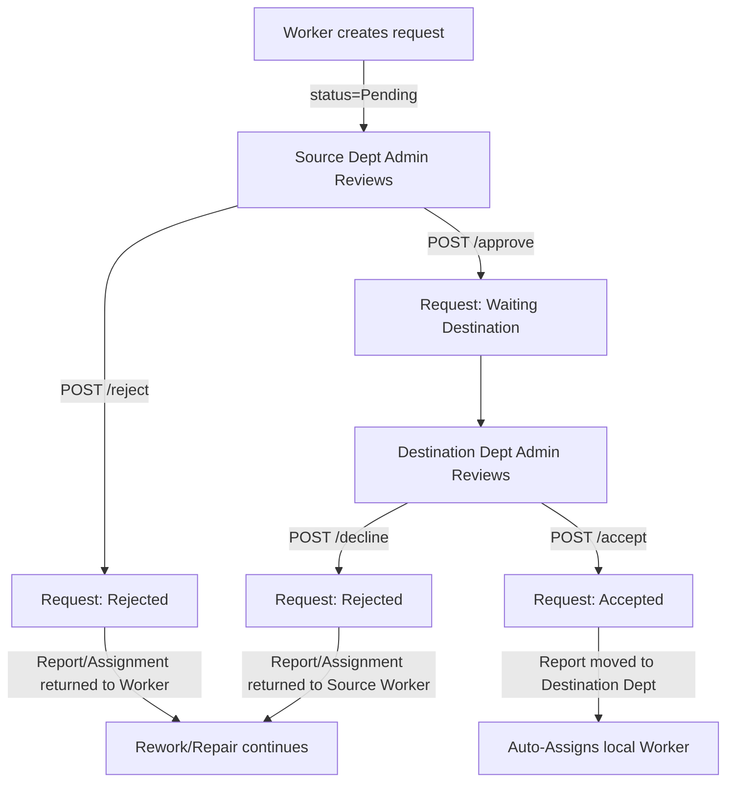

# Forward Requests API

The Forward Requests API manages the inter-departmental routing workflow for civic issue reports. When a report is incorrectly categorized (either via AI misclassification or citizen category selection), the assigned worker can flag it for forwarding. A Department Admin from the source department then reviews the request, designates the target department, and forwards it. Finally, a Department Admin from the destination department reviews the incoming request to accept it (which triggers automatic assignment in the new department) or decline it (which returns it to the source department).

---

## Endpoint Summary

The Forward Requests controller maps exactly 8 operations under `/api/v1/forward-requests`:

| Method | Endpoint | Roles | Authentication | Purpose |
| :---: | :--- | :--- | :--- | :--- |
| **POST** | `/api/v1/forward-requests/{report_id}` | Worker | Bearer Access Token | Submit a forward request for an assigned report. |
| **GET** | `/api/v1/forward-requests/pending` | Department Admin | Bearer Access Token | Retrieve outgoing pending forward requests created within the admin's department. |
| **GET** | `/api/v1/forward-requests/incoming` | Department Admin | Bearer Access Token | Retrieve incoming forward requests routed to the admin's department. |
| **GET** | `/api/v1/forward-requests/{request_id}` | Department Admin | Bearer Access Token | Retrieve detailed metadata for a specific forward request. |
| **POST** | `/api/v1/forward-requests/{request_id}/approve` | Department Admin (Source) | Bearer Access Token | Approve the worker's request and designate the destination department. |
| **POST** | `/api/v1/forward-requests/{request_id}/accept` | Department Admin (Destination) | Bearer Access Token | Accept an incoming report and auto-assign it to a local worker. |
| **POST** | `/api/v1/forward-requests/{request_id}/decline` | Department Admin (Destination) | Bearer Access Token | Decline an incoming report, returning the assignment to the source worker. |
| **POST** | `/api/v1/forward-requests/{request_id}/reject` | Department Admin (Source) | Bearer Access Token | Reject the worker's request, keeping the report in the source department. |

---

## Forward Request Lifecycle

The forwarding workflow follows a sequential progression across worker and administrator roles:



### Process Detail:
1. **Worker Flags Report:** Submits `POST /api/v1/forward-requests/{report_id}`. This logs a request record in `Pending` state.
2. **Source Department Review:**
   * **Rejection:** Source admin calls `POST /api/v1/forward-requests/{request_id}/reject`. The request status updates to `Rejected`, report/assignment status remains active, and the worker must resolve it.
   * **Approval:** Source admin calls `POST /api/v1/forward-requests/{request_id}/approve` detailing the target `department_id`. The request transitions to `Waiting Destination`, the active worker assignment is cancelled (restoring worker availability), and the report status shifts to `Pending`.
3. **Destination Department Review:**
   * **Decline:** Destination admin calls `POST /api/v1/forward-requests/{request_id}/decline`. The request status updates to `Rejected`, the report's department remains unchanged, and the original worker assignment is reactivated (setting worker availability back to `False`).
   * **Accept:** Destination admin calls `POST /api/v1/forward-requests/{request_id}/accept`. The request status updates to `Accepted`, the report's `department_id` updates to the target department, the forward count is incremented, and a new auto-assignment is triggered to allocate a local worker in the destination department.

---

## Forwarding and Assignments

Forwarding interacts dynamically with the report's assignment state:
* **Active Assignment Required:** Workers can only request forwarding if they hold an active assignment for the target report in `In Progress` status.
* **Release on Approval:** Approving a forward request cancels the worker's active assignment (`AssignmentStatus.CANCELLED`) and sets their profile availability back to `is_available = True` (releasing them for other tasks).
* **Restoration on Decline/Rejection:** Rejecting a forward request (by the source admin) or declining it (by the destination admin) reactivates the worker's original assignment (`AssignmentStatus.ASSIGNED`), sets the report status back to `Assigned`, and locks the worker's profile availability back to `is_available = False`.
* **Re-Assignment on Accept:** Accepting the forward request updates the report's department and initiates a new worker allocation via the **Least Active Workload** strategy. Refer to [Assignments API Reference](12-assignments-api.md) for auto-assignment rules.

---

## Forwarding and Report State

* **Eligible Report Statuses:** A report must be in `Pending`, `Assigned`, or `In Progress` status to be eligible for forwarding. Completed or resolved reports cannot be forwarded.
* **Transition States:**
  * Standard creation has no immediate effect on report status (remains `Assigned` or `In Progress`).
  * Source approval shifts the report status to `Pending` (clearing assignments).
  * Destination acceptance triggers auto-assignment, transitioning report status to `Assigned`.
  * Rejection/Decline restores report status to `Assigned` (reactivating the source worker's task).

---

## Forward Request Data Model

Exposed fields within the `DepartmentForwardRequest` data schemas:

| Field | Type | Returned | Description |
| :--- | :--- | :---: | :--- |
| `id` | Integer | Yes | Database primary key of the forward request. |
| `report_id` | Integer | Yes | Linked report ID. |
| `worker_id` | Integer | Yes | ID of the worker who requested the forward. |
| `current_department_id` | Integer | Yes | ID of the source department. |
| `destination_department_id` | Integer \| null | Yes | ID of the destination department. |
| `reason` | String | Yes | Worker's text explanation. |
| `decision_reason` | String \| null | Yes | Text explanation recorded by the reviewing administrator. |
| `status` | String | Yes | Serialized status string. |
| `reviewed_by` | Integer \| null | Yes | User ID of the reviewing Department Admin. |
| `reviewed_at` | DateTime \| null | Yes | Timestamp of review decision. |
| `created_at` | DateTime | Yes | Timestamp of request creation. |

---

## Forward Request Enumerations

### `ForwardRequestStatus`
Defines the review lifecycle state of a request.

| Value | Meaning |
| :--- | :--- |
| `Pending` | Worker has submitted the request; pending source admin review. |
| `Waiting Destination` | Approved by source admin; waiting destination admin acceptance/decline. |
| `Accepted` | Accepted by destination admin; report routed and reassigned. |
| `Rejected` | Rejected by source admin or declined by destination admin. |

### `ForwardReasonType`
Administrative categories for report forwarding.

| Value | Meaning |
| :--- | :--- |
| `WRONG_AI_CLASSIFICATION` | YOLO model classified the civic issue incorrectly. |
| `WRONG_CITIZEN_CATEGORY` | Citizen submitted the report under the wrong category. |
| `ADMINISTRATIVE_TRANSFER` | Administrative re-routing due to localized jurisdiction. |
| `DUPLICATE_DEPARTMENT` | Double mapping of department boundaries. |
| `OTHER` | Miscellaneous reasoning. |

---

## Detailed Endpoint Specifications

---

## `POST /api/v1/forward-requests/{report_id}`

### Purpose
Allows an assigned worker to request that a report be forwarded because it belongs to another department.

### Roles / Authorization
* Worker role. The worker must hold the active assignment for the target report.

### Authentication
* Bearer Access Token required.

### Headers
* `Authorization: Bearer <access_token>`
* `Content-Type: application/json`

### Path Parameters

| Name | Type | Required | Description |
| :--- | :--- | :---: | :--- |
| `report_id` | Integer | Yes | Database ID of the report. |

### Request Body / Form Data

| Field | Type | Required | Constraints / Validation | Description |
| :--- | :--- | :---: | :--- | :--- |
| `reason` | String | Yes | None | Worker explanation for forwarding. |

### Validation Rules
* **Pydantic Validation:** Malformed JSON bodies return `422 Unprocessable Entity`.
* **Assignment Verification:** Checks for an active assignment linked to the report. If missing or the worker ID does not match the caller, raises `403 Forbidden`.
* **Report Check:** If the report does not exist, returns `404 Not Found`.
* **Existing Request Check:** If a forward request is already in `Pending` status for this report, returns `400 Bad Request`.

### Rate Limit
* `No endpoint-specific rate limit verified.`

### Business Flow
1. Authenticates worker and decodes path report ID.
2. Checks report existence. Throws `404` if not found.
3. Checks for an active assignment owned by the worker. Raises `403` if mismatch.
4. Checks if another request is already pending. Raises `400` on duplicate.
5. Inserts a new `DepartmentForwardRequest` in `Pending` status.
6. Logs audit log: `FORWARD_REQUEST_CREATED`.
7. Commits database transaction and returns the forward request response.

### Success Response
* **HTTP Status:** `200 OK`
* **Response Model:** `ForwardRequestResponse`

### Example Success Response
```json
{
  "id": 14,
  "report_id": 92,
  "worker_id": 18,
  "current_department_id": 2,
  "reason": "This pothole is actually a burst water main; belongs to Drainage.",
  "status": "Pending",
  "decision_reason": null,
  "reviewed_at": null,
  "reviewed_by": null
}
```

### Error Responses
| HTTP Status | Condition | Response / Detail |
| :---: | :--- | :--- |
| **400** | A forward request is already pending. | `{"detail": "A forward request is already pending."}` |
| **401** | Missing/invalid token. | `{"detail": "Invalid or expired token."}` |
| **403** | Worker does not own the active assignment. | `{"detail": "You can flag only reports assigned to you."}` |
| **404** | Report ID does not exist. | `{"detail": "Report not found."}` |
| **422** | Request body parameter missing. | `{"detail": [{"loc": ["body", "reason"], "msg": "field required", "type": "value_error.missing"}]}` |

---

## `GET /api/v1/forward-requests/pending`

### Purpose
Retrieves a list of all outgoing pending forward requests generated within the admin's department.

### Roles / Authorization
* Department Admin role. Scoped strictly to the admin's `department_id`.

### Success Response
* **HTTP Status:** `200 OK`
* **Response Model:** `list[ForwardRequestResponse]`

---

## `GET /api/v1/forward-requests/incoming`

### Purpose
Retrieves a list of all incoming forward requests routed to the admin's department.

### Roles / Authorization
* Department Admin role. Scoped strictly to requests where `destination_department_id` matches the admin's `department_id`.

### Success Response
* **HTTP Status:** `200 OK`
* **Response Model:** `list[IncomingForwardRequestResponse]`

---

## `GET /api/v1/forward-requests/{request_id}`

### Purpose
Retrieves detailed metadata, report status, and department configurations for a specific forward request.

### Roles / Authorization
* Department Admin role. Access allowed if the admin's department matches either the source (`current_department_id`) or destination (`destination_department_id`).

### Path Parameters

| Name | Type | Required | Description |
| :--- | :--- | :---: | :--- |
| `request_id` | Integer | Yes | Database ID of the forward request. |

### Success Response
* **HTTP Status:** `200 OK`
* **Response Model:** `ForwardRequestDetailResponse`

### Example Success Response
```json
{
  "request_id": 14,
  "status": "Pending",
  "reason": "This pothole is actually a burst water main.",
  "created_at": "2026-07-28T16:10:00Z",
  "worker": {
    "id": 18,
    "name": "Bob Vance",
    "email": null,
    "phone": null
  },
  "report": {
    "id": 92,
    "report_number": "REP-2026-0103",
    "issue_type": "Road Damage",
    "priority": "High",
    "status": "Assigned",
    "latitude": 12.9716,
    "longitude": 77.5946,
    "address": "42 Main St",
    "support_count": 0,
    "risk_score": 0.0,
    "ai_confidence": 0.89,
    "verification_decision": "PASS",
    "verification_passed": true
  },
  "departments": {
    "source_department": {
      "id": 2,
      "name": "Roads"
    },
    "destination_department": null
  },
  "images": {
    "original_image": "uploads/8e9a2b1c4d7e6f8a.jpeg",
    "annotated_image": "uploads/annotated_8e9a2b1c4d7e6f8a.jpeg",
    "resolution_image": null
  },
  "timeline": []
}
```

---

## `POST /api/v1/forward-requests/{request_id}/approve`

### Purpose
Allows a Source Department Admin to approve the worker's forward request and designate the destination department.

### Roles / Authorization
* Department Admin (Source). Scoped strictly to requests where `current_department_id` matches the admin's `department_id`.

### Path Parameters

| Name | Type | Required | Description |
| :--- | :--- | :---: | :--- |
| `request_id` | Integer | Yes | Database ID of the forward request. |

### Request Body / Form Data

| Field | Type | Required | Constraints / Validation | Description |
| :--- | :--- | :---: | :--- | :--- |
| `department_id` | Integer | Yes | None | Destination department ID. |
| `reason_type` | String | Yes | Must match `ForwardReasonType` | Category explaining the forward action. |
| `remarks` | String | Yes | `min_length=5`, `max_length=500` | Administrative review remarks. |

### Validation Rules
* **Pydantic Validation:** Remarks under 5 characters returns `422`.
* **State Check:** Request status must be `Pending`. Throws `400` if already processed.
* **Scope Check:** Admin's department must match `current_department_id`. Raises `403` if mismatch.
* **Source/Destination Logic Check:** Destination department cannot equal the source department ID. Raises `400`.
* **Report Eligibility:** The report status must be `Pending`, `Assigned`, or `In Progress`. Returns `400` if resolved.

### Business Flow
1. Authenticates source admin and checks request existence. Throws `404` if not found.
2. Checks role and department scoping. Raises `403` if mismatch.
3. Checks status is `Pending`. Raises `400` if processed.
4. Invokes `ReportService.forward_report()`. This cancels the active worker assignment, releases worker availability to `True`, adds a record in `ReportForwardHistory`, and shifts report status to `Pending`.
5. Updates forward request status to `Waiting Destination`, sets `destination_department_id`, and stores review metadata.
6. Dispatches notification to destination admins and commits transaction.

### Success Response
* **HTTP Status:** `200 OK`
* **Response Model:** `ForwardRequestResponse`

### Example Success Response
```json
{
  "id": 14,
  "report_id": 92,
  "worker_id": 18,
  "current_department_id": 2,
  "reason": "This pothole is actually a burst water main.",
  "status": "Waiting Destination",
  "decision_reason": "Burst water main; routing to Drainage department.",
  "reviewed_at": "2026-07-28T16:25:00Z",
  "reviewed_by": 2
}
```

---

## `POST /api/v1/forward-requests/{request_id}/accept`

### Purpose
Allows a Destination Department Admin to accept an incoming forwarded report.

### Roles / Authorization
* Department Admin (Destination). Scoped strictly to requests where `destination_department_id` matches the admin's `department_id`.

### Path Parameters

| Name | Type | Required | Description |
| :--- | :--- | :---: | :--- |
| `request_id` | Integer | Yes | Database ID of the forward request. |

### Validation Rules
* **State Check:** Request status must be exactly `Waiting Destination`. Throws `400` if not.
* **Scope Check:** Admin's department must match `destination_department_id`. Raises `403`.

### Business Flow
1. Authenticates destination admin.
2. Checks request existence. Throws `404` if not found.
3. Checks status is `Waiting Destination` and department matches. Raises `400` or `403` on error.
4. Updates report department to destination ID and increments forward count.
5. Updates forward request status to `Accepted` and registers reviewer metadata.
6. **Initiates local dispatch:** triggers auto-assignment to find a worker in the destination department.
7. Dispatches success notifications and commits transaction.

### Success Response
* **HTTP Status:** `200 OK`
* **Response Model:** `ForwardRequestResponse`

---

## `POST /api/v1/forward-requests/{request_id}/decline`

### Purpose
Allows a Destination Department Admin to decline an incoming forwarded report, returning the task back to the source department.

### Roles / Authorization
* Department Admin (Destination). Scoped strictly to requests where `destination_department_id` matches the admin's `department_id`.

### Path Parameters

| Name | Type | Required | Description |
| :--- | :--- | :---: | :--- |
| `request_id` | Integer | Yes | Database ID of the forward request. |

### Request Body / Form Data

| Field | Type | Required | Constraints / Validation | Description |
| :--- | :--- | :---: | :--- | :--- |
| `reason` | String | Yes | `min_length=5`, `max_length=500` | Rejection feedback reasoning. |

### Business Flow
1. Authenticates destination admin. Checks request and department scope.
2. Updates request status to `Rejected`.
3. **Restores previous state:** Reactivates the original worker assignment (`AssignmentStatus.ASSIGNED`), locks their availability to `False`, and shifts report status back to `Assigned`.
4. Logs audit log `FORWARD_DECLINED` and `REPORT_RETURNED_TO_SOURCE`.
5. Dispatches notification to source worker and admins, and commits transaction.

### Success Response
* **HTTP Status:** `200 OK`
* **Response Model:** `ForwardRequestResponse`

---

## `POST /api/v1/forward-requests/{request_id}/reject`

### Purpose
Allows a Source Department Admin to reject the worker's forward request, returning the assignment to the worker.

### Roles / Authorization
* Department Admin (Source). Scoped strictly to requests where `current_department_id` matches the admin's `department_id`.

### Path Parameters

| Name | Type | Required | Description |
| :--- | :--- | :---: | :--- |
| `request_id` | Integer | Yes | Database ID of the forward request. |

### Request Body / Form Data

| Field | Type | Required | Constraints / Validation | Description |
| :--- | :--- | :---: | :--- | :--- |
| `reason` | String | Yes | `min_length=5`, `max_length=500` | Administrative rejection remarks. |

### Business Flow
1. Authenticates source admin. Checks request and department scope.
2. Updates request status to `Rejected`.
3. Restores report status to `Assigned`, active assignment status back to `ASSIGNED`, and locks worker availability to `False`.
4. Logs audit log `FORWARD_REQUEST_REJECTED` and dispatches notification to the worker.
5. Commits transaction and returns request details.

### Success Response
* **HTTP Status:** `200 OK`
* **Response Model:** `ForwardRequestResponse`
